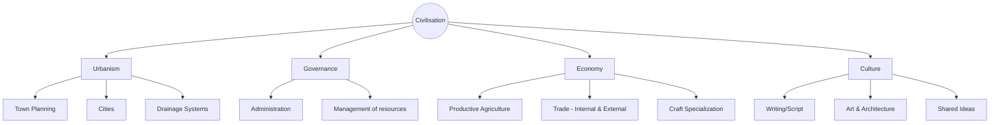

import Callout from '@/components/Callout.astro'

## Defining Civilisation

At the end of the Neolithic period, humans began settling down and farming. However, a "civilisation" represents a leap forward from simple village life. It is an advanced stage of human society characterized by complexity and organization.

### Key Characteristics

For a society to be termed a **civilisation**, it generally possesses the following features:

1.  **Urbanism:** The growth of cities with town planning and public amenities (like drainage).
2.  **Government & Administration:** A system to manage complex societies, maintain order, and organize collective works.
3.  **Crafts:** Specialized production of goods (ornaments, tools) using raw materials like stone and metal.
4.  **Trade:** Exchange of goods within the city, with other regions, and even with distant lands.
5.  **Writing:** A system to keep records and communicate.
6.  **Productive Agriculture:** Farming that produces enough surplus to feed people living in cities who are not farmers (like artisans or rulers).

<Callout variant="tip">
**Think About It:** Which of these is fundamental? **Productive agriculture** is often considered the foundation, as surplus food allows people to leave farming and take up other specialized roles like trading, ruling, or crafting.
</Callout>