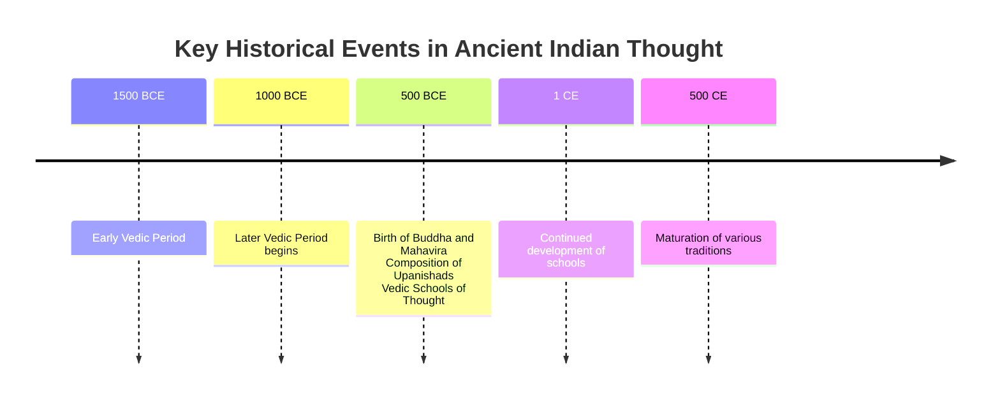

import Callout from '@/components/Callout.astro'

## Introduction

Indian culture is often compared to an ancient tree with many roots and branches. While there are diverse manifestations of this culture—art, science, religion, and governance—they are united by a common trunk. This chapter explores the early "schools of thought" and spiritual seekers who shaped India's unique personality.

We will delve into the Vedic age, the emergence of the Upanishads, and the rise of distinct paths like Buddhism and Jainism, alongside the rich contributions of folk and tribal traditions.

### Timeline of Developments

The following timeline highlights key periods discussed in this chapter:

## The Big Questions

As we study this chapter, we will explore:
1.  **What are the Vedas?** What is their core message?
2.  **New Schools of Thought:** What emerged in the 1st millennium BCE, and what were their principles?
3.  **Tribal Contributions:** How did folk and tribal traditions contribute to Indian culture?

## Chapter Content

The following topics cover the detailed study material for this chapter:

*   **[The Vedas and Vedic Culture](./topics/01-vedas-and-vedic-culture.mdx)**
*   **[Vedic Society and Thought](./topics/02-vedic-society-and-thought.mdx)**
*   **[Stories from the Upanishads](./topics/03-stories-from-upanishads.mdx)**
*   **[Buddhism](./topics/04-buddhism.mdx)**
*   **[Jainism](./topics/05-jainism.mdx)**
*   **[Folk and Tribal Roots](./topics/06-folk-and-tribal-roots.mdx)**