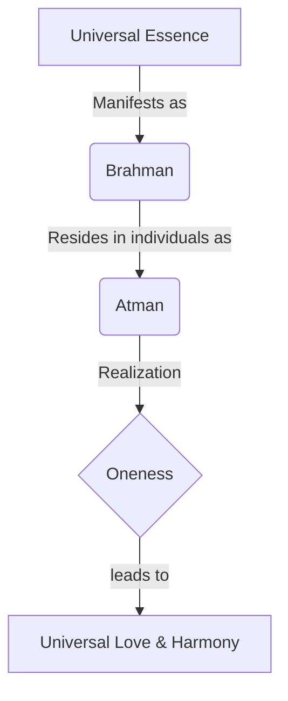

import Callout from '@/components/Callout.astro'

## Vedic Society

Early Vedic society was organized into **janas** (clans). The Rig Veda lists over 30 such clans, including the Bharatas, Purus, Kurus, and Yadus.

### Governance
Governance was likely collective. The texts mention:
*   **Raja:** A king or ruler.
*   **Sabha and Samiti:** Collective gatherings or assemblies.

### Professions
The society was diverse, with professions such as:
*   Agriculturists
*   Weavers
*   Potters
*   Builders
*   Healers
*   Priests

## Vedic Schools of Thought

Over time, Vedic culture developed complex rituals (*yajna*) for individual and collective well-being. From this foundation, deeper philosophical inquiries emerged.

### The Upanishads
A group of texts called the **Upanishads** introduced new metaphysical concepts:
1.  **Rebirth:** The cycle of taking birth again and again.
2.  **Karma:** Our actions and their results.

### Vedanta: Brahman and Atman
One major school of thought, **Vedanta**, proposed that everything in the universe is one divine essence.

*   **Brahman:** The universal divine essence (distinct from the god Brahma).
*   **Atman:** The Self or divine essence residing within every individual.

**Core Philosophy:** The *Atman* is ultimately one with *Brahman*.

#### Famous Mantras
Two profound mantras summarize this philosophy:

$$
\text{aham brahmāsmi} \rightarrow \text{"I am Brahman" (I am divine)}
$$

$$
\text{tat tvam asi} \rightarrow \text{"You are That"}
$$

### Interdependence
Since everyone shares the same divine essence, the world is interconnected. This leads to the universal prayer:
*"Sarve bhavantu sukhinah"* — **"May all creatures be happy."**

