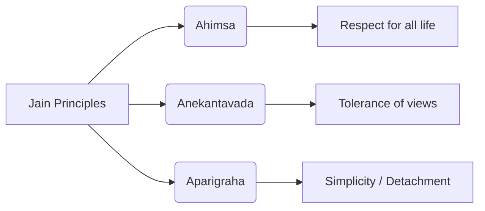

import Callout from '@/components/Callout.astro'

## The Origins

Jainism became widespread around the same time as Buddhism (6th century BCE), though its roots are considered much older.

**Vardhamana Mahavira**, a prince from Vaishali (Bihar), left home at age 30. After 12 years of ascetic discipline, he attained supreme wisdom. He became known as a **Jina** (Conqueror) and **Mahavira** (Great Hero).

<Callout variant="tip">
**What is a Jina?**
The word 'Jain' comes from *Jina*. It refers to a conqueror not of territories, but of **ignorance and attachments**.
</Callout>

## Core Teachings

Jainism shares concepts like *ahimsa* and *karma* with Buddhism and Vedanta but has unique emphases.

### The Three Pillars

1.  **Ahimsa (Non-violence):**
    *   "All breathing, existing, living, sentient creatures should not be slain, nor treated with violence."
    *   This extends to all life forms, emphasizing deep interconnectedness.

2.  **Anekantavada (Many-sidedness):**
    *   The truth has many aspects. No single statement can fully describe the absolute truth. It teaches tolerance of different viewpoints.

3.  **Aparigraha (Non-possession):**
    *   Limiting oneself to what is truly necessary.
    *   Detachment from material possessions.

### A Jain Story: Rohineya
Rohineya was a skilled burglar. He accidentally heard a sermon by Mahavira about liberation. Later, when caught and tested by a minister, he remembered Mahavira's words, which helped him see through the deception. Feeling remorse, he confessed, returned stolen goods, and became a monk.
*   **Moral:** Everyone deserves a second chance; right action and thinking lead to liberation.

