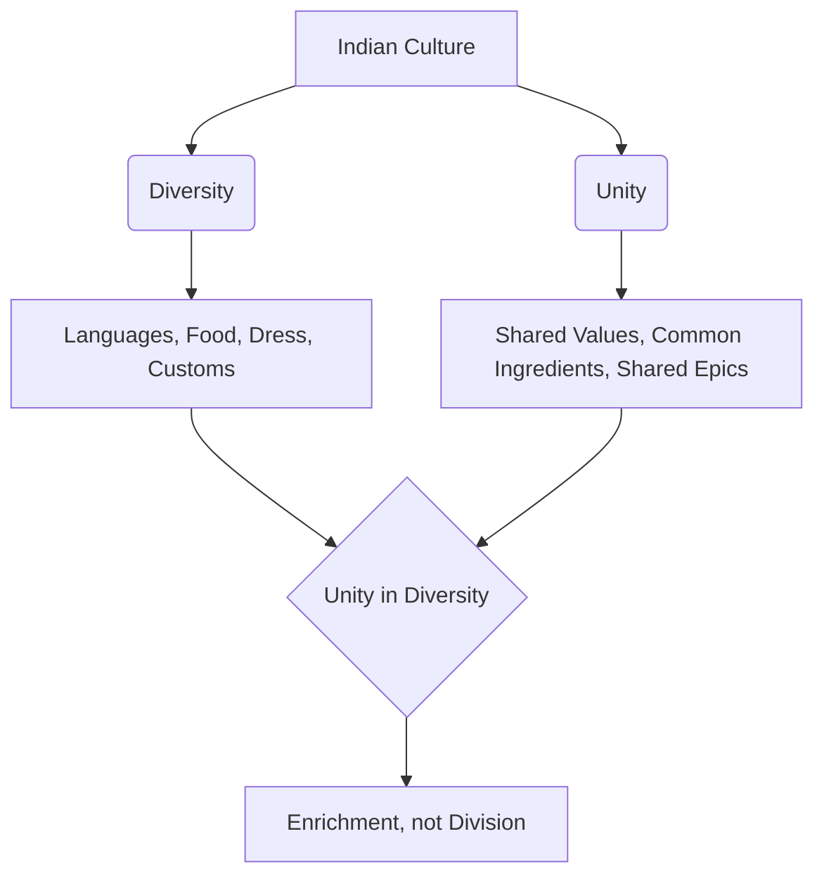

import Callout from '@/components/Callout.astro'

## Introduction

India is a land of striking contrasts and immense variety. From changing landscapes to diverse languages, food habits, and clothing styles, diversity is the first thing that strikes a visitor. However, beneath this surface of diversity lies a deep, underlying unity that has held the civilization together for millennia.

This chapter explores how the concept of **"Many in the One"** plays out in the Indian scenario, examining how various dimensions of life—food, textiles, festivals, and literature—reflect this unique blend of unity and diversity.

<Callout variant="tip">
**The Core Philosophy:**
*"The principle of unity in diversity which has always been normal to [India]... the Many in the One, would place her on the sure foundation of her Swabhava and Swadharma."* — **Sri Aurobindo**
</Callout>

### The Big Questions

As we navigate this chapter, we will seek answers to the following key inquiries:

1.  **Meaning:** What is meant by 'unity in diversity' in the Indian scenario?
2.  **Observation:** What aspects of India's diversity are the most striking?
3.  **Analysis:** How do we make out the unity underlying the diversity?

### Chapter Roadmap

The following topics will guide our exploration:

*   **A Rich Diversity:** Understanding the demographics and linguistic variety of India.
*   **Food for All:** How common ingredients create thousands of diverse dishes.
*   **Textiles and Clothing:** The story of the Sari—one garment, endless forms.
*   **Festivals Galore:** Celebrating the same event under different names across the country.
*   **An Epic Spread:** The unifying role of literature, specifically the *Panchatantra* and the Epics (*Ramayana* and *Mahabharata*).

### Key Concept Map

