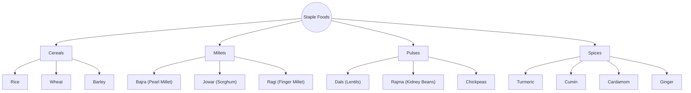

import Callout from '@/components/Callout.astro'

## Common Ingredients, Endless Dishes

One of the most relatable examples of unity in diversity is food. While there are thousands of distinct dishes across India, the building blocks (ingredients) remain remarkably consistent.

### The Unity: Staple Grains
Almost every part of the country relies on a specific set of grains and pulses. These are called **staple grains** because they form the basic food for most Indians.

#### Classification of Indian Staples

### The Diversity: Regional Variations

The unity lies in the *ingredients*, while the diversity lies in the *preparation*.
*   **Example:** Rice is eaten in Kashmir, Tamil Nadu, Bengal, and Gujarat, but the dishes prepared from it (Biryani, Idli, Pakhala, Khichdi) vary drastically in taste and texture.
*   **Spices:** Common spices like turmeric and ginger are used nationwide but in different combinations to create distinct regional flavors.

<Callout variant="tip">
**Conclusion:** The same ingredients (**Unity**) are used in endless combinations to prepare a vast variety of dishes (**Diversity**).
</Callout>

