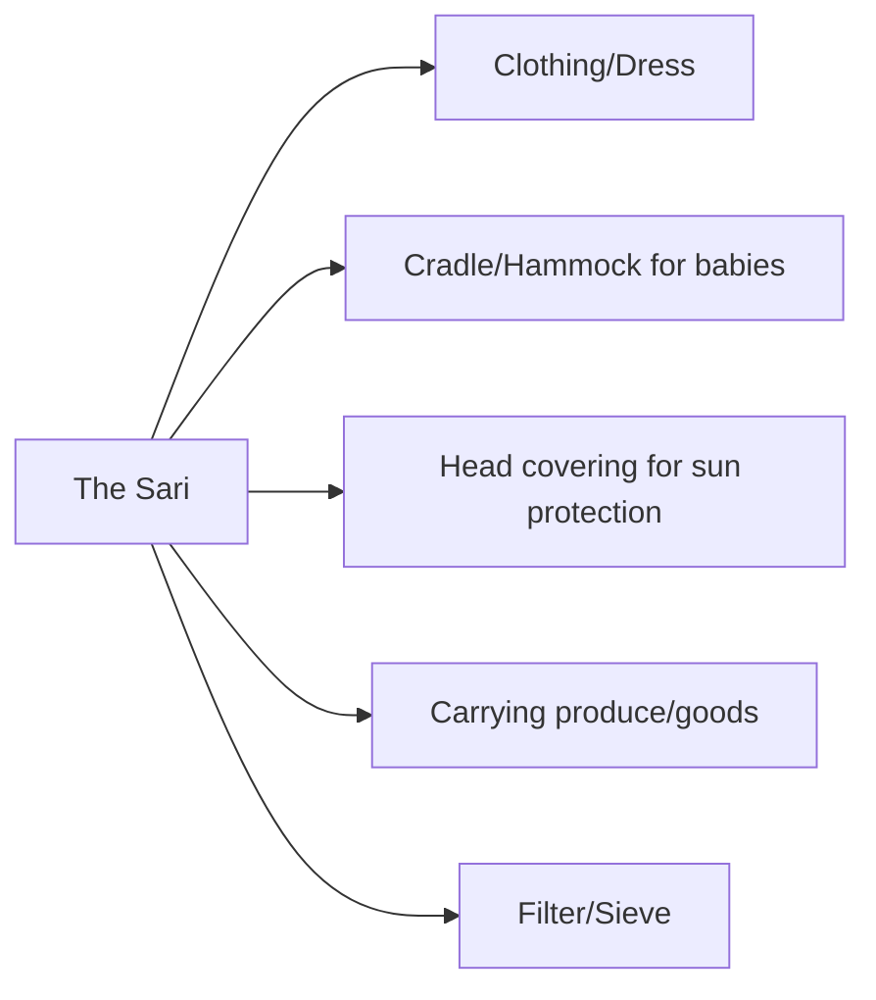

import Callout from '@/components/Callout.astro'

## The Common Thread

Just as with food, clothing in India shows a "commonality in traditional dress" despite regional variations. The most prominent example is the **Sari**.

### The Sari: One Dress, Many Forms

The sari is a plain length of unstitched cloth. Its unity lies in its simplicity—it is a single piece of fabric. However, its diversity is immense:

1.  **Fabrics:** Cotton, Silk (Banarasi, Kanjivaram, Paithani, Patan Patola, Muga, Mysore), and synthetic fibers.
2.  **Weaving & Design:** Ikat, block printing, embroidery.
3.  **Draping Styles:** Varies from region to region (e.g., Nauvari in Maharashtra, Seedha Pallu in Gujarat).

<Callout variant="info">
**Historical Fact:** The sari has a long history. A stone relief from **Vaishali (Bihar)** dating back a few centuries BCE depicts a woman in a sari.
</Callout>

### Global Impact: The Chintz
Indian textiles were historically world-renowned.
*   **Chintz:** A type of printed cotton that became incredibly popular in 17th-century Europe.
*   **Economic Impact:** It was so popular that England and France eventually banned its import to protect their own textile industries.

### Versatility of the Sari
The sari is not just a dress; it is a multi-purpose tool for Indian women.

This unstitched piece of cloth reflects the genius of Indian adaptability—simple in form, infinite in function.