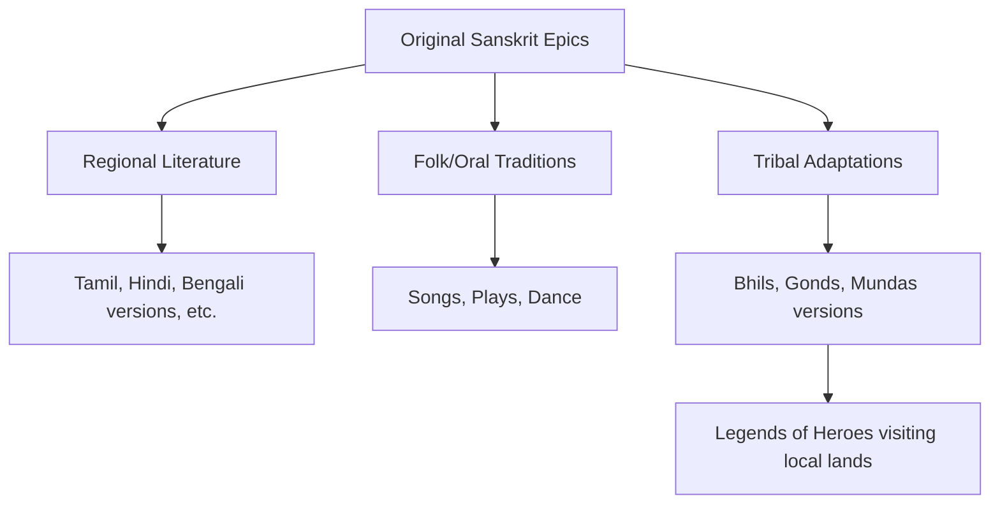

import Callout from '@/components/Callout.astro'

## Literature: Connecting Minds

Indian literature is among the most abundant in the world. Despite different languages, Indian texts share important themes, values, and concerns.

### The Panchatantra
*   **Origin:** Sanskrit text, at least 2,200 years old.
*   **Format:** Stories with animals as characters teaching life skills.
*   **Spread:** Adapted into almost every Indian language and translated into 50+ languages globally (including adaptations in Southeast Asia, the Arab world, and Europe).

### The Two Epics: Ramayana and Mahabharata

These two massive Sanskrit poems have shaped Indian culture for millennia.

1.  **The Mahabharata:** The story of the Pāṇḍavas and Kauravas, featuring Kṛiṣhṇa, fighting to re-establish *dharma*.
2.  **The Rāmāyaṇa:** The story of Rāma, Sītā, Lakṣhmaṇa, and Hanuman fighting the demon Rāvaṇa.

#### Regional and Tribal Adaptations
The epics are not static; they have been "translated" into the local culture of every region.

*   **Regional Languages:** Translated into Tamil (Kamba Ramayanam), Hindi (Ramcharitmanas), and hundreds of others.
*   **Tribal Communities:** Tribes like the **Bhils, Gonds, and Mundas** have their own oral versions.
*   **Localization:** Many tribes believe the epic heroes visited *their* specific regions.
    *   *Example:* The **Irula tribals** in Tamil Nadu maintain a shrine commemorating the Pandavas' visit (Fig 8.7 in text).

<Callout variant="tip">
**Unity in Diversity:** The same stories are told differently, yet the core values of *dharma*, truth, and justice remain consistent across all versions.
</Callout>