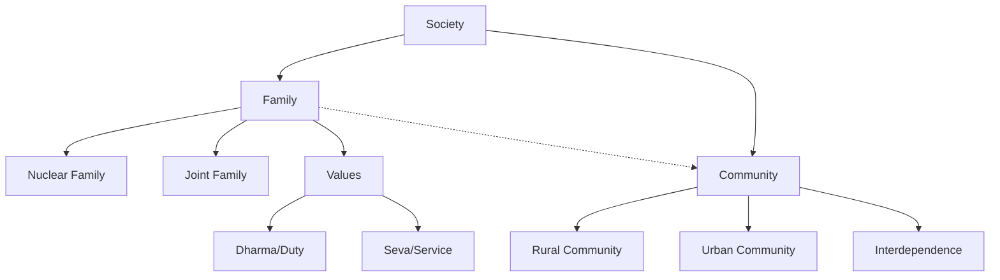

import Callout from '@/components/Callout.astro'

## Introduction

Almost everyone belongs to a family. It is the most fundamental and ancient unit of any society. In this chapter, we explore the different types of families found in India, the values that bind family members together, and how families connect to form larger communities.

> **"Love and dharma are the flower and fruit of family life."** — *Tiruvalluvar*

<Callout variant="tip">
**Chapter At A Glance:**
1.  **The Family Unit:** Nuclear vs. Joint families and kinship terms.
2.  **Roles & Responsibilities:** Cooperation, interdependence, and *Dharma* (duty).
3.  **Community:** How families connect, share resources, and support each other (e.g., *Halma*).
</Callout>

### The Big Questions
As you study this chapter, keep these core questions in mind:
1.  Why is the family unit important?
2.  What is a community and what is its role?

### Concept Map

