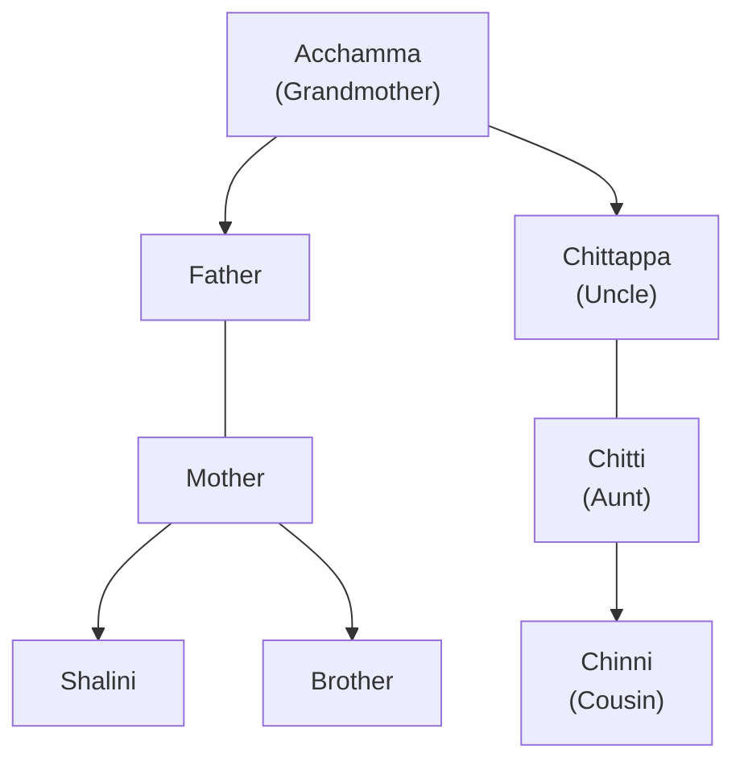

import Callout from '@/components/Callout.astro'

## Story 1: Shalini (Kerala)
**Context:** A joint family facing financial difficulty during the Onam festival.

*   **Family Members:** Shalini, Parents, Brother, Acchamma (Grandmother), Chittappa (Uncle), Chitti (Aunt), Chinni (Cousin).
*   **The Situation:** The uncle lost his job. The family could not afford expensive silk dresses for everyone.
*   **The Resolution:** Shalini's parents bought simple cotton clothes for *everyone*, including the uncle's family, instead of expensive ones just for themselves.
*   **Lesson:** Families share resources. Personal desires (like a silk dress) are sometimes sacrificed (*Tyaga*) to support other family members in tough times.

### Shalini's Family Tree

## Story 2: Tenzing (Meghalaya)
**Context:** A family in the mountains where gender roles are flexible and cooperative.

*   **The Father:** Runs a grocery store but also cleans the house, tends the garden, and cooks. He shares household chores equally.
*   **The Mother:** Works in a handicraft cooperative making traditional fabrics.
*   **The Grandparents:**
    *   *Grandmother:* Tells stories, wisdom.
    *   *Grandfather:* Helps with homework, takes Tenzing to the bus, does social work in the colony (fixing power failures, helping storm victims).
*   **Decision Making:** Parents discuss special expenses together.
*   **Lesson:** Gender equality in household chores and the vital role of grandparents in education and social responsibility.

<Callout variant="tip">
**Comparison:**
Both stories highlight **Interdependence**. In Kerala, it was financial support. In Meghalaya, it was the sharing of labor and duties.
</Callout>