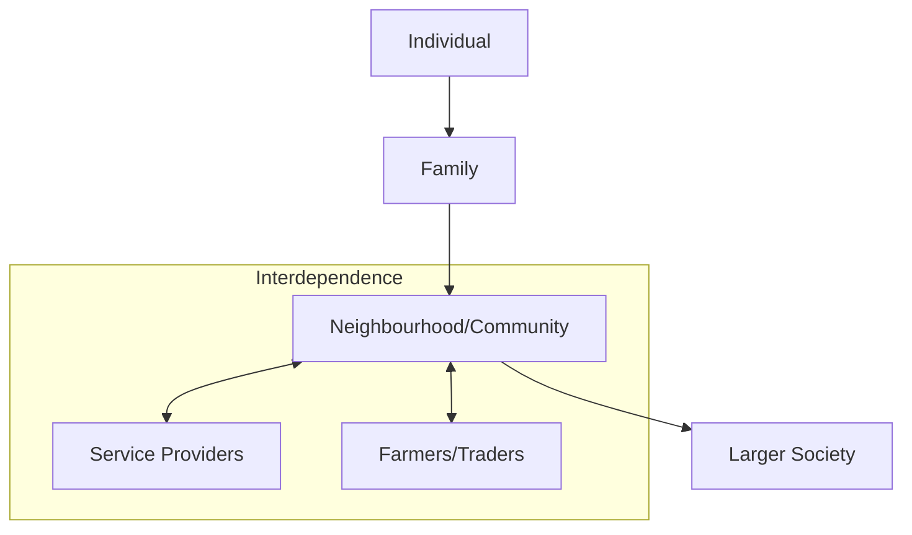

import Callout from '@/components/Callout.astro'

## Defining Community

A community is a group of connected people living together or sharing common interests/values. Families are not isolated; they connect to form communities.

### Rural vs. Urban Communities

| Feature | Rural / Tribal Communities | Urban Communities |
| :--- | :--- | :--- |
| **Shared Resources** | Water, grazing lands, forest produce. | Parks, roads, community halls. |
| **Cooperation** | Agricultural help (sowing, harvesting together). | Residents' Welfare Associations (RWAs). |
| **Rules** | Often unwritten customs for resource use. | Written rules on waste, parking, pets. |

### Types of Communities
A person can belong to multiple communities simultaneously:
1.  **Residential:** Your neighbourhood or village.
2.  **School:** Your class, sports team, NCC, NSS, or drama club.
3.  **Cultural/Religious:** Groups based on shared religion or region (e.g., "Mumbai's Parsi community").
4.  **Professional:** A community of scientists, farmers, or artists.

### Interdependence
Communities rely on each other. An RWA (Residential Community) depends on:
*   The Trading Community (for supplies).
*   Municipal Workers (for waste handling).

**No community can survive in isolation.**

