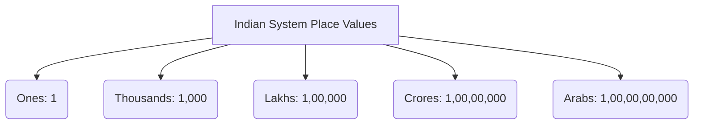

import Callout from '@/components/Callout.astro'

## Reading and Writing Large Numbers

As numbers grow bigger, reading them digit by digit becomes confusing. To make reading large numbers easier, we use **commas** to separate the digits into specific groups or "periods" (like thousands, lakhs, and millions).

There are two primary systems used globally for placing these commas and naming the numbers:

### 1. The Indian System

In the Indian system, commas are placed to group digits in a **3-2-2-2** pattern from right to left.
*   **First comma:** Placed after the hundreds place (3 digits from the right).
*   **Second comma:** Placed after the ten-thousands place (2 digits later).
*   **Third comma:** Placed after the ten-lakhs place (2 digits later).

**Example:** $12,78,830$
*   **Read as:** Twelve lakh seventy-eight thousand eight hundred thirty.

### 2. The International (American) System

In the International system, the digits are grouped uniformly in a **3-3-3** pattern from right to left.
*   **First comma:** Placed after the hundreds place (3 digits from the right).
*   **Second comma:** Placed after the hundred-thousands place (3 digits later).
*   **Third comma:** Placed after the hundred-millions place (3 digits later).

**Example:** $1,278,830$
*   **Read as:** One million two hundred seventy-eight thousand eight hundred thirty.

<Callout variant="tip">
**Comparison Check:**
*   $1$ Lakh = $100$ Thousand
*   $10$ Lakhs = $1$ Million
*   $1$ Crore = $10$ Million
*   $100$ Crores = $1$ Billion
</Callout>

### Word Origins

The words "lakh" and "crore" originate from the ancient Sanskrit words *lakṣha* (लक्ष) and *koṭi* (कोटि). The Indian system is also widely followed in countries like Bhutan, Nepal, Sri Lanka, Pakistan, Bangladesh, and Maldives.