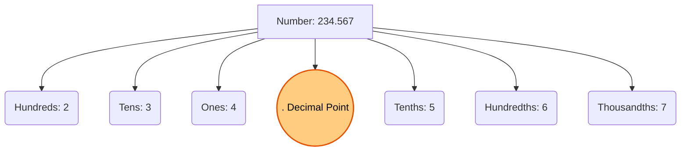

import Callout from '@/components/Callout.astro'

## The Need for Smaller Units

When using a ruler, you'll notice that the space between $0 \text{ cm}$ and $1 \text{ cm}$ is divided into $10$ equal parts. We do this when exact measures are required. 

If an object's length falls exactly on the 4th small mark past the $2 \text{ cm}$ line, its length is $2$ whole centimeters plus $4$ out of $10$ parts of the next centimeter. We write this as the mixed fraction $2 \frac{4}{10} \text{ cm}$.

<svg width="400" height="100" viewBox="0 0 400 100" stroke="currentColor" fill="none" class="text-foreground border border-foreground/20 rounded-md">
    <!-- Ruler base -->
    <rect x="20" y="20" width="360" height="60" fill="currentColor" opacity="0.1" />
    <line x1="20" y1="20" x2="380" y2="20" stroke-width="2" />
    
    <!-- Ticks -->
    <!-- 0 cm -->
    <line x1="50" y1="20" x2="50" y2="50" stroke-width="2" />
    <text x="50" y="65" text-anchor="middle" fill="currentColor" font-size="14">0</text>
    
    <!-- 1 cm -->
    <line x1="150" y1="20" x2="150" y2="50" stroke-width="2" />
    <text x="150" y="65" text-anchor="middle" fill="currentColor" font-size="14">1</text>
    
    <!-- 2 cm -->
    <line x1="250" y1="20" x2="250" y2="50" stroke-width="2" />
    <text x="250" y="65" text-anchor="middle" fill="currentColor" font-size="14">2</text>
    
    <!-- 3 cm -->
    <line x1="350" y1="20" x2="350" y2="50" stroke-width="2" />
    <text x="350" y="65" text-anchor="middle" fill="currentColor" font-size="14">3</text>

    <!-- Sub-ticks for tenths (0 to 1) -->
    <line x1="60" y1="20" x2="60" y2="35" stroke-width="1" />
    <line x1="70" y1="20" x2="70" y2="35" stroke-width="1" />
    <line x1="80" y1="20" x2="80" y2="35" stroke-width="1" />
    <line x1="90" y1="20" x2="90" y2="35" stroke-width="1" />
    <line x1="100" y1="20" x2="100" y2="40" stroke-width="1.5" /> <!-- Middle tick -->
    <line x1="110" y1="20" x2="110" y2="35" stroke-width="1" />
    <line x1="120" y1="20" x2="120" y2="35" stroke-width="1" />
    <line x1="130" y1="20" x2="130" y2="35" stroke-width="1" />
    <line x1="140" y1="20" x2="140" y2="35" stroke-width="1" />
</svg>

## A Tenth Part

When a unit is divided into $10$ equal parts, each part is called a **tenth** or $\frac{1}{10}$.
If you have $34$ tenths, it can be written as:
$$ \frac{34}{10} = \frac{10}{10} + \frac{10}{10} + \frac{10}{10} + \frac{4}{10} = 3 \text{ units and } 4 \text{ tenths.} $$

We read $\frac{4}{10}$ as "four-tenths". We read $4 \frac{1}{10}$ as "four and one-tenth".

## A Hundredth Part

What if we need even more precision? We can split each one-tenth into 10 smaller parts. Since there are $10$ one-tenths in a unit, splitting each into $10$ gives us $100$ smaller parts in a single unit. Each part is called a **hundredth** or $\frac{1}{100}$.

*   **1 tenth** = $10$ hundredths ($\frac{1}{10} = \frac{10}{100}$)

## The Decimal Place Value System

In the Indian place value system, each position is $10$ times smaller than the one immediately to its left:
*   $1000 \div 10 = 100$ (Hundreds)
*   $100 \div 10 = 10$ (Tens)
*   $10 \div 10 = 1$ (Ones/Units)

By continuing this pattern past $1$, we get decimal places!
*   $1 \div 10 = \frac{1}{10}$ (**Tenths**)
*   $\frac{1}{10} \div 10 = \frac{1}{100}$ (**Hundredths**)
*   $\frac{1}{100} \div 10 = \frac{1}{1000}$ (**Thousandths**)

We use a **decimal point (`.`)** to separate the whole number part (integers) from the fractional part.

### Reading Decimal Numbers

*   **$705$** is read as *seven hundred and five*.
*   **$70.5$** is read as *seventy point five* (short for seventy and five-tenths).
*   **$7.05$** is read as *seven point zero five* (short for seven and five-hundredths).
*   **$0.274$** is read as *zero point two seven four*. 

<Callout variant="warning">
**Important Rule:**
We do **not** read digits after the decimal point as regular numbers. $0.274$ is NOT "zero point two hundred seventy-four." It must be read digit by digit: "zero point two seven four."
</Callout>