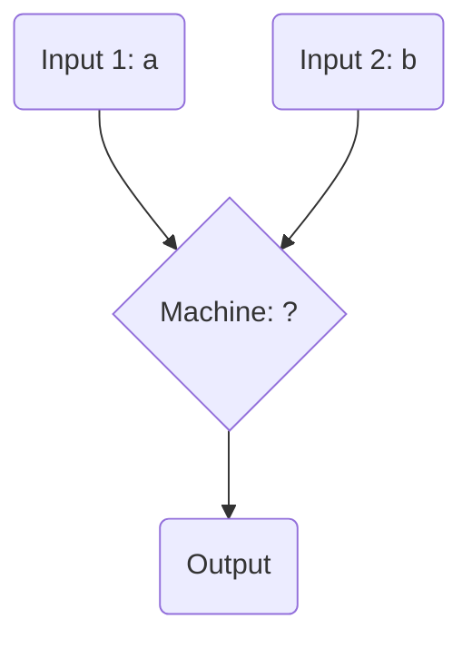

import Callout from '@/components/Callout.astro'

## The Formula Detective (Number Machines)

Imagine a "Number Machine" that takes in two numbers, performs a specific hidden mathematical operation, and outputs a final result. By observing the inputs and outputs, we can write an algebraic formula for the machine.

If we see the following data:
*   Inputs $(5, 2) \to$ Output $8$
*   Inputs $(8, 1) \to$ Output $15$
*   Inputs $(9, 11) \to$ Output $7$

**What is the formula?**
Let the first input be $a$, and the second be $b$.
Notice that $2 \times 5 - 2 = 8$. 
And $2 \times 8 - 1 = 15$.
And $2 \times 9 - 11 = 18 - 11 = 7$.
The machine's formula is **$2a - b$**.

## Patterns in Geometry

Algebra is incredibly useful for predicting how many items are needed for geometric patterns as they grow indefinitely.

### Matchstick Triangles

<svg width="300" height="80" viewBox="0 0 300 80" stroke="#d97706" fill="none">
  <!-- Step 1 -->
  <polygon points="30,70 50,30 70,70" stroke-width="4"/>
  <text x="50" y="90" fill="currentColor" stroke="none" text-anchor="middle">Step 1 (3)</text>
  
  <!-- Step 2 -->
  <polygon points="110,70 130,30 150,70" stroke-width="4"/>
  <polyline points="130,30 170,30 150,70" stroke-width="4"/>
  <text x="140" y="90" fill="currentColor" stroke="none" text-anchor="middle">Step 2 (5)</text>

  <!-- Step 3 -->
  <polygon points="210,70 230,30 250,70" stroke-width="4"/>
  <polyline points="230,30 270,30 250,70" stroke-width="4"/>
  <polyline points="250,70 290,70 270,30" stroke-width="4"/>
  <text x="250" y="90" fill="currentColor" stroke="none" text-anchor="middle">Step 3 (7)</text>
</svg>

*   **Step 1:** $3$ matchsticks
*   **Step 2:** $5$ matchsticks
*   **Step 3:** $7$ matchsticks

Notice that each new triangle requires adding exactly $2$ more matchsticks. 
For Step $y$, the expression is **$2y + 1$**.
If we want to know the matchsticks for Step 33, we simply substitute $y = 33$: 
$2(33) + 1 = 66 + 1 = \mathbf{67 \text{ matchsticks}}$.

## Calendar Grid Patterns

If you take a calendar and draw a $2 \times 2$ square around any four dates, an interesting pattern emerges.

| | |
|---|---|
| $a$ | $a+1$ |
| $a+7$ | $a+8$ |

*   Top-left is $a$.
*   Top-right is 1 day later ($a+1$).
*   Bottom-left is exactly 1 week later ($a+7$).
*   Bottom-right is 1 week and 1 day later ($a+8$).

**Diagonal Sums:**
*   Diagonal 1: $a + (a + 8) = \mathbf{2a + 8}$
*   Diagonal 2: $(a + 1) + (a + 7) = \mathbf{2a + 8}$

Because we used algebraic modelling (using $a$), we have proven that the sum of the diagonals in *any* $2 \times 2$ calendar grid will always be exactly equal!