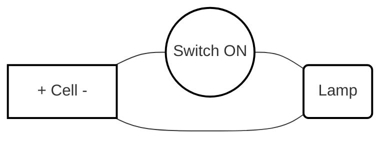

import Callout from '@/components/Callout.astro'

## The Electric Switch

We don't want our torches or room lights to be ON all the time. We need a way to easily break and complete the circuit. This is what a switch does.

<Callout variant="info">
**Definition:**
A **switch** is a simple device that either completes or breaks an electrical circuit.
</Callout>

*   **ON Position (Closed Circuit):** The switch mechanism connects the gap in the wires. The path is complete, and current flows. The device works.
*   **OFF Position (Open Circuit):** The switch mechanism moves away, creating an air gap in the wires. The path is broken, and current cannot flow. The device stops working.

*You can build a simple homemade switch using a piece of cardboard, two drawing pins, and a metal safety pin! When the safety pin touches both drawing pins, the circuit is closed.*

## Circuit Diagrams

Drawing pictures of actual batteries, realistic bulbs, and messy wires can be confusing and time-consuming. To solve this, international scientific organizations created standard symbols for electrical components.

A representation of an electrical circuit using these symbols is called a **circuit diagram**.

### Drawing a Circuit Diagram

Here is how you draw a simple circuit containing a single cell, a switch in the ON position, and a lamp:

*(Imagine this as a continuous rectangular wire path using standard symbols)*

1.  **Cell Symbol:** Draw a long vertical line (positive) parallel to a shorter, thicker vertical line (negative).
2.  **Wire:** Draw straight, solid lines connecting components.
3.  **Switch:** Draw a line with two distinct dots. If it's ON, connect the dots with a line. If it's OFF, draw the line angling upward from one dot, not touching the other.
4.  **Lamp:** Draw a circle with an 'X' inside it.