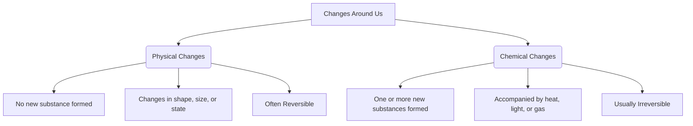

import Callout from '@/components/Callout.astro'

## Introduction

Look around you! From the melting of ice cubes in your glass to the rusting of an old iron gate, our world is in a constant state of change. Have you ever wondered why a chopped apple turns brown, or why you cannot un-pop popcorn? 

In this chapter, we will explore the fascinating transformations that happen in our everyday lives. We will act as science detectives to categorize these changes based on their properties, understanding whether a completely new substance is formed or if the material just changed its appearance. 

<Callout variant="info">
**Did you know?**
The light emitted by fireflies in the evening is the result of a chemical change! This incredible natural phenomenon of producing light without heat is called **bioluminescence**.
</Callout>

## Chapter Topics

1. [Physical Changes](./topics/01-physical-changes)
2. [Chemical Changes](./topics/02-chemical-changes)
3. [Combustion and Rusting](./topics/03-combustion-and-rusting)
4. [Natural Changes and Classifications](./topics/04-natural-changes-and-classification)

## Practice & Solutions

1. [Exercise Solutions: Let Us Enhance Our Learning](./solutions/let-us-enhance-our-learning)
2. [Exploratory Projects](./practice/exploratory-projects)

## Concept Overview

Here is a quick cheat sheet to help you classify the changes happening around you:

### Key Chemical Equations to Remember

*   **Testing for Carbon Dioxide:**
    $$ \text{Calcium hydroxide (Lime water)} + \text{Carbon dioxide} \rightarrow \text{Calcium carbonate (milky precipitate)} + \text{Water} $$
*   **Baking Soda & Vinegar Reaction:**
    $$ \text{Acetic Acid (Vinegar)} + \text{Sodium bicarbonate (Baking soda)} \rightarrow \text{Carbon dioxide gas} + \text{Other substances} $$
*   **Combustion of Magnesium:**
    $$ \text{Magnesium} + \text{Oxygen} \rightarrow \text{Magnesium oxide} + \text{Heat} + \text{Light} $$