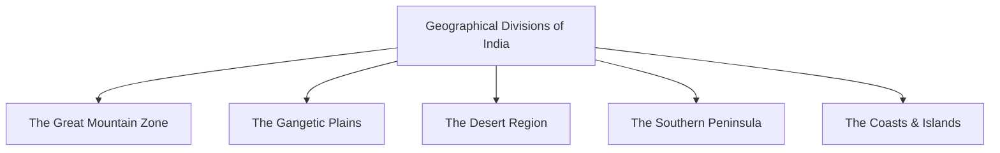

import Callout from '@/components/Callout.astro'

## Introduction

India is the seventh-largest country in the world and forms a major part of the Indian Subcontinent in Asia. When astronaut Rakesh Sharma looked at India from space in 1984, he famously described it to Prime Minister Indira Gandhi as *"Sāre jahān se achchha"* (better than the whole world). 

India is a land of incredible geographical diversity. Its vast landscape shapes the climate, culture, and history of the nation. It is bounded by the mighty Himalayas in the north, the Thar Desert and the Arabian Sea in the west, the Bay of Bengal in the east, and the Indian Ocean in the south.

<Callout variant="info">
**The Indian Subcontinent**
India, along with its neighbors—Pakistan, Bangladesh, Nepal, Bhutan, Sri Lanka, and Myanmar—forms a distinct geographical region known as the Indian Subcontinent.
</Callout>

## Major Geographical Divisions

For the purpose of study, India's geography can be broadly divided into five main regions:

## Chapter Topics

1. [The Himalayas and Northern Plains](./topics/01-himalayas-and-plains)
2. [Deserts, Hills, and Plateaus](./topics/02-deserts-and-plateaus)
3. [Coastlines, Islands, and Deltas](./topics/03-coasts-and-islands)

## Practice & Solutions

1. [Chapter 1 Questions and Activities](./solutions/chapter-1-questions)
2. [Important Geographical Facts](./practice/important-geographical-facts)

## Key Terms to Remember

*   **Subcontinent:** A large, relatively self-contained landmass forming a subdivision of a continent.
*   **Plateau:** A landform that rises up from the surrounding land and has a more or less flat surface; often with steep slopes on its sides.
*   **Peninsula:** A piece of land that is surrounded by water on three sides (like southern India).
*   **Delta:** A triangular or fan-shaped landform created by the deposition of sediment at the mouth of a river as it flows into an ocean or lake.
*   **Archipelago:** A group or chain of islands.