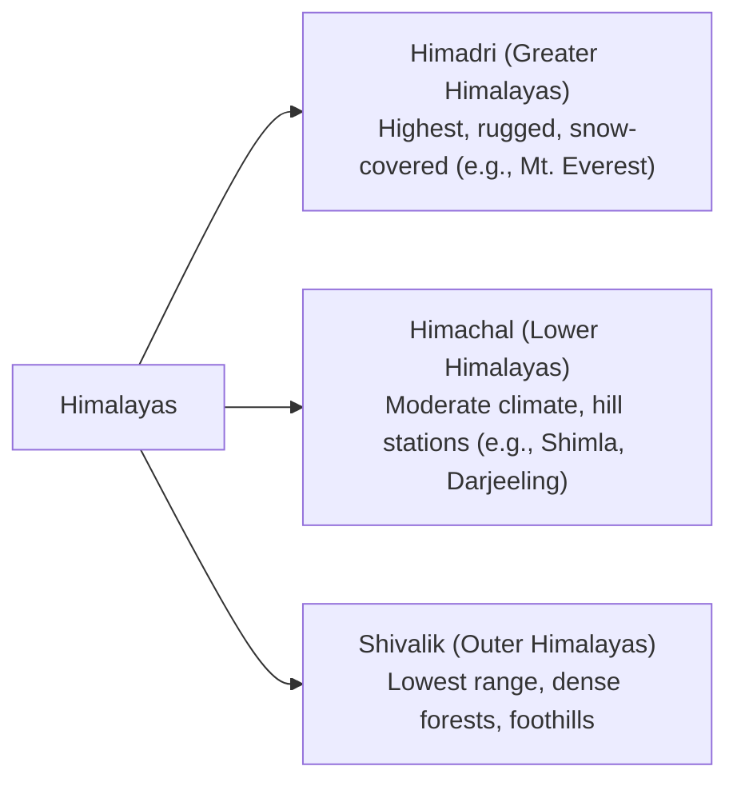

import Callout from '@/components/Callout.astro'

## The Himalayas: The Abode of Snow

The word 'Himalaya' is a combination of two Sanskrit words: *hima* (snow) and *ālaya* (abode or dwelling), meaning the "abode of snow." Stretching about 2,500 km across six countries (India, Nepal, Bhutan, China, Pakistan, and Afghanistan), the Himalayas stand as a massive natural barrier in the north.

### Formation of the Himalayas

The Himalayas have a fascinating geological history:

1.  Millions of years ago, India was part of a giant supercontinent called **Gondwana**, located near Africa.
2.  It broke away and slowly drifted northwards.
3.  Around 50 million years ago, the Indian landmass collided with the Eurasian landmass.
4.  The immense pressure caused the land between them to crumple and fold upwards, forming the Himalayan mountains!

<Callout variant="info">
**Did you know?**
India is still pushing into Asia at a rate of about 5 centimeters per year. This means the Himalayas are still growing taller by about 5 millimeters every year!
</Callout>

### The Three Main Ranges

The Himalayas are broadly categorized into three parallel ranges:

*   **Importance:** Often called the 'Water Tower of Asia', the summer snowmelt feeds major rivers like the Ganga, Indus, and Brahmaputra. The *Bhagirathi River* (a major tributary of the Ganga) originates from *Gaumukh* at the edge of the Gangotri Glacier.
*   **Culture:** The region is home to traditional architecture like the *kath-kuni* or *dhajji-dewari* style houses, which use stone and wood to stay warm and resist mild earthquakes.

## The Cold Desert: Ladakh

When we think of a desert, we imagine hot sand. But India also has a **cold desert** in Ladakh.
*   **Climate:** Winter temperatures can drop below $-30^\circ\text{C}$ with very little rainfall.
*   **Landscape:** Rugged, rocky terrain with deep valleys and salty lakes like *Pangong Tso*. The terrain often resembles the moon, earning it the nickname **'moonland'**.
*   **Life & Culture:** Despite harsh conditions, it hosts unique wildlife (snow leopards, yaks) and a rich culture featuring ancient monasteries and festivals like *Losar* and the *Hemis Festival*.

## The Gangetic Plains

Moving south from the Himalayas, we enter the vast and fertile Gangetic (or Northern) Plains.

*   **Formation:** Nourished by the mighty rivers originating in the Himalayas (Ganga, Indus, Brahmaputra) and their tributaries.
*   **Importance:** These rivers deposit rich minerals, making the soil highly fertile and ideal for agriculture (like multi-cropping). This agricultural abundance makes the plains one of the most densely populated regions in India.
*   **Infrastructure:** The flat terrain has allowed for the development of an extensive transportation network of roads and railways.