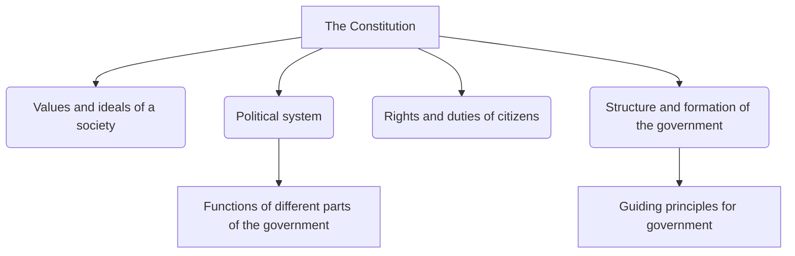

import Callout from '@/components/Callout.astro'

## The Rulebook of the Nation

Imagine playing a state-level Kabaddi tournament. A dispute breaks out over whether a player is 'out' or not. How is it resolved? The referee checks the **official rulebook**. Once the rule is read, both teams agree, and the game continues fairly. 

A **Constitution** is exactly like that official rulebook, but for an entire country! 

It is a document that spells out a nation’s basic principles and laws. Many important officials, like the President, Prime Minister, and judges, take an oath to preserve, protect, and defend it.

## Why Do We Need a Constitution?

Without a constitution, there would be chaos. A constitution is needed to:
*   Determine what kind of government will exist and how it will be formed.
*   Describe how laws are made and implemented.
*   Establish who elects the leaders.
*   Define the rights and duties of individual citizens.
*   State the values and ideals the country is committed to (like equality, justice, and freedom).

## What Does a Constitution Contain?

Most constitutions contain a few core elements that define the nation. Here is a breakdown of what forms the basis of a constitution:

Specifically, the Indian Constitution lays out:
1.  **The framework of the three organs of government** (Legislature, Executive, and Judiciary) and their specific roles.
2.  **Checks and balances** among these three organs to ensure fairness and prevent any one group from becoming too powerful.
3.  **The rights and duties** of the citizens.
4.  **An outline of long-term goals** and aspirations for the nation.

<Callout variant="info">
**Did You Know?**
Helium is a gas that doesn’t react with paper or ink. The original Indian Constitution is kept in a helium-filled glass case in Parliament to preserve it over time!
</Callout>