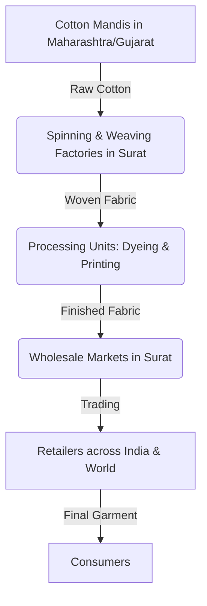

import Callout from '@/components/Callout.astro'

## The Flow of Goods

Have you ever wondered how a shirt made in a factory in Gujarat reaches a small shop in your neighborhood? Several participants play specific roles in the smooth functioning of markets.

Here is how goods flow in a typical physical market:

### 1. Wholesalers
Wholesalers buy goods in **large quantities** directly from the producer, manufacturer, or farms. 
*   Because they buy in bulk, they need large warehouses (godowns) to store the items. 
*   For perishable goods (like vegetables, fruits, and flowers), they use **Cold Storage** facilities to maintain specific low temperatures to prevent rotting.
*   Wholesalers act as the main channel of supply, assessing how much product is required across the country to ensure uninterrupted supply.

### 2. Distributors
In some cases, it is difficult for a wholesaler to reach thousands of tiny shops due to distance. **Distributors** are individuals or businesses who bridge this gap by taking goods from wholesalers and supplying them to retailers across different terrains.

### 3. Retailers
Retailers are the shopkeepers located near your household (e.g., a local grocery store, a garment shop, a salon). They buy in smaller quantities from wholesalers or distributors and sell the final product directly to **consumers** (you!).

## Online Distribution: The Aggregator

In online markets, the chain looks a bit different. Manufacturers send bulk products to the warehouse of an online business. 

<Callout variant="info">
**Aggregator:** A website or mobile application that organizes and combines offers from multiple sellers and sells them to consumers at one place (e.g., popular e-commerce websites). The aggregator packs the products and delivers them straight to the online buyer.
</Callout>

## Case Study: The Surat Textile Market

To understand the supply chain, let's look at **Surat, Gujarat**—Asia's oldest textile market and a famous textile hub.

Apart from textiles, Surat is also home to the world's largest diamond cutting and polishing industry, employing over 1.5 million artisans! Its strategic location on the west coast, with major ports, highways, and railways, has made it a flourishing trading hub for centuries.