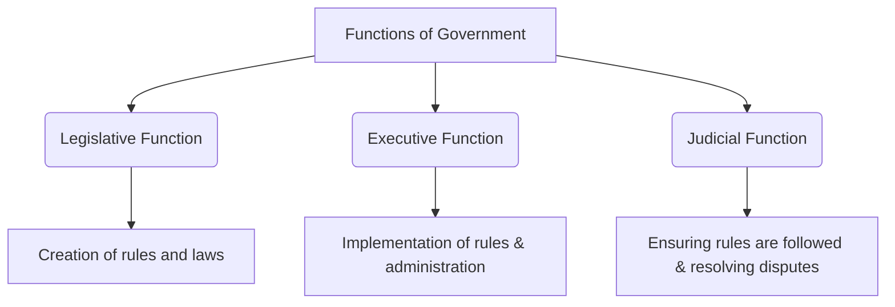

import Callout from '@/components/Callout.astro'

## The Role of the Government

The government plays a deeply important role in our daily lives. Its main responsibilities include:
*   Maintaining **law and order** in society.
*   Ensuring peace, stability, and security for the people.
*   Managing relationships with other countries.
*   Taking care of **national defence**.
*   Delivering essential goods and services (education, healthcare, infrastructure).
*   Managing the economy and economic activities.
*   Working for the **welfare** and improving people’s lives.

## Functions of Government

Just like a student committee in a school must make rules, implement them, and ensure they are followed, a government carries out three core responsibilities, known as its **functions**:

## What Makes Governments Different?

Since countries have their own unique histories, cultures, and aspirations, governments evolve differently. The major aspects that differentiate one government from another are:

### 1. Who gets to decide that ‘this is the government’?
This relates to the **source of authority**. 
*   In a **democracy** like India, the people are the source of authority.
*   In a **theocracy**, religious beliefs and institutions provide authority.

### 2. How is the government formed?
*   In a **democracy**, governments are usually formed through elections.
*   In a **monarchy**, someone from within a ruling family inherits the right to govern.

### 3. What are the different parts of the government and what do they do?
Any government has many parts. The three functions (legislative, executive, and judicial) can be performed by completely independent bodies or by the same body. Most democracies have a **Constitution**, which is a book of fundamental rules dictating how the government will work.

### 4. What is the government working for? (Goals)
Governments operate towards certain values. For example, the Indian government works towards **equality and prosperity for all**, while some governments might only work for the prosperity of specific groups or ruling families.

<Callout variant="info">
**Representative:** A person who is chosen to act or make decisions on behalf of another person or group of people.
</Callout>