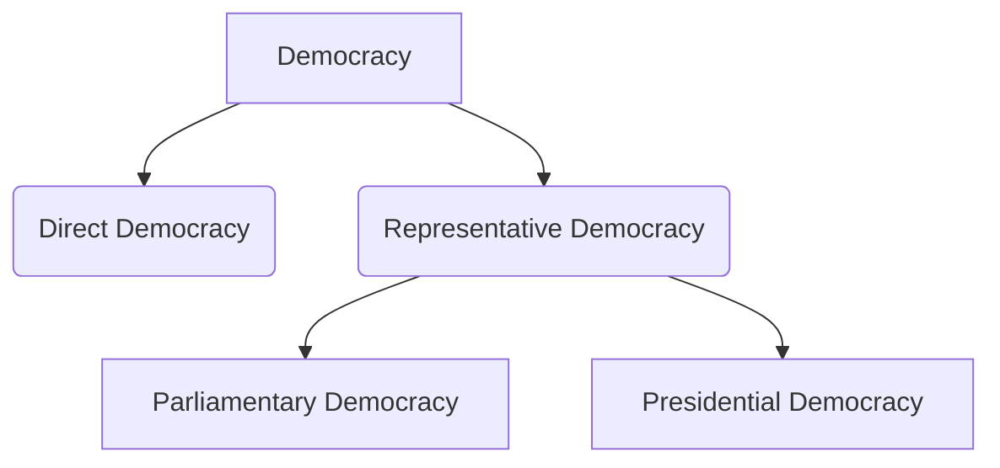

import Callout from '@/components/Callout.astro'

## What is Democracy?

Democracy is best understood as the **‘rule of the people’**. This means that the ultimate source of power and authority in a country rests with its citizens.

<Callout variant="tip">
**Do You Know?**
Abraham Lincoln, a U.S. president in the late 19th century, described democracy as a *"government of the people, by the people, for the people"*—a phrase still widely used today.
</Callout>

### Fundamental Principles of Democracy

While democracies vary, they share core fundamental ideals:

*   **Equality:** Every person has the right to be treated equally, with equal access to education and health, and equality before the law.
*   **Freedom:** Citizens have the right to make their own choices and express their opinions.
*   **Representative participation:** Every person has the right to choose their representatives through elections.
*   **Universal adult franchise:** Grants every adult citizen the right to vote.
*   **Fundamental rights:** Essential rights like freedom of speech, equality, and protection against exploitation are guaranteed.
*   **Independent judiciary:** Ensures citizens' fundamental rights are protected and laws are followed by everyone, including the government.

## Different Forms of Democratic Governments

### 1. Direct Democracy
In this form, **all citizens participate directly** in decision-making and law-creation.
*   *Example:* Switzerland follows elements of direct democracy.
*   *Limitation:* Extremely difficult to carry out in large countries due to population size.

### 2. Representative Democracy
People elect their representatives through universal adult franchise. The people do not govern directly, but the elected government is **accountable** to them. Regular elections (e.g., every 5 years in India) allow citizens to change their representatives.

<Callout variant="info">
**Accountability:** Accountability in democracy means that the government is answerable to the people who have elected them.
</Callout>

Representative democracies primarily exist in two forms:

#### A. Parliamentary Democracy
*   **Structure:** Members of the executive are also part of the legislature. 
*   **Functioning:** The council of ministers (led by the Prime Minister) is accountable to the legislature and stays in power as long as they have its confidence.
*   **Example:** India (Prime Minister and Council of Ministers are part of Parliament).

#### B. Presidential Democracy
*   **Structure:** The executive works independently of the legislature.
*   **Functioning:** The President is directly elected by the people and does not need the confidence of the legislature to hold office.
*   **Example:** United States of America.

### Comparison of Democratic Structures

| Country | Executive | Legislature | Judiciary |
| :--- | :--- | :--- | :--- |
| **India** | Prime Minister and Council of Ministers | Lower House (Lok Sabha) is more powerful than Upper House (Rajya Sabha) | Independent (Separation of power) |
| **USA** | President | Equal power between Upper House (Senate) & Lower House (House of Representatives) | Independent (Separation of power) |
| **South Korea** | President | Single house (National Assembly) | Independent (Separation of power) |
| **Australia** | Prime Minister and Council of Ministers | Equal power between Upper House (Senate) & Lower House (House of Representatives) | Independent (Separation of power) |

<Callout variant="warning">
**Important Concept: Separation of Power**
This means that the three organs of the government—Legislature, Executive, and Judiciary—work independently and do not interfere in each other's functions.
</Callout>