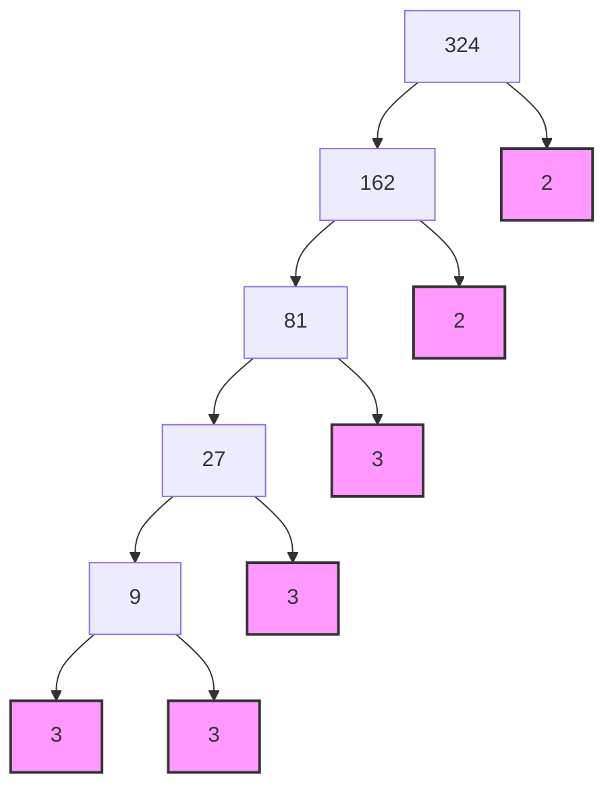

import Callout from '@/components/Callout.astro'

## What is a Square Root?

The square root is the inverse operation of squaring. If $n^2 = x$, then the square root of $x$ is $n$.
We denote it by the symbol $\sqrt{x}$.

$$
\sqrt{81} = 9 \quad \text{because} \quad 9 \times 9 = 81
$$

## Finding Square Roots

### Method 1: Repeated Subtraction
Since a square is the sum of consecutive odd numbers, we can subtract odd numbers ($1, 3, 5\dots$) from the given number until we reach zero. The number of steps is the square root.

**Example: Find $\sqrt{25}$**
1.  $25 - 1 = 24$ (Step 1)
2.  $24 - 3 = 21$ (Step 2)
3.  $21 - 5 = 16$ (Step 3)
4.  $16 - 7 = 9$ (Step 4)
5.  $9 - 9 = 0$ (Step 5)

We reached 0 in 5 steps. Therefore, $\sqrt{25} = 5$.

### Method 2: Prime Factorization
For larger numbers, we use prime factorization. We pair identical prime factors and pick one from each pair.

**Example: Find $\sqrt{324}$**

1.  Find prime factors of 324:
    $324 = 2 \times 2 \times 3 \times 3 \times 3 \times 3$
2.  Group them in pairs:
    $324 = (2 \times 2) \times (3 \times 3) \times (3 \times 3)$
3.  Take one from each pair:
    $\sqrt{324} = 2 \times 3 \times 3$
4.  Multiply:
    $2 \times 3 \times 3 = 18$

### Method 3: Estimation
If a number is not a perfect square (or is very large), we can estimate.
**Example: Find $\sqrt{250}$**
1.  We know $10^2 = 100$ and $20^2 = 400$. So the root is between 10 and 20.
2.  $15^2 = 225$ and $16^2 = 256$.
3.  250 is closer to 256 than 225.
4.  Therefore, $\sqrt{250} \approx 16$.