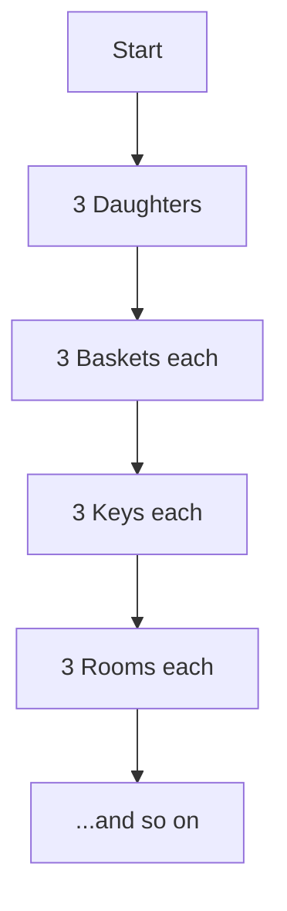

import Callout from '@/components/Callout.astro'

## Example 1: The Stones that Shine (Page 23)

**Problem:**
3 daughters receive 3 baskets each.
Each basket has 3 keys.
Each key opens 3 rooms.
Each room has 3 tables.
Each table has 3 necklaces.
Each necklace has 3 diamonds.
How many diamonds are there?

**Solution:**
This is a classic powers of 3 problem.
*   Daughters: 3 ($3^1$)
*   Baskets: $3 \times 3 = 9$ ($3^2$)
*   Keys: $9 \times 3 = 27$ ($3^3$)
*   Rooms: $27 \times 3 = 81$ ($3^4$)
*   Tables: $81 \times 3 = 243$ ($3^5$)
*   Necklaces: $243 \times 3 = 729$ ($3^6$)
*   Diamonds: $729 \times 3 = 2187$ ($3^7$)

**Answer:** There are $3^7 = 2187$ diamonds.

## Example 2: The Magical Pond (Page 25)

**Problem:**
A lotus doubles every day. The pond is full on Day 30.
On which day was it half full?

**Solution:**
Since the lotus population **doubles** every day, going backwards means **halving** every day.
*   Day 30: Full (100%)
*   Day 29: Half Full (50%)
*   Day 28: Quarter Full (25%)

**Answer:** Day 29.

## Example 3: Password Combinations (Page 26)

**Problem:**
A safe has a 5-digit password (digits 0-9). How many combinations?

**Solution:**
*   Digit 1: 10 options (0-9)
*   Digit 2: 10 options
*   Digit 3: 10 options
*   Digit 4: 10 options
*   Digit 5: 10 options

Total combinations = $10 \times 10 \times 10 \times 10 \times 10 = 10^5 = 1,00,000$.

## Example 4: Comparing Large Numbers (Page 29)

**Problem:**
Which is larger: $10000000000000$ or $999999 \times 999999$?

**Solution:**
1.  Roxie's number: $10,000,000,000,000 = 10^{13}$.
2.  Estu's number: $999,999 \approx 10^6$.
    So $(10^6) \times (10^6) = 10^{12}$.
    Even precisely: $(10^6 - 1) \times (10^6 - 1) \approx 10^{12}$.

Since $10^{13} > 10^{12}$, **Roxie's number is larger.**