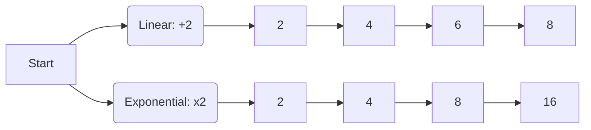

import Callout from '@/components/Callout.astro'

## Linear vs. Exponential Growth

There are two main ways quantities increase:
1.  **Linear Growth (Additive):** Adding a fixed amount each step.
    *   *Example:* Walking up a ladder. Each step adds 20 cm to your height.
    *   Sequence: 20, 40, 60, 80...
2.  **Exponential Growth (Multiplicative):** Multiplying by a fixed amount each step.
    *   *Example:* Cell division or folding paper. Each step **doubles** the previous value.
    *   Sequence: 1, 2, 4, 8, 16...

### The Paper Folding Experiment

Let's look at the thickness of paper (assumed $0.001$ cm) as we fold it.

| Folds ($n$) | Calculation | Thickness ($2^n \times 0.001$) | Comparison |
| :--- | :--- | :--- | :--- |
| 0 | $2^0$ | 0.001 cm | Sheet of paper |
| 10 | $2^{10}$ | $\approx 1.02$ cm | Notebook |
| 17 | $2^{17}$ | $\approx 131$ cm | 4-year-old child |
| 27 | $2^{27}$ | $\approx 1.3$ km | Small Mountain |
| 30 | $2^{30}$ | $\approx 10.7$ km | Cruising altitude of jets |
| 46 | $2^{46}$ | $\approx 70,368,744$ km | Distance to Moon (approx) |

<Callout variant="tip">
**Key Insight:** Linear growth adds up slowly. Exponential growth starts slow but explodes very quickly. This is why just 46 folds can reach the moon!
</Callout>

### Visualizing the Difference

