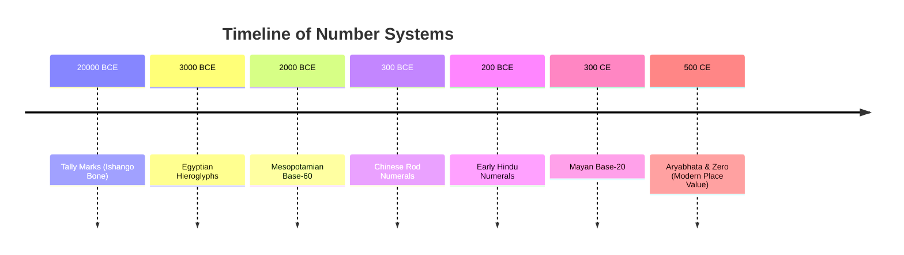

<<<FILE_START: index.mdx>>>
---
title: "Chapter 3: A Story of Numbers"
description: "A journey through the evolution of numbers, from primitive counting to the modern Hindu number system."
date: 2024-04-10
tags: ["math", "history", "number-systems", "grade-8"]
order: 1
draft: false
---

import Callout from '@/components/Callout.astro'

## Introduction

How did humans learn to count? It wasn't an overnight discovery. From using simple scratches on bones to developing complex place-value systems, the story of numbers is a fascinating journey across civilizations.

This chapter takes us back in time to explore how different cultures—from the cave dwellers to the Mesopotamians, Egyptians, Mayans, Chinese, and Indians—solved the problem of representing large quantities.

## The Evolution of Number Systems

## Topics Covered

1.  **The Need for Counting:** From tracking livestock to marking calendars.
2.  **Early Methods:** Body parts, tally marks, and counting in twos.
3.  **Roman Numerals:** An additive system using letters.
4.  **The Idea of a Base:** Grouping numbers (Base-5, Base-10, Base-60).
5.  **Ancient Systems:**
    *   **Egyptian:** Non-positional base-10.
    *   **Mesopotamian:** Positional base-60.
    *   **Mayan:** Positional base-20.
    *   **Chinese:** Rod numerals.
6.  **The Hindu Number System:** The revolutionary place-value system with Zero.

<Callout variant="tip">
**Key Concept:** A **Place Value System** is one where the value of a digit depends on its position in the number (e.g., the '5' in 50 is different from the '5' in 500). This was the game-changer that made modern mathematics possible.
</Callout>
<<<FILE_END>>>

<<<FILE_START: topics/01-early-counting.mdx>>>
---
title: "Early Counting Methods"
description: "How early humans counted using one-to-one mapping, body parts, and tally marks."
date: 2024-04-10
tags: ["history", "counting", "tally-marks"]
order: 2
draft: false
---

import Callout from '@/components/Callout.astro'

## The Mechanism of Counting

Before numbers were written, humans needed to count things like cattle or days. They used **One-to-One Mapping**:
1.  **Physical Objects:** Using a pebble or a stick for each cow.
2.  **Sounds/Names:** Assigning a sound (like 'a', 'b', 'c') to each object.
3.  **Written Symbols:** Making scratches or marks.

### Tally Marks
One of the oldest methods is making notches on bones.
*   **Ishango Bone:** 20,000–35,000 years old (Democratic Republic of Congo).
*   **Lebombo Bone:** ~44,000 years old (South Africa) with 29 notches.

  <svg width="300" height="100" viewBox="0 0 300 100" xmlns="http://www.w3.org/2000/svg">
    <!-- Bone Shape -->
    <path d="M 20 40 Q 10 20 30 20 L 270 20 Q 290 20 280 40 Q 290 60 270 60 L 30 60 Q 10 60 20 40 Z" fill="#e0cda9" stroke="#8b7355" stroke-width="2"/>
    <!-- Tally Marks -->
    <line x1="40" y1="25" x2="40" y2="55" stroke="#5c4033" stroke-width="2"/>
    <line x1="50" y1="25" x2="50" y2="55" stroke="#5c4033" stroke-width="2"/>
    <line x1="60" y1="25" x2="60" y2="55" stroke="#5c4033" stroke-width="2"/>
    <line x1="70" y1="25" x2="70" y2="55" stroke="#5c4033" stroke-width="2"/>
    <line x1="90" y1="25" x2="90" y2="55" stroke="#5c4033" stroke-width="2"/>
    <line x1="100" y1="25" x2="100" y2="55" stroke="#5c4033" stroke-width="2"/>

    <text x="150" y="85" font-family="sans-serif" font-size="12" text-anchor="middle" fill="currentColor">Ancient Tally Stick</text>
  </svg>

### Counting in Twos (Gumulgal System)
The **Gumulgal** people of Australia used a system based on just two numbers:
1.  **urapon** (1)
2.  **ukasar** (2)

Larger numbers were built by combining these:
*   3 = **ukasar-urapon** (2 + 1)
*   4 = **ukasar-ukasar** (2 + 2)
*   5 = **ukasar-ukasar-urapon** (2 + 2 + 1)

This is an early example of an additive system using a small "base" (grouping size).
<<<FILE_END>>>

<<<FILE_START: topics/02-roman-numerals.mdx>>>
---
title: "Roman Numerals"
description: "Understanding the Roman number system, its symbols, and limitations."
date: 2024-04-10
tags: ["roman", "numerals", "base-10"]
order: 3
draft: false
---

## Landmark Numbers
The Roman system uses specific letters as **landmark numbers**.

| Symbol | I | V | X | L | C | D | M |
| :--- | :--- | :--- | :--- | :--- | :--- | :--- | :--- |
| **Value** | 1 | 5 | 10 | 50 | 100 | 500 | 1000 |

## Rules of Formation
1.  **Addition:** Symbols placed after a larger one are added ($VI = 5 + 1 = 6$).
2.  **Subtraction:** Symbols placed before a larger one are subtracted ($IV = 5 - 1 = 4$).
3.  **Repetition:** Symbols (I, X, C, M) can be repeated up to 3 times ($XXX = 30$). V, L, D are never repeated.

### Arithmetic Difficulty
Adding Roman numerals is cumbersome because it involves grouping and regrouping letters rather than simple column addition.

**Example:** $27 + 43$
*   $27 = XXVII$
*   $43 = XLIII$
*   Summing Is: $II + III = V$
*   Summing Xs: $XX + XL$ (This is hard to visualize directly without converting).

This difficulty paved the way for better systems.
<<<FILE_END>>>

<<<FILE_START: topics/03-egyptian-system.mdx>>>
---
title: "Egyptian Number System"
description: "A base-10 non-positional system using hieroglyphs."
date: 2024-04-10
tags: ["egyptian", "hieroglyphs", "base-10"]
order: 4
draft: false
---

## The Concept of a Base
The Egyptians used a **Base-10** system. This means they grouped things in tens.
However, it was **not positional**. The value of a symbol was fixed, regardless of where it was written.

## Symbols (Hieroglyphs)

  <svg width="400" height="150" viewBox="0 0 400 150" xmlns="http://www.w3.org/2000/svg">
    <!-- 1: Stroke -->
    <line x1="30" y1="50" x2="30" y2="100" stroke="currentColor" stroke-width="3"/>
    <text x="30" y="130" text-anchor="middle" fill="currentColor">1 (Stroke)</text>

    <!-- 10: Heel Bone (Arch) -->
    <path d="M 80 100 Q 95 40 110 100" fill="none" stroke="currentColor" stroke-width="3"/>
    <text x="95" y="130" text-anchor="middle" fill="currentColor">10 (Heel)</text>

    <!-- 100: Coil of Rope -->
    <path d="M 160 90 Q 150 60 170 60 Q 190 60 180 90 Q 170 110 160 90" fill="none" stroke="currentColor" stroke-width="3"/>
    <text x="170" y="130" text-anchor="middle" fill="currentColor">100 (Coil)</text>

    <!-- 1000: Lotus Flower -->
    <path d="M 230 100 L 230 70 L 220 60 L 230 50 L 240 60 L 230 70" fill="none" stroke="currentColor" stroke-width="2"/>
    <circle cx="230" cy="110" r="10" fill="none" stroke="currentColor"/>
    <text x="230" y="130" text-anchor="middle" fill="currentColor">1000 (Lotus)</text>

    <!-- 10000: Finger -->
    <path d="M 300 100 L 300 60 L 320 70" fill="none" stroke="currentColor" stroke-width="3"/>
    <text x="310" y="130" text-anchor="middle" fill="currentColor">10,000 (Finger)</text>
  </svg>

## Representation
To write **324**:
*   3 Hundreds (Coils)
*   2 Tens (Heels)
*   4 Ones (Strokes)

Written as: `@@@ nn ||||` (grouping order didn't strictly matter, though usually largest to smallest).

## Shortcomings
To write very large numbers (like 1,000,000,000), you would need new symbols for every power of 10. A positional system solves this by reusing symbols.
<<<FILE_END>>>

<<<FILE_START: topics/04-mesopotamian-system.mdx>>>
---
title: "Mesopotamian (Babylonian) System"
description: "The first positional number system using Base-60."
date: 2024-04-10
tags: ["babylonian", "base-60", "place-value"]
order: 5
draft: false
---

import Callout from '@/components/Callout.astro'

## Sexagesimal System (Base-60)
The Mesopotamians used **Base-60**. This legacy survives today in how we measure time (60 seconds = 1 minute) and angles (360 degrees).

## Symbols
They used only two basic marks made by a stylus on clay:
1.  **Pin/Wedge ($\triangledown$):** Represents **1**.
2.  **Hook/Angle (<):** Represents **10**.

  <svg width="200" height="100" viewBox="0 0 200 100" xmlns="http://www.w3.org/2000/svg">
    <!-- 1 -->
    <path d="M 50 20 L 60 20 L 55 60 Z" fill="currentColor"/>
    <text x="55" y="80" text-anchor="middle" fill="currentColor">1</text>

    <!-- 10 -->
    <path d="M 120 40 L 150 30 L 150 50 Z" fill="currentColor"/>
    <text x="135" y="80" text-anchor="middle" fill="currentColor">10</text>
  </svg>

## Place Value
Numbers were written in groups. The value depended on the position (powers of 60).

**Example: 640**
$$
640 = (10 \times 60) + 40
$$
*   **Left Group (60s place):** Hook (10) representing $10 \times 60$.
*   **Right Group (1s place):** 4 Hooks (40).

<Callout variant="warning">
**The Zero Problem:** Initially, they had no zero. A blank space was used, which could be confusing. Later, a placeholder symbol was introduced, but it wasn't a full zero number like we use today.
</Callout>
<<<FILE_END>>>

<<<FILE_START: topics/05-mayan-chinese-systems.mdx>>>
---
title: "Mayan and Chinese Systems"
description: "Exploring the Vigesimal (Base-20) Mayan system and Chinese Rod Numerals."
date: 2024-04-10
tags: ["mayan", "chinese", "base-20"]
order: 6
draft: false
---

## The Mayan System (Base-20)
Developed in Central America, this system used **Base-20**.
It had a symbol for **Zero** (a shell shape), which was a major advancement.

### Symbols
*   **Dot ($\bullet$):** 1
*   **Bar (—):** 5
*   **Shell:** 0

Numbers were written vertically.
*   **Top Level:** Multiples of 400 ($20^2$) *[Wait, specific calendar counts varied, but pure math was base-20]*
*   **Middle Level:** Multiples of 20 ($20^1$)
*   **Bottom Level:** Multiples of 1 ($20^0$)

  <svg width="300" height="150" viewBox="0 0 300 150" xmlns="http://www.w3.org/2000/svg">
    <!-- Mayan 7: Bar and 2 dots -->
    <circle cx="50" cy="40" r="5" fill="currentColor"/>
    <circle cx="70" cy="40" r="5" fill="currentColor"/>
    <rect x="40" y="55" width="40" height="10" fill="currentColor"/>
    <text x="60" y="90" text-anchor="middle" fill="currentColor">7</text>

    <!-- Mayan 0: Shell -->
    <path d="M 150 40 Q 180 40 180 60 Q 150 80 120 60 Q 120 40 150 40 M 150 40 L 150 80 M 130 50 L 170 50" fill="none" stroke="currentColor" stroke-width="2"/>
    <text x="150" y="100" text-anchor="middle" fill="currentColor">0 (Shell)</text>
  </svg>

## The Chinese Rod Numerals (Base-10)
A decimal place-value system used for calculation on counting boards.
It alternated between **vertical** (Zong) and **horizontal** (Heng) rods to distinguish positions (Units vs Tens vs Hundreds).

| Place | 1000s | 100s | 10s | 1s |
| :--- | :--- | :--- | :--- | :--- |
| **Type** | Heng | Zong | Heng | Zong |

This prevented confusion when writing numbers like 11 (one vertical next to another vertical would look like 2).
<<<FILE_END>>>

<<<FILE_START: topics/06-hindu-number-system.mdx>>>
---
title: "The Hindu Number System"
description: "The origin of the modern decimal place-value system and the invention of Zero."
date: 2024-04-10
tags: ["india", "zero", "modern-math"]
order: 7
draft: false
---

import Callout from '@/components/Callout.astro'

## The Ultimate System
The system we use today originated in India (~2000 years ago). It combined the best features of previous systems:
1.  **Base-10:** Intuitive (10 fingers).
2.  **Positional:** Unending numbers with few symbols.
3.  **Zero ($0$):** A true number, not just a placeholder.

## Evolution of Digits
*   **Brahmi Numerals:** Ancestors of 1-9.
*   **Gwalior Inscription:** Early written zero.
*   **Journey:** India $\to$ Arabia (Al-Khwarizmi) $\to$ Europe (Fibonacci).

## The Power of Zero
In ancient India, zero was defined as a number that results from subtracting a number from itself ($x - x = 0$). Mathematicians like **Aryabhata** and **Brahmagupta** defined rules for calculating with zero, creating a complete arithmetic system.

<Callout variant="tip">
**Why is it called Hindu-Arabic?**
Europeans learned the system from Arab mathematicians, so they called them "Arabic numerals." Arabs called them "Hindu numerals" because they learned them from India. Today, it is properly called the **Hindu Number System**.
</Callout>
<<<FILE_END>>>

<<<FILE_START: solutions/ex-3.1.mdx>>>
---
title: "Figure It Out: Stick Arithmetic"
description: "Solution to the stick counting method on Page 54."
date: 2024-04-10
tags: ["solutions", "sticks", "arithmetic"]
order: 8
draft: false
---

## Question 1
**Using sticks (Method 1), give a method for adding, subtracting, multiplying, and dividing.**

**Solution:**
1.  **Addition:** Combine the two bundles of sticks into one large bundle. The total count is the sum.
2.  **Subtraction:** To subtract collection B from collection A, remove one stick from A for every stick in B. The remaining sticks in A are the result.
3.  **Multiplication:** To multiply a collection of $N$ sticks by $M$, create $M$ identical piles of $N$ sticks each. Combine them all to get the product.
4.  **Division:** To divide $N$ sticks by $M$, distribute the sticks one by one into $M$ separate piles until you run out. The size of one pile is the quotient.

## Question 2
**Extending the 'aa' (base-26 letters) system.**

**Solution:**
This works like a spreadsheet column system (A, B... Z, AA, AB... AZ, BA...).
*   After 'z', we start with two letters: 'aa', 'ab', ... 'az'.
*   Then 'ba', 'bb' ... 'bz'.
*   This creates a base-26 bijective system (where there is no zero symbol).

## Question 3
**Make your own number system.**
*   *Student Activity:* Try using shapes like $\triangle$ for 1 and $\square$ for 5.
<<<FILE_END>>>

<<<FILE_START: solutions/ex-3.2.mdx>>>
---
title: "Figure It Out: Roman Numerals"
description: "Solutions to Roman Numeral exercises on Page 59."
date: 2024-04-10
tags: ["solutions", "roman"]
order: 9
draft: false
---

## Question 1
**Represent the following in Roman system:**

**(i) 1222**
*   1000 = M
*   200 = CC
*   20 = XX
*   2 = II
*   **Answer:** MCCXXII

**(ii) 2999**
*   2000 = MM
*   900 = CM (1000 - 100)
*   90 = XC (100 - 10)
*   9 = IX (10 - 1)
*   **Answer:** MMCMXCIX

**(iii) 302**
*   300 = CCC
*   2 = II
*   **Answer:** CCCII

**(iv) 715**
*   700 = DCC (500 + 100 + 100)
*   10 = X
*   5 = V
*   **Answer:** DCCXV
<<<FILE_END>>>

<<<FILE_START: solutions/ex-3.3.mdx>>>
---
title: "Figure It Out: Gumulgal System"
description: "Solutions to arithmetic in the Gumulgal system on Page 60."
date: 2024-04-10
tags: ["solutions", "indigenous", "base-2"]
order: 10
draft: false
---

## Question 2
**Perform operations in Gumulgal (counting by 2s):**

**(i) Addition:**
(ukasar-ukasar-ukasar-ukasar-urapon) + (ukasar-ukasar-ukasar-urapon)
*   Left: $2+2+2+2+1 = 9$
*   Right: $2+2+2+1 = 7$
*   Sum: $16$.
*   Gumulgal for 16: Eight 'ukasar's.
*   **Answer:** ukasar-ukasar-ukasar-ukasar-ukasar-ukasar-ukasar-ukasar.

**(ii) Subtraction:**
(9) - (5) = 4
*   4 is two 2s.
*   **Answer:** ukasar-ukasar.

**(iii) Multiplication:**
(ukasar-ukasar-ukasar-ukasar-urapon) $\times$ (ukasar-ukasar)
*   $9 \times 4 = 36$.
*   **Answer:** Eighteen 'ukasar's strung together.

**(iv) Division:**
(16) $\div$ (2) = 8.
*   8 is four 2s.
*   **Answer:** ukasar-ukasar-ukasar-ukasar.
<<<FILE_END>>>

<<<FILE_START: solutions/ex-3.4.mdx>>>
---
title: "Figure It Out: Egyptian System"
description: "Solutions to Egyptian numeral conversions on Page 62."
date: 2024-04-10
tags: ["solutions", "egyptian"]
order: 11
draft: false
---

## Question 1
**Represent in Egyptian System:**

*   **10458:**
    *   1 Finger (10,000)
    *   4 Coils (400)
    *   5 Heels (50)
    *   8 Strokes (8)
*   **1023:** 1 Lotus, 2 Heels, 3 Strokes.
*   **2660:** 2 Lotuses, 6 Coils, 6 Heels.
*   **784:** 7 Coils, 8 Heels, 4 Strokes.
*   **1111:** 1 Lotus, 1 Coil, 1 Heel, 1 Stroke.
*   **70707:** 7 Fingers, 7 Coils, 7 Strokes.

## Question 2
**Identify the numbers:**

**(i)** 2 Coils, 3 Heels, 4 Strokes.
$$100+100 + 10+10+10 + 1+1+1+1 = 234$$

**(ii)** 4 Lotuses, 3 Coils, 2 Strokes.
$$4000 + 300 + 2 = 4302$$
<<<FILE_END>>>

<<<FILE_START: solutions/ex-3.5.mdx>>>
---
title: "Figure It Out: Base-5 System"
description: "Solutions to the Base-5 activity on Page 63."
date: 2024-04-10
tags: ["solutions", "base-5"]
order: 12
draft: false
---

## Question 1
**Write in Base-5 system:**
Symbols: $\triangle$ (1), $\square$ (5), $\hexagon$ (25), $\bigcirc$ (125), $\sim$ (625).

*   **15:** Three 5s $\rightarrow$ $\square\square\square$
*   **50:** Two 25s $\rightarrow$ $\hexagon\hexagon$
*   **137:**
    *   $125 \times 1 = 125$ ($\bigcirc$)
    *   $137 - 125 = 12$.
    *   $12 = 5 \times 2 + 2$ ($\square\square + \triangle\triangle$)
    *   **Answer:** $\bigcirc \square\square \triangle\triangle$
*   **293:**
    *   $125 \times 2 = 250$ ($\bigcirc\bigcirc$)
    *   $293 - 250 = 43$.
    *   $25 \times 1 = 25$ ($\hexagon$)
    *   $43 - 25 = 18$.
    *   $5 \times 3 = 15$ ($\square\square\square$)
    *   $18 - 15 = 3$ ($\triangle\triangle\triangle$)
    *   **Answer:** $\bigcirc\bigcirc \hexagon \square\square\square \triangle\triangle\triangle$
*   **651:**
    *   $625 \times 1$ ($\sim$)
    *   $25 \times 1$ ($\hexagon$)
    *   $1 \times 1$ ($\triangle$)
    *   **Answer:** $\sim \hexagon \triangle$

## Question 2
**Is there a number that cannot be represented?**
No. Just like base-10, any integer can be broken down into powers of 5. As long as we have symbols for higher powers (or simply repeat the highest symbol enough times), we can write any number.
<<<FILE_END>>>

<<<FILE_START: solutions/ex-3.6.mdx>>>
---
title: "Figure It Out: Adding Egyptian Numerals"
description: "Solutions to addition exercises on Page 65."
date: 2024-04-10
tags: ["solutions", "egyptian", "addition"]
order: 13
draft: false
---

## Question 1
**Add the following Egyptian numerals:**

**(i)**
*   Number A: 1 Lotus, 3 Coils, 6 Heels, 5 Strokes ($1365$)
*   Number B: 2 Coils, 3 Heels, 4 Strokes ($234$)
*   **Sum:** 1 Lotus, 5 Coils, 9 Heels, 9 Strokes.
*   **Result:** 1599.

**(ii)**
*   Number A: 2 Coils, 6 Heels ($260$)
*   Number B: 1 Coil, 5 Heels ($150$)
*   **Total:** 3 Coils, 11 Heels.
*   **Regrouping:** 10 Heels = 1 Coil.
*   **Result:** 4 Coils, 1 Heel ($410$).

## Question 2
**Add Base-5 Numerals:**
$\bigcirc\bigcirc\bigcirc \square\triangle\triangle + \bigcirc\bigcirc\bigcirc\bigcirc \square\triangle\triangle$

*   **Triangles (1s):** 2 + 2 = 4 ($\triangle\triangle\triangle\triangle$)
*   **Squares (5s):** 1 + 1 = 2 ($\square\square$)
*   **Circles (125s):** 3 + 4 = 7.
    *   Regrouping: 5 Circles = 1 Wiggle (625).
    *   Remainder: 2 Circles.
*   **Answer:** $\sim \bigcirc\bigcirc \square\square \triangle\triangle\triangle\triangle$
<<<FILE_END>>>

<<<FILE_START: solutions/ex-3.8.mdx>>>
---
title: "Figure It Out: Mesopotamian System"
description: "Solutions to Base-60 conversions on Page 73."
date: 2024-04-10
tags: ["solutions", "mesopotamian"]
order: 14
draft: false
---

**Represent the numbers using Wedge ($\triangledown=1$) and Hook ($<=10$):**

**(i) 63**
*   $63 = 1 \times 60 + 3$.
*   Left (60s): $\triangledown$
*   Right (1s): $\triangledown\triangledown\triangledown$
*   **Notation:** $\triangledown \quad \triangledown\triangledown\triangledown$

**(ii) 132**
*   $132 = 2 \times 60 + 12$.
*   Left (60s): $\triangledown\triangledown$
*   Right (1s): $<\triangledown\triangledown$
*   **Notation:** $\triangledown\triangledown \quad <\triangledown\triangledown$

**(iii) 200**
*   $200 = 3 \times 60 + 20$.
*   Left: $\triangledown\triangledown\triangledown$
*   Right: $<<$
*   **Notation:** $\triangledown\triangledown\triangledown \quad <<$

**(iv) 60**
*   $60 = 1 \times 60 + 0$.
*   Left: $\triangledown$
*   Right: (Blank/Placeholder)
*   **Notation:** $\triangledown$ (followed by space).

**(v) 3605**
*   $3605 = 1 \times 3600 + 0 \times 60 + 5$.
*   Left (3600s): $\triangledown$
*   Middle (60s): (Blank/Zero)
*   Right (1s): $\triangledown\triangledown\triangledown\triangledown\triangledown$
<<<FILE_END>>>

<<<FILE_START: solutions/ex-3.9.mdx>>>
---
title: "Figure It Out: Mayan System"
description: "Solutions to Mayan conversions on Page 76."
date: 2024-04-10
tags: ["solutions", "mayan"]
order: 15
draft: false
---

**Represent using Mayan System (Vertical: 20s on top, 1s on bottom):**
*Symbols: Dot (1), Bar (5).*

**(i) 77**
*   $77 = 3 \times 20 + 17$.
*   **Top (20s):** 3 dots ($\bullet\bullet\bullet$).
*   **Bottom (1s):** 17 (3 Bars + 2 Dots).

**(ii) 100**
*   $100 = 5 \times 20 + 0$.
*   **Top:** 5 (1 Bar).
*   **Bottom:** 0 (Shell).

**(iii) 361**
*   $361 = 18 \times 20 + 1$.
*   **Top:** 18 (3 Bars + 3 Dots).
*   **Bottom:** 1 Dot.

**(iv) 721**
*   $721 = 1 \times 400 + 16 \times 20 + 1$. (Assuming 3 levels: 400s, 20s, 1s).
*   **Top (400s):** 1 Dot.
*   **Middle (20s):** 16 (3 Bars + 1 Dot).
*   **Bottom (1s):** 1 Dot.
<<<FILE_END>>>

<<<FILE_START: solutions/ex-3.10.mdx>>>
---
title: "Figure It Out: Chinese and Hindu Systems"
description: "Solutions to exercises on Page 80."
date: 2024-04-10
tags: ["solutions", "chinese", "hindu"]
order: 16
draft: false
---

## Question 1 (Chinese System)
**Why alternate between Zong (vertical) and Heng (horizontal)?**
To distinguish between place values.
*   If we used only verticals, a number like **11** (one ten, one unit) would look like `||`, which could be mistaken for **2**.
*   By alternating, 11 becomes `- |` (Horizontal 1, Vertical 1), clearly showing two different positions.

**Represent 41 with only Zongs:**
It would be `|||| |`. Without spaces, it looks like `|||||` (5). This creates ambiguity.

## Question 2 (Base-2 Gumulgal Place Value)
If we used 'ukasar' (2) and 'urapon' (1) in a place value system (Base 2):
*   Digits: 0 and 1. Gumulgal has no zero.
*   If we define urapon=1 and a new zero, then:
    *   $10_2$ (2) = 1 urapon, 0.
    *   $11_2$ (3) = 1 urapon, 1 urapon.
*   Gumulgal was additive ($2+1=3$). A positional system uses powers ($1 \times 2^1 + 1 \times 2^0 = 3$).

## Question 4 (8 Fingers)
**If humans had 8 fingers, we would use Base-8 (Octal).**
*   **Digits:** 0, 1, 2, 3, 4, 5, 6, 7. (No digit 8).
*   **Representation of 25 (base-10):**
    *   Base-8: $25 = 3 \times 8 + 1 \rightarrow 31_8$.
    *   Base-5: $25 = 1 \times 25 + 0 \times 5 + 0 \times 1 \rightarrow 100_5$.
    *   Base-2: $25 = 16 + 8 + 1 = 11001_2$.
<<<FILE_END>>>

<<<FILE_START: practice/solved-examples.mdx>>>
---
title: "Solved Examples: Base Conversions"
description: "Practice problems for converting between Base-10 and other historical bases."
date: 2024-04-10
tags: ["practice", "bases"]
order: 17
draft: false
---

import Callout from '@/components/Callout.astro'

## Example 1: Converting to Mayan
**Convert 45 to Mayan Numerals.**

**Solution:**
1.  Determine the base: 20.
2.  Divide 45 by 20:
    $$45 \div 20 = 2 \text{ remainder } 5$$
3.  **Top position (20s):** 2 (Two dots $\bullet\bullet$)
4.  **Bottom position (1s):** 5 (One bar —)

## Example 2: Converting to Base-5
**Convert 34 to Base-5.**

**Solution:**
1.  Powers of 5: 1, 5, 25.
2.  Largest power $\le$ 34 is 25.
    $$34 \div 25 = 1 \text{ remainder } 9$$
3.  Next power is 5.
    $$9 \div 5 = 1 \text{ remainder } 4$$
4.  Last power is 1.
    $$4 \div 1 = 4$$
5.  **Result:** $114_5$ ($1 \times 25 + 1 \times 5 + 4 \times 1$).

## Example 3: Mesopotamian Addition
**Add $12$ and $50$ in Base-60.**

**Solution:**
1.  Convert to Base-10 sum: $12 + 50 = 62$.
2.  Convert 62 to Base-60.
    $$62 = 1 \times 60 + 2$$
3.  **Representation:**
    *   60s place: 1 Wedge ($\triangledown$)
    *   1s place: 2 Wedges ($\triangledown\triangledown$)
    *   Written: $\triangledown \quad \triangledown\triangledown$
<<<FILE_END>>>
