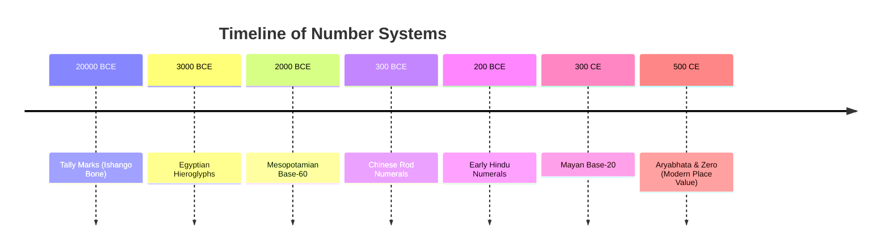

import Callout from '@/components/Callout.astro'

## Introduction

How did humans learn to count? It wasn't an overnight discovery. From using simple scratches on bones to developing complex place-value systems, the story of numbers is a fascinating journey across civilizations.

This chapter takes us back in time to explore how different cultures—from the cave dwellers to the Mesopotamians, Egyptians, Mayans, Chinese, and Indians—solved the problem of representing large quantities.

## The Evolution of Number Systems

## Topics Covered

1.  **The Need for Counting:** From tracking livestock to marking calendars.
2.  **Early Methods:** Body parts, tally marks, and counting in twos.
3.  **Roman Numerals:** An additive system using letters.
4.  **The Idea of a Base:** Grouping numbers (Base-5, Base-10, Base-60).
5.  **Ancient Systems:**
    *   **Egyptian:** Non-positional base-10.
    *   **Mesopotamian:** Positional base-60.
    *   **Mayan:** Positional base-20.
    *   **Chinese:** Rod numerals.
6.  **The Hindu Number System:** The revolutionary place-value system with Zero.

<Callout variant="tip">
**Key Concept:** A **Place Value System** is one where the value of a digit depends on its position in the number (e.g., the '5' in 50 is different from the '5' in 500). This was the game-changer that made modern mathematics possible.
</Callout>