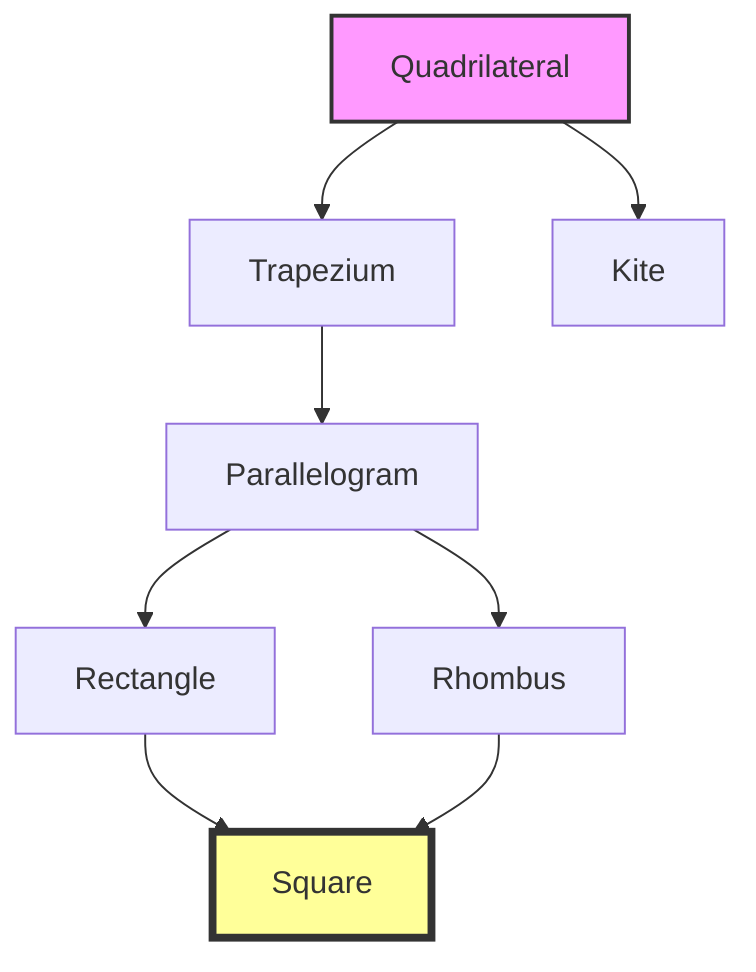

import Callout from '@/components/Callout.astro'

## Introduction

In this chapter, we explore **Quadrilaterals**, which are four-sided closed figures. The word comes from Latin: *quadri* (four) and *latus* (sides). We will study specific types like rectangles, squares, parallelograms, rhombuses, kites, and trapeziums, deducing their properties through geometric reasoning.

### Key Concept: Angle Sum Property
The sum of the angles of a quadrilateral is always **$360^\circ$**.

$$
\angle A + \angle B + \angle C + \angle D = 360^\circ
$$

This is because any quadrilateral can be divided into two triangles by drawing a diagonal. Since the sum of angles in a triangle is $180^\circ$, for two triangles it is $180^\circ \times 2 = 360^\circ$.

## Formula Sheet: Properties Summary

| Quadrilateral | Sides | Angles | Diagonals |
| :--- | :--- | :--- | :--- |
| **Parallelogram** | Opposite sides equal & parallel | Opposite angles equal; Adjacent sum to $180^\circ$ | Bisect each other |
| **Rectangle** | Opposite sides equal & parallel | All angles $90^\circ$ | Equal length; Bisect each other |
| **Rhombus** | All sides equal; Opposite parallel | Opposite angles equal | Bisect each other at **$90^\circ$** |
| **Square** | All sides equal; Opposite parallel | All angles $90^\circ$ | Equal length; Bisect at **$90^\circ$** |
| **Trapezium** | One pair of opposite sides parallel | - | - |
| **Kite** | Adjacent pairs of sides equal | - | One diagonal bisects the other at $90^\circ$ |

## Hierarchy of Quadrilaterals

Understanding how these shapes relate to each other is crucial. A square is a special rectangle, and a rectangle is a special parallelogram.

## Topics Covered
1.  **Rectangles and Squares:** Defining them via diagonals and angles.
2.  **Parallelograms:** Deducting properties of sides and angles.
3.  **Rhombus:** The equilateral quadrilateral.
4.  **Kite and Trapezium:** Special cases of symmetry and parallel lines.
5.  **Deductive Reasoning:** Using congruence to prove geometric properties.