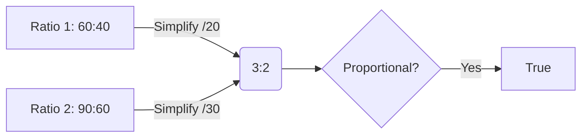

## What is a Ratio?
A ratio represents the relationship between two quantities.
For Image A (Width 60, Height 40), the ratio is **60 : 40**.

This means for every 60 units of width, there are 40 units of height.

## Simplest Form
We can simplify ratios by dividing both terms by their Highest Common Factor (HCF).
*   **Ratio:** $60 : 40$
*   **HCF of 60 and 40:** 20
*   **Divide by 20:** $3 : 2$

So, the fundamental relationship is **3 units of width for every 2 units of height**.

## Proportion
When two ratios reduce to the same simplest form, they are **proportional**.
We write this as:
$$ a : b :: c : d $$

**Example:**
*   Image A: $60 : 40 \rightarrow 3 : 2$
*   Image D: $90 : 60 \rightarrow 3 : 2$

Since $3:2 = 3:2$, Image A and Image D are proportional ($60:40 :: 90:60$).

