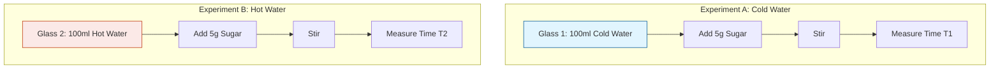

import Callout from '@/components/Callout.astro'

## Scenario: The Dissolving Sugar Mystery

To practice the skills learned in the "Puri" experiment, let's apply the scientific method to a common kitchen observation.

**Observation:** You notice that sugar seems to disappear faster in hot tea than in cold lemonade.

### Step 1: Formulate a Question
**Q:** Does the temperature of water affect how fast sugar dissolves?

### Step 2: Identify Variables

| Variable Type | What is it in this experiment? |
| :--- | :--- |
| **Independent Variable**  *(What we change)* | The temperature of the water (Hot vs. Cold). |
| **Dependent Variable**  *(What we measure)* | The time taken for the sugar to completely dissolve (in seconds). |
| **Control Variables**  *(What we keep same)* | 1. Amount of water (e.g., 100ml). 2. Amount of sugar (e.g., 1 teaspoon). 3. Type of sugar (Granulated). 4. Stirring speed (e.g., stir 5 times). |

### Step 3: Experimental Setup (Diagram)

### Step 4: Hypothesize

Based on the particle theory (which you will learn later in this book), we hypothesize that **higher temperature** makes particles move faster, so sugar should dissolve faster in hot water.

### Step 5: Data Table Template

Create a table like this in your notebook when you do the experiment:

| Trial | Temperature ($^\circ C$) | Time to Dissolve (seconds) | Observations |
| :--- | :--- | :--- | :--- |
| 1 | Cold ($10^\circ C$) | | Water stayed clear longer |
| 2 | Hot ($80^\circ C$) | | Sugar disappeared quickly |

<Callout variant="success">
**Conclusion:** If $T_{hot} < T_{cold}$, then our hypothesis is correct: Temperature increases the rate of dissolving.
</Callout>
