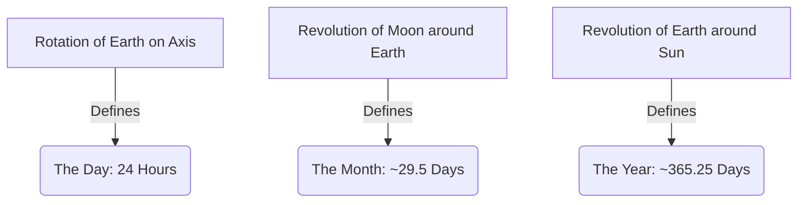

<<<FILE_START: index.mdx>>>
---
title: "Keeping Time with the Skies"
description: "Understanding how celestial motions determine our days, months, and years, and exploring the science of calendars."
date: 2024-04-10
tags: ["astronomy", "time", "moon-phases", "calendars", "satellites"]
order: 1
draft: false
---

import Callout from '@/components/Callout.astro'

# Keeping Time with the Skies

Have you ever wondered why a week has 7 days, or why a month is roughly 30 days? The answer lies above us. For thousands of years, humans have looked at the sky to measure time. This chapter explores the natural clocks provided by the Earth, Moon, and Sun.

We will learn why the Moon changes shape, how calendars were invented to track seasons, and how modern satellites help us today.

## Key Concepts

1.  **Phases of the Moon**: Why the moon waxes and wanes.
2.  **Units of Time**: How celestial motion defines the Day, Month, and Year.
3.  **Calendars**: The difference between Lunar, Solar, and Luni-solar calendars.
4.  **Satellites**: Natural (Moon) vs. Artificial (Man-made).

## Key Definitions

| Term | Definition |
| :--- | :--- |
| **Mean Solar Day** | The average time (24 hours) for the Sun to return to the highest point in the sky. |
| **Solar Year** | The time Earth takes to complete one revolution around the Sun (~365.25 days). |
| **Lunar Month** | The time for the Moon to cycle through all its phases (~29.5 days). |
| **Waxing** | The period when the illuminated part of the Moon is **growing**. |
| **Waning** | The period when the illuminated part of the Moon is **shrinking**. |
| **New Moon (Amavasya)** | When the Moon is between Earth and Sun; the illuminated side faces away from us. |
| **Full Moon (Purnima)** | When Earth is between Moon and Sun; the entire illuminated side faces us. |
| **Leap Year** | A year with an extra day (366 days) added to synchronize the calendar with Earth's revolution. |

<Callout variant="tip">
**Scientific Heritage:**
The **Saha Equation**, developed by Indian astrophysicist **Meghnad Saha**, is crucial for understanding stars. He also led the committee that established India's Unified National Calendar.
</Callout>

Start your journey into timekeeping by exploring the topics below!
<<<FILE_END>>>

<<<FILE_START: topics/01-phases-of-moon.mdx>>>
---
title: "The Phases of the Moon"
description: "Why does the Moon change its shape every night? Understanding the geometry of the Earth-Moon-Sun system."
date: 2024-04-10
tags: ["moon", "phases", "waxing", "waning"]
order: 2
draft: false
---

import Callout from '@/components/Callout.astro'

## Why does the Moon change shape?

The Moon is a spherical ball of rock. It does **not** produce its own light; it only reflects sunlight.

At any moment, exactly 50% of the Moon is lit by the Sun (the side facing the Sun), and 50% is in shadow. However, because the Moon revolves around the Earth, we see different amounts of that illuminated side.

### The Cycle of Phases

The cycle from one New Moon to the next takes about **29.5 days**.

1.  **New Moon:** The Moon is between Earth and Sun. The lit side faces the Sun, the dark side faces us. We see nothing.
2.  **Waxing Crescent:** A sliver of light appears on the right.
3.  **First Quarter:** We see half of the Moon illuminated.
4.  **Waxing Gibbous:** More than half is lit.
5.  **Full Moon:** The Earth is between the Moon and Sun. We see the fully illuminated face.
6.  **Waning Gibbous:** The light starts to shrink.
7.  **Last Quarter:** We see the other half illuminated.
8.  **Waning Crescent:** A sliver of light remains on the left.

  <svg width="400" height="400" viewBox="0 0 400 400" fill="none" stroke="currentColor" stroke-width="2">
    <!-- Sun Direction -->
    <path d="M380 50 L340 50 M380 200 L340 200 M380 350 L340 350" stroke="orange" stroke-width="3" marker-end="url(#arrow)" />
    <text x="350" y="30" fill="currentColor" stroke="none" font-size="14" text-anchor="middle">Sunlight</text>

    <!-- Earth -->
    <circle cx="200" cy="200" r="30" fill="currentColor" opacity="0.2" stroke="currentColor" />
    <text x="200" y="205" fill="currentColor" stroke="none" font-size="10" text-anchor="middle">Earth</text>

    <!-- Orbit -->
    <circle cx="200" cy="200" r="120" stroke="currentColor" stroke-dasharray="5,5" opacity="0.5" />

    <!-- Moon Positions -->
    <!-- Position 1: New Moon (Right) -->
    <circle cx="320" cy="200" r="15" fill="black" stroke="currentColor" />
    <text x="340" y="220" font-size="10" fill="currentColor" stroke="none">New Moon</text>

    <!-- Position 2: Full Moon (Left) -->
    <circle cx="80" cy="200" r="15" fill="white" stroke="currentColor" />
    <text x="60" y="220" font-size="10" fill="currentColor" stroke="none">Full Moon</text>

    <!-- Position 3: First Quarter (Top) -->
    <path d="M200 65 A15 15 0 0 1 200 95 Z" fill="white" stroke="none"/> <!-- Right Half Lit -->
    <path d="M200 65 A15 15 0 0 0 200 95 Z" fill="black" stroke="none"/>
    <circle cx="200" cy="80" r="15" stroke="currentColor" fill="none"/>
    <text x="200" y="60" font-size="10" fill="currentColor" stroke="none" text-anchor="middle">First Quarter</text>

    <!-- Position 4: Last Quarter (Bottom) -->
    <path d="M200 305 A15 15 0 0 1 200 335 Z" fill="black" stroke="none"/>
    <path d="M200 305 A15 15 0 0 0 200 335 Z" fill="white" stroke="none"/> <!-- Left Half Lit -->
    <circle cx="200" cy="320" r="15" stroke="currentColor" fill="none"/>
    <text x="200" y="350" font-size="10" fill="currentColor" stroke="none" text-anchor="middle">Last Quarter</text>

    <defs>
      <marker id="arrow" markerWidth="10" markerHeight="10" refX="9" refY="3" orient="auto">
        <path d="M0,0 L0,6 L9,3 z" fill="orange" />
      </marker>
    </defs>
  </svg>

### Moonrise and Moonset
The Moon does **not** rise at the same time every day.
*   Because the Moon moves in its orbit around Earth, it rises about **50 minutes later** each day.
*   **New Moon:** Rises at sunrise, sets at sunset (invisible).
*   **Full Moon:** Rises at sunset, sets at sunrise (visible all night).
*   **Crescent Moon:** Visible just after sunset (Waxing) or just before sunrise (Waning).

<Callout variant="info">
**Activity: The Ball and Stick**
If you hold a ball (Moon) and shine a torch (Sun) on it while turning around (Earth), you can recreate the phases.
*   Holding the ball towards the light = New Moon (Dark side faces you).
*   Holding the ball opposite the light = Full Moon (Lit side faces you).
</Callout>
<<<FILE_END>>>

<<<FILE_START: topics/02-calendars.mdx>>>
---
title: "The Story of Calendars"
description: "How humans used the motion of the Sun and Moon to create Solar, Lunar, and Luni-solar calendars."
date: 2024-04-10
tags: ["calendars", "leap-year", "solar", "lunar", "luni-solar"]
order: 3
draft: false
---

import Callout from '@/components/Callout.astro'

## Natural Units of Time

Our timekeeping is strictly based on astronomy:

## The Problem of Synchronization

Nature's cycles don't fit perfectly together. This led to different types of calendars.

### 1. Solar Calendars (e.g., Gregorian Calendar)
*   **Basis:** The revolution of Earth around the Sun (Seasons).
*   **Length:** ~365.25 days.
*   **The Issue:** We can't have a quarter of a day on a calendar.
*   **The Solution (Leap Year):** We count 365 days for 3 years. In the 4th year, we add the remaining quarters ($0.25 \times 4 = 1$ day) to February, making it 29 days.
    *   **Rule:** A year is a leap year if divisible by 4. (Century years like 1900 must be divisible by 400).

### 2. Lunar Calendars (e.g., Islamic Calendar)
*   **Basis:** The phases of the Moon.
*   **Length:** $12 \text{ months} \times 29.5 \text{ days} = 354 \text{ days}$.
*   **The Issue:** A lunar year is **11 days shorter** than a solar year ($365 - 354 = 11$).
*   **Result:** Festivals drift backward through the seasons. If a festival is in summer this year, in a few years, it will be in winter.

### 3. Luni-Solar Calendars (e.g., Indian National Calendar)
*   **Basis:** Uses Lunar months but adjusts to the Solar year to keep seasons in place.
*   **The Solution (Adhika Maasa):** Every 2-3 years, the accumulated difference (11 days + 11 days + ...) forms roughly one extra month. This extra month, called **Adhika Maasa** (Intercalary Month), is added to the calendar.
*   This keeps festivals like Holi or Diwali in their respective seasons, though the exact date shifts slightly.

<Callout variant="tip">
**Be a Scientist: Vikram Sarabhai**
Vikram Sarabhai (1919–1971) is known as the **Father of the Indian Space Programme**. He pioneered the launch of India's first satellites, which are the modern way we "keep time" and monitor the skies.
</Callout>

### Comparison Table

| Feature | Solar Calendar | Lunar Calendar | Luni-Solar Calendar |
| :--- | :--- | :--- | :--- |
| **Primary Base** | Sun (Seasons) | Moon Phases | Both |
| **Year Length** | 365 or 366 days | ~354 days | 354 + adjustment |
| **Drift** | Aligned with seasons | Drifts across seasons | Aligned with seasons |
| **Example** | Gregorian (Jan-Dec) | Hijri | Hindu, Jewish, Chinese |
<<<FILE_END>>>

<<<FILE_START: topics/03-satellites.mdx>>>
---
title: "Artificial Satellites"
description: "Moving from natural moons to man-made eyes in the sky."
date: 2024-04-10
tags: ["satellites", "ISRO", "space", "technology"]
order: 4
draft: false
---

import Callout from '@/components/Callout.astro'

## Natural vs. Artificial Satellites

*   **Natural Satellite:** A celestial body orbiting a planet (e.g., The Moon).
*   **Artificial Satellite:** A man-made machine launched into orbit.

  <svg width="300" height="200" viewBox="0 0 300 200" fill="none" stroke="currentColor" stroke-width="2">
    <!-- Earth -->
    <circle cx="150" cy="100" r="50" fill="currentColor" opacity="0.1" stroke="currentColor" />
    <path d="M130 80 Q150 120 170 90" stroke="currentColor" fill="none" opacity="0.5"/>
    <text x="140" y="105" font-size="12" fill="currentColor" stroke="none">Earth</text>

    <!-- Satellite Orbit -->
    <ellipse cx="150" cy="100" rx="90" ry="30" stroke="currentColor" stroke-dasharray="5,5" />

    <!-- Satellite -->
    <rect x="230" y="90" width="10" height="20" fill="currentColor" />
    <line x1="230" y1="100" x2="210" y2="100" stroke="currentColor" /> <!-- Panel Left -->
    <rect x="200" y="90" width="10" height="20" stroke="currentColor" fill="none" />
    <line x1="240" y1="100" x2="260" y2="100" stroke="currentColor" /> <!-- Panel Right -->
    <rect x="260" y="90" width="10" height="20" stroke="currentColor" fill="none" />

    <text x="210" y="140" font-size="10" fill="currentColor" stroke="none">Artificial Satellite</text>
  </svg>

## Applications of Satellites

1.  **Communication:** Phone, Internet, and TV signals.
2.  **Weather Monitoring:** Predicting cyclones, rain, and tracking clouds (e.g., INSAT series).
3.  **Navigation:** GPS and NavIC (India's navigation system).
4.  **Remote Sensing:** Mapping resources, forests, and water bodies (e.g., Cartosat, Bhuvan).
5.  **Scientific Research:** Studying stars and galaxies (e.g., AstroSat).

## India in Space (ISRO)
The **Indian Space Research Organisation (ISRO)** has launched many successful missions:
*   **Chandrayaan:** Series of missions to the Moon.
*   **Mangalyaan:** Mission to Mars.
*   **Aditya L1:** Mission to study the Sun.

<Callout variant="warning">
**Space Debris:**
With so many satellites launching, dead satellites and rocket parts create "Space Junk". This is dangerous as it can collide with working satellites.
</Callout>
<<<FILE_END>>>

<<<FILE_START: solutions/exercises.mdx>>>
---
title: "Textbook Solutions: Keeping Time with the Skies"
description: "Solutions to the exercises and logic questions from Chapter 11."
date: 2024-04-10
tags: ["solutions", "exercises", "grade-8", "physics"]
order: 5
draft: false
---

import Callout from '@/components/Callout.astro'

## Keep the Curiosity Alive (Page 187-189)

### Q1. True or False
*   (i) **True**. We see the Moon because it reflects sunlight.
*   (ii) **False**. Phases are caused by our changing viewing angle of the lit side, not Earth's shadow. (Earth's shadow causes eclipses).
*   (iii) **True**. Calendars are based on periodic astronomical cycles.
*   (iv) **False**. The Moon is often visible during the day, but it is fainter than the Sun.

### Q2. Amol's Birthday
**Question:** Amol was born on 6th May on a Full Moon day. Will his birthday fall on a Full Moon every year?
**Answer:** **No.**
*   The Gregorian calendar (May 6th) is based on the Sun.
*   The Full Moon cycle (Lunar month) is ~29.5 days.
*   These two cycles do not match perfectly. Next year, on May 6th, the Moon phase will be about 11 days different. It will likely be a waning gibbous or quarter moon, not a Full Moon.

### Q3. Errors in Figure 11.10
*   *Observation of Figure 11.10 (implied context): usually depicts stars inside the crescent or incorrect shadows.*
1.  **Stars inside the Crescent:** We cannot see stars through the Moon. The dark part of the Moon is solid rock blocking the view.
2.  **Incorrect Illumination:** The lit side of the Moon must always face the Sun. If the Sun is below the horizon, the bottom of the Moon should be lit.

### Q4. Identifying Moon Phases (Fig 11.11)
**Matching:**
1.  **Day of New Moon:** E (Completely Dark)
2.  **Three days after New Moon:** D (Waxing Crescent)
3.  **A week after Full Moon:** F (Waning Gibbous/Last Quarter approach - *Note: Actually, a week after Full Moon is Last Quarter, represented by a half moon, but looking at options, F is the waning gibbous/quarter shape*).
4.  **Full Moon:** B (Fully Lit)

### Q5. Malini's Observation
**Scenario:** Moon overhead at Sunset.
*   **Logic:**
    *   Sun is setting in the **West**.
    *   Moon is **Overhead** (90 degrees away).
    *   This geometry corresponds to the **First Quarter** (Half Moon).
*   **Waxing or Waning?** Since it follows the New Moon and is visible at sunset, it is the **Waxing** phase.

### Q6. Ravi vs. Kaushalya
*   **Ravi:** "Crescent Moon rising in the East when Sun was setting." $\rightarrow$ **False**.
    *   A crescent moon is close to the Sun. If the Sun is setting (West), the Crescent moon must also be in the West. It cannot rise in the East at that time.
*   **Kaushalya:** "Gibbous Moon during afternoon in the East." $\rightarrow$ **True**.
    *   A Waxing Gibbous moon rises in the afternoon (around 3 PM) in the East and is visible while the Sun is still up in the West.

### Q7. Moon Moving Away
**Question:** Moon is getting farther away and slower. Will we need *Adhika Maasa* more or less often?
**Answer:**
*   If the Moon moves slower, the Lunar Month (currently 29.5 days) becomes **longer**.
*   The gap between the Lunar year ($12 \times \text{Month}$) and Solar year (365 days) will **decrease**.
*   Currently, gap is $365 - 354 = 11$ days. If Lunar month becomes 30 days, Lunar year = 360 days. Gap = 5 days.
*   Since the gap is smaller, it will take longer to accumulate enough days for an extra month.
*   **Conclusion:** We will need the intercalary month **less often**.

### Q8. Full Moons in a Solar Calendar
**Proof:**
*   A solar year is 365 days.
*   A lunar cycle is 29.5 days.
*   Total Lunar cycles in a year: $365 / 29.5 \approx 12.37$.
*   This means there are usually 12 Full Moons, but sometimes 13.
*   If there are 13 Full Moons in 12 Solar Months, one solar month **must** have two Full Moons. (This second Full Moon is often popularly called a "Blue Moon").

### Q10. No Leap Years?
**Question:** If we stopped leap years, when would Independence Day (Aug 15) happen in Winter?
**Calculation:**
1.  Without leap years, the calendar loses 0.25 days every year (stays behind Earth's orbit).
2.  The calendar date "August 15" will happen earlier and earlier relative to the seasons.
3.  Shift required: From Summer/Monsoon (Aug) to Winter (Jan) is approximately 7 months backwards.
4.  7 months $\approx 210$ days.
5.  Years needed = $\frac{\text{Total Days Shift}}{\text{Error per Year}} = \frac{210}{0.25} = 840$ years.
6.  **Answer:** In approximately **700-800 years**, August 15th would occur during the winter season.

### Q12. Periodic Phenomena
*   (i) **Day:** Rotation of Earth on its axis.
*   (ii) **Month:** Revolution of Moon around Earth.
*   (iii) **Year:** Revolution of Earth around Sun.
<<<FILE_END>>>

<<<FILE_START: practice/solved-examples.mdx>>>
---
title: "Practice: Logic & Calculations"
description: "Deep dive into the math of moonrise and shadow lengths."
date: 2024-04-10
tags: ["practice", "math", "astronomy"]
order: 6
draft: false
---

import Callout from '@/components/Callout.astro'

## The 50-Minute Delay

**Observation:** You noticed in the chapter that the Moon rises about 50 minutes later every day. Why?

**The Physics:**
1.  Earth rotates $360^\circ$ in 24 hours.
2.  While Earth rotates, the Moon revolves around Earth in the same direction.
3.  In 24 hours, the Moon moves about $12^\circ$ to $13^\circ$ in its orbit.
4.  So, when Earth completes one full rotation (360 degrees), the Moon is no longer in the same spot—it has moved ahead!
5.  Earth has to rotate an *extra* $13^\circ$ to catch up to the Moon.

**The Math:**
*   Earth rotates $360^\circ$ in $1440$ minutes (24 hrs).
*   Speed of rotation: $1440 / 360 = 4$ minutes per degree.
*   Extra rotation needed: $\approx 12.5^\circ$.
*   Time taken: $12.5^\circ \times 4 \text{ min/degree} = 50$ minutes.

**Conclusion:** That is why Moonrise is delayed by 50 minutes daily.

## Activity Analysis: Shadow Sticks (Activity 11.3)

**Goal:** Find the shortest shadow to determine "Local Noon".

**Procedure:**
1.  Place a stick vertically on flat ground.
2.  Mark the tip of the shadow every 10 minutes from 11:00 AM to 1:00 PM.
3.  Measure the length of the shadow at each mark.

**Outcome:**
*   The shadow is longest in the morning and evening.
*   The shadow is **shortest** exactly when the Sun is at its highest point in the sky.
*   This moment is **Local Noon**. It might not be exactly 12:00 PM on your watch (which follows Standard Time for the whole country).

<Callout variant="tip">
**Did you know?**
The line connecting the North and South celestial poles passing directly overhead is called the **Meridian**. When the Sun crosses the meridian, it is noon. "AM" stands for *Ante Meridiem* (Before Meridian) and "PM" stands for *Post Meridiem* (After Meridian).
</Callout>
<<<FILE_END>>>
