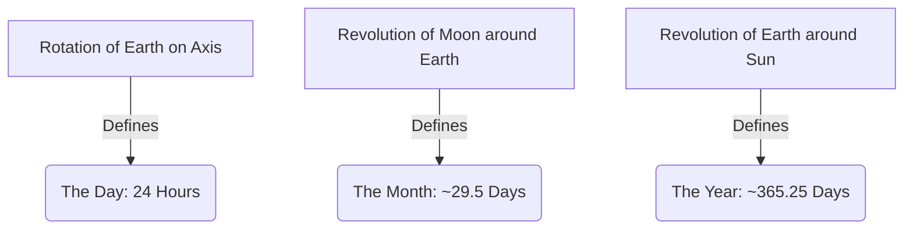

import Callout from '@/components/Callout.astro'

## Natural Units of Time

Our timekeeping is strictly based on astronomy:

## The Problem of Synchronization

Nature's cycles don't fit perfectly together. This led to different types of calendars.

### 1. Solar Calendars (e.g., Gregorian Calendar)
*   **Basis:** The revolution of Earth around the Sun (Seasons).
*   **Length:** ~365.25 days.
*   **The Issue:** We can't have a quarter of a day on a calendar.
*   **The Solution (Leap Year):** We count 365 days for 3 years. In the 4th year, we add the remaining quarters ($0.25 \times 4 = 1$ day) to February, making it 29 days.
    *   **Rule:** A year is a leap year if divisible by 4. (Century years like 1900 must be divisible by 400).

### 2. Lunar Calendars (e.g., Islamic Calendar)
*   **Basis:** The phases of the Moon.
*   **Length:** $12 \text{ months} \times 29.5 \text{ days} = 354 \text{ days}$.
*   **The Issue:** A lunar year is **11 days shorter** than a solar year ($365 - 354 = 11$).
*   **Result:** Festivals drift backward through the seasons. If a festival is in summer this year, in a few years, it will be in winter.

### 3. Luni-Solar Calendars (e.g., Indian National Calendar)
*   **Basis:** Uses Lunar months but adjusts to the Solar year to keep seasons in place.
*   **The Solution (Adhika Maasa):** Every 2-3 years, the accumulated difference (11 days + 11 days + ...) forms roughly one extra month. This extra month, called **Adhika Maasa** (Intercalary Month), is added to the calendar.
*   This keeps festivals like Holi or Diwali in their respective seasons, though the exact date shifts slightly.

<Callout variant="tip">
**Be a Scientist: Vikram Sarabhai**
Vikram Sarabhai (1919–1971) is known as the **Father of the Indian Space Programme**. He pioneered the launch of India's first satellites, which are the modern way we "keep time" and monitor the skies.
</Callout>

### Comparison Table

| Feature | Solar Calendar | Lunar Calendar | Luni-Solar Calendar |
| :--- | :--- | :--- | :--- |
| **Primary Base** | Sun (Seasons) | Moon Phases | Both |
| **Year Length** | 365 or 366 days | ~354 days | 354 + adjustment |
| **Drift** | Aligned with seasons | Drifts across seasons | Aligned with seasons |
| **Example** | Gregorian (Jan-Dec) | Hijri | Hindu, Jewish, Chinese |