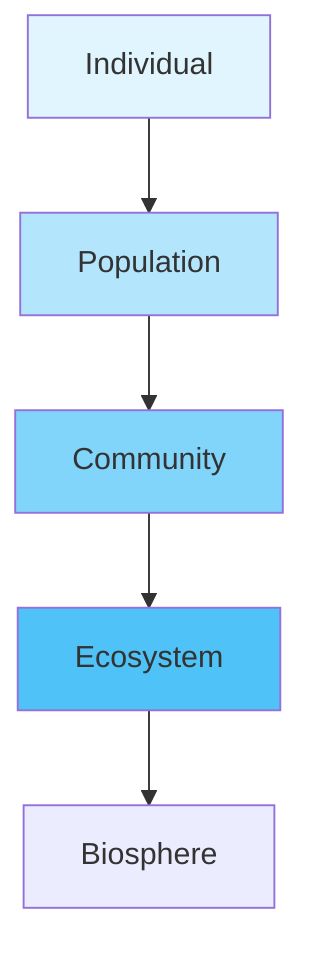

import Callout from '@/components/Callout.astro'

## Interpreting Our Surroundings

Every organism needs a specific place to live, called a **Habitat**. Within a habitat, there are two main types of components that interact with each other:

1.  **Biotic Components**: The living things. (Plants, animals, fungi, bacteria).
2.  **Abiotic Components**: The non-living things. (Air, water, soil, sunlight, temperature).

### Activity: Pond vs. Forest
If you compare a pond and a forest, you will see they have different components but follow the same rules of interaction.

| Feature | Pond Habitat | Forest Habitat |
| :--- | :--- | :--- |
| **Biotic** | Fish, Frogs, Lotus, Algae, Ducks | Tigers, Deer, Trees, Birds, Insects |
| **Abiotic** | Water, Dissolved Oxygen, Mud | Soil, Wind, Sunlight, Rocks |

## Levels of Organization

Nature is organized in a hierarchy. It starts small and gets bigger.

1.  **Individual**: A single organism (e.g., one frog).
2.  **Population**: A group of the *same* organisms living in the same place at the same time (e.g., all the frogs in the pond).
3.  **Community**: Different populations living together (e.g., frogs + fish + lotus plants).
4.  **Ecosystem**: The community interacting with the abiotic factors (living + non-living).

<Callout variant="info">
**Did you know?**
A habitat can be as large as a forest or as small as the space under a rotting log. The key is that it provides the right conditions for life to survive.
</Callout>

### Types of Ecosystems
*   **Terrestrial**: Forests, Grasslands, Deserts.
*   **Aquatic**: Ponds, Rivers, Oceans.
*   **Human-made**: Aquariums, Crop fields, Gardens.