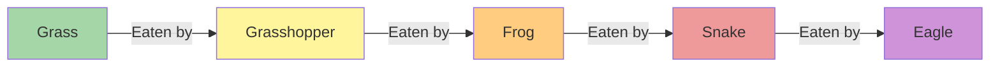

import Callout from '@/components/Callout.astro'

## Who Eats Whom?

### The Food Chain
A food chain is a simple, linear sequence showing the transfer of energy from one organism to another.

**Example of a Grassland Food Chain:**

### Trophic Levels
Each step in a food chain is called a **Trophic Level** (*troph* = food).

1.  **Level 1: Producers (Autotrophs)** - Green plants that make food using sunlight.
2.  **Level 2: Primary Consumers (Herbivores)** - Animals that eat plants (e.g., Deer, Grasshopper).
3.  **Level 3: Secondary Consumers (Small Carnivores)** - Animals that eat herbivores (e.g., Frog, Fox).
4.  **Level 4: Tertiary Consumers (Top Carnivores)** - Animals that eat other carnivores (e.g., Tiger, Eagle).

  <svg width="400" height="300" viewBox="0 0 400 300" fill="none" stroke="currentColor" stroke-width="2">
    {/* Pyramid Structure */}
    <path d="M200 20 L350 280 L50 280 Z" stroke="currentColor" fill="none" />

    {/* Levels */}
    <line x1="170" y1="80" x2="230" y2="80" stroke="currentColor" /> {/* Top Tip */}
    <line x1="140" y1="140" x2="260" y2="140" stroke="currentColor" /> {/* Level 3 line */}
    <line x1="110" y1="210" x2="290" y2="210" stroke="currentColor" /> {/* Level 2 line */}

    {/* Labels */}
    <text x="200" y="65" text-anchor="middle" font-size="12" fill="currentColor" stroke="none">Tertiary Consumers</text>
    <text x="200" y="120" text-anchor="middle" font-size="12" fill="currentColor" stroke="none">Secondary Consumers</text>
    <text x="200" y="185" text-anchor="middle" font-size="12" fill="currentColor" stroke="none">Primary Consumers</text>
    <text x="200" y="255" text-anchor="middle" font-size="14" font-weight="bold" fill="currentColor" stroke="none">Producers (Plants)</text>

    {/* Organism Icons (Text Representation) */}
    <text x="200" y="270" text-anchor="middle" font-size="10" fill="gray" stroke="none">Grass, Trees</text>
    <text x="200" y="200" text-anchor="middle" font-size="10" fill="gray" stroke="none">Insects, Deer</text>
    <text x="200" y="135" text-anchor="middle" font-size="10" fill="gray" stroke="none">Frogs, Birds</text>
    <text x="200" y="50" text-anchor="middle" font-size="10" fill="gray" stroke="none">Eagle, Tiger</text>
  </svg>

### The Food Web
In nature, chains are never simple. A frog eats many insects, and a snake eats frogs, rats, and birds. When we connect all possible food chains in an ecosystem, we get a network called a **Food Web**.

<Callout variant="tip">
**Why is a web better than a chain?**
A food web provides stability. If one food source disappears (e.g., frogs die out), the snake can still survive by eating rats. In a single chain, if one link breaks, the whole chain collapses.
</Callout>