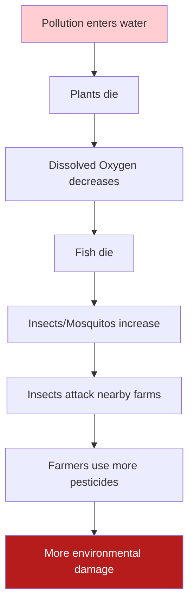

import Callout from '@/components/Callout.astro'

## The Domino Effect
A small change in an ecosystem can lead to massive consequences.

**Example: Pollution in a Pond**

## Case Study: The Frog Leg Export Ban
In the 1980s, India exported frog legs.
*   **Result:** Frog population declined.
*   **Consequence:** Since frogs eat insects, the insect pest population exploded in farms.
*   **Reaction:** Farmers had to use dangerous chemical pesticides.
*   **Solution:** The government banned frog export to restore ecological balance.

## Conservation: The Sundarbans
The Sundarbans (Mangrove forests) are a critical ecosystem.
*   **Benefits:** They act as a barrier against cyclones/tsunamis, protect soil from erosion, and provide a habitat for the Royal Bengal Tiger.
*   **Threats:** Illegal logging, poaching, and pollution.
*   **Conservation:** Designated as a World Heritage Site to protect this unique habitat.

## Sustainable Farming
Modern farming (Green Revolution) increased food production but caused issues:
1.  **Monoculture:** Growing the same crop repeatedly reduces soil nutrients.
2.  **Pesticides/Fertilizers:** Kill friendly soil microbes (earthworms) and pollute water.

**The Solution:**
*   **Organic Farming:** Using manure and compost.
*   **Crop Rotation:** Changing crops to replenish soil.
*   **Biological Pest Control:** Using natural predators (like ladybugs) instead of chemicals.