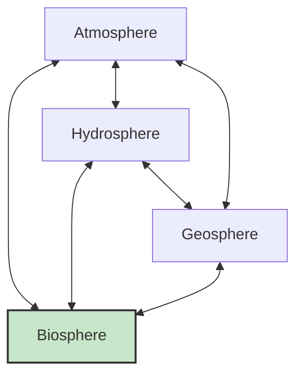

<<<FILE_START: index.mdx>>>
---
title: "Our Home: Earth, a Unique Life Sustaining Planet"
description: "Explore why Earth is the only known planet to support life, its unique conditions, and the biological processes that sustain it."
date: 2024-04-10
tags: ["earth", "solar-system", "biology", "ecology", "conservation"]
order: 1
draft: false
---

import Callout from '@/components/Callout.astro'

# Our Home: Earth

Welcome to the final chapter of your Grade 8 Science journey. We have explored forces, light, and ecosystems. Now, we bring it all together to study our home: **Planet Earth**.

Earth is not just a rock floating in space; it is a complex, dynamic system that sustains life. In this chapter, we will uncover the secrets of the **Goldilocks Zone**, why Venus is hotter than Mercury, how life continues through reproduction, and the threats our planet faces today.

## Key Concepts

1.  **Uniqueness of Earth**: Why life exists here and nowhere else (that we know of).
2.  **Conditions for Life**: The role of temperature, water, atmosphere, and magnetic fields.
3.  **Spheres of Earth**: How the Atmosphere, Hydrosphere, Geosphere, and Biosphere interact.
4.  **Continuity of Life**: How reproduction (Asexual and Sexual) keeps life going.
5.  **Triple Planetary Crisis**: Climate Change, Pollution, and Biodiversity Loss.

## Key Definitions

| Term | Definition |
| :--- | :--- |
| **Habitable Zone** | Also called the "Goldilocks Zone". The range of distance from a star where liquid water can exist. |
| **Greenhouse Effect** | The trapping of heat by gases (like $CO_2$) in the atmosphere, keeping the planet warm. |
| **Geodiversity** | The variety of rocks, soils, minerals, and landforms on Earth. |
| **Biosphere** | The zone of Earth where life exists (Land, Water, and Air). |
| **Ozone Layer** | A layer in the atmosphere that shields Earth from harmful UV radiation. |
| **Gametes** | Specialized reproductive cells (Sperm and Egg) carrying genetic material. |
| **Zygote** | The cell formed by the fusion of male and female gametes. |

<Callout variant="tip">
**Scientific Heritage: Mangalyaan**
India's **Mars Orbiter Mission (Mangalyaan)**, launched by ISRO in 2013, was a historic mission to explore our neighbor Mars. It showed the world that India could perform high-quality space science with smart, low-cost technology.
</Callout>

Start your exploration by clicking on the topics below!
<<<FILE_END>>>

<<<FILE_START: topics/01-unique-earth.mdx>>>
---
title: "Why is Earth Unique?"
description: "Comparing Earth to other planets and understanding its structure."
date: 2024-04-10
tags: ["solar-system", "earth-structure", "venus", "temperature"]
order: 2
draft: false
---

import Callout from '@/components/Callout.astro'

## The Blue Marble

Earth is the only planet in our solar system where life thrives. From space, it looks like a blue marble because 70% of its surface is covered with water. But what lies beneath?

### Structure of the Earth
If Earth were the size of an apple, the crust (where we live) would be as thin as the apple's skin.

  <svg width="300" height="300" viewBox="0 0 300 300" fill="none" stroke="currentColor" stroke-width="2">
    <!-- Outer Crust -->
    <circle cx="150" cy="150" r="140" stroke="currentColor" stroke-width="2" fill="#e0f7fa" />
    <text x="150" y="25" text-anchor="middle" font-size="12" fill="currentColor" stroke="none">Crust (Thin)</text>

    <!-- Mantle -->
    <circle cx="150" cy="150" r="120" stroke="currentColor" stroke-width="1" fill="#ffecb3" />
    <text x="150" y="60" text-anchor="middle" font-size="12" fill="currentColor" stroke="none">Mantle</text>

    <!-- Outer Core -->
    <circle cx="150" cy="150" r="70" stroke="currentColor" stroke-width="1" fill="#ffcc80" />
    <text x="150" y="110" text-anchor="middle" font-size="12" fill="currentColor" stroke="none">Outer Core</text>

    <!-- Inner Core -->
    <circle cx="150" cy="150" r="30" stroke="currentColor" stroke-width="1" fill="#ef5350" />
    <text x="150" y="155" text-anchor="middle" font-size="10" fill="white" stroke="none">Inner Core</text>

    <!-- Slice Effect -->
    <path d="M150 150 L290 150 A140 140 0 0 1 150 290 Z" fill="rgba(0,0,0,0.1)" stroke="none" />
  </svg>

### Earth vs. The Solar System

Let's compare Earth with its neighbors.

| Planet | Avg Temp ($^\circ C$) | Has Atmosphere? | Status |
| :--- | :--- | :--- | :--- |
| **Mercury** | 170 | No | Too Hot / No Air |
| **Venus** | **450** | Yes (Thick) | **Hottest Planet** |
| **Earth** | 15 | Yes (Just Right) | **Life Exists** |
| **Mars** | -60 | Yes (Thin) | Too Cold |

<Callout variant="warning">
**Why is Venus hotter than Mercury?**
Mercury is closer to the Sun, so it should be hotter. However, Venus is the hottest planet ($450^\circ C$). This is because Venus has a thick atmosphere made mostly of **Carbon Dioxide ($CO_2$)**. This creates a runaway **Greenhouse Effect**, trapping huge amounts of heat.
</Callout>

### The Greenhouse Effect
On Earth, the greenhouse effect is actually helpful (in moderation). Without it, Earth would be too cold for life.
1.  Solar radiation enters the atmosphere.
2.  Earth warms up and releases heat.
3.  Greenhouse gases (like $CO_2$) trap some of this heat.
4.  This keeps the planet warm enough for liquid water.
<<<FILE_END>>>

<<<FILE_START: topics/02-conditions-for-life.mdx>>>
---
title: "What Makes Earth Habitable?"
description: "The Goldilocks Zone, Gravity, Atmosphere, and Magnetic Fields."
date: 2024-04-10
tags: ["habitable-zone", "goldilocks", "magnetic-field", "atmosphere"]
order: 3
draft: false
---

import Callout from '@/components/Callout.astro'

## 1. Position: The Goldilocks Zone

Earth is located at just the right distance from the Sun. This region is called the **Habitable Zone** or **Goldilocks Zone**.
*   **Too Close:** Water evaporates (like on Venus).
*   **Too Far:** Water freezes (like on Mars).
*   **Just Right:** Water exists as **liquid**, which is essential for life.

  <svg width="500" height="200" viewBox="0 0 500 200" fill="none" stroke="currentColor" stroke-width="2">
    <!-- Sun -->
    <circle cx="0" cy="100" r="50" fill="orange" stroke="none" />
    <text x="10" y="105" fill="white" font-weight="bold" font-size="14">SUN</text>

    <!-- Hot Zone -->
    <rect x="60" y="50" width="100" height="100" fill="red" opacity="0.2" stroke="none" />
    <text x="80" y="40" fill="currentColor" font-size="12" stroke="none">Too Hot</text>
    <circle cx="90" cy="100" r="5" fill="gray" /> <!-- Mercury -->
    <circle cx="130" cy="100" r="8" fill="#d4a017" /> <!-- Venus -->

    <!-- Habitable Zone -->
    <rect x="180" y="50" width="120" height="100" fill="green" opacity="0.2" stroke="none" />
    <text x="200" y="40" fill="currentColor" font-size="12" stroke="none">Habitable Zone</text>
    <circle cx="240" cy="100" r="9" fill="blue" /> <!-- Earth -->
    <text x="230" y="130" fill="currentColor" font-size="10" stroke="none">Earth</text>

    <!-- Cold Zone -->
    <rect x="320" y="50" width="150" height="100" fill="blue" opacity="0.2" stroke="none" />
    <text x="350" y="40" fill="currentColor" font-size="12" stroke="none">Too Cold</text>
    <circle cx="350" cy="100" r="6" fill="red" /> <!-- Mars -->
  </svg>

## 2. Size and Gravity
Earth is massive enough to have strong gravity.
*   **Role:** Gravity holds the **atmosphere** in place.
*   If Earth were smaller (like Mars), the gravity would be too weak, and the air would escape into space.
*   The atmosphere provides Oxygen for breathing and contains the **Ozone Layer**, which blocks harmful UV rays.

## 3. Magnetic Field
Earth acts like a giant magnet due to the movement of molten iron in its core.
*   **Role:** It creates a protective shield called the **Magnetosphere**.
*   **Function:** It deflects **Solar Wind** and **Cosmic Rays** (harmful high-energy particles) from space, protecting the atmosphere and life.

<Callout variant="info">
**Did you know?**
If Earth's magnetic field disappeared, the solar wind could strip away our ozone layer, exposing us to deadly radiation!
</Callout>
<<<FILE_END>>>

<<<FILE_START: topics/03-spheres-of-earth.mdx>>>
---
title: "The Spheres of Earth"
description: "How Air, Water, Land, and Life interact to sustain the planet."
date: 2024-04-10
tags: ["biosphere", "hydrosphere", "geosphere", "atmosphere"]
order: 4
draft: false
---

import Callout from '@/components/Callout.astro'

## The Four Spheres

Life on Earth is sustained by the interaction of four major systems:

1.  **Atmosphere (Air):**
    *   Contains Oxygen for respiration and Carbon Dioxide for photosynthesis.
    *   Regulates temperature via the Greenhouse Effect.
    *   Protects via the Ozone Layer.

2.  **Hydrosphere (Water):**
    *   Covers 70% of Earth.
    *   Essential for all cellular processes, digestion, and temperature regulation in organisms.
    *   Drives the water cycle (Rainfall).

3.  **Geosphere (Land/Soil):**
    *   Includes rocks, minerals, and soil.
    *   Soil provides nutrients (Nitrogen, Potassium) for plants.
    *   Geodiversity creates different habitats (mountains, valleys, plains).

4.  **Biosphere (Life):**
    *   The zone where the other three spheres interact to support life.
    *   Includes everything from bacteria to blue whales.

## The Importance of Balance

Earth functions like a giant team.
*   Plants (Biosphere) take $CO_2$ from the Atmosphere and water from the Hydrosphere/Geosphere to make food.
*   They release Oxygen back into the Atmosphere.
*   Decomposers return nutrients to the Geosphere.

Even a small disruption, like cutting down forests, affects rainfall (Hydrosphere), soil quality (Geosphere), and air quality (Atmosphere).
<<<FILE_END>>>

<<<FILE_START: topics/04-reproduction.mdx>>>
---
title: "Continuity of Life: Reproduction"
description: "How life persists on Earth through Asexual and Sexual reproduction."
date: 2024-04-10
tags: ["reproduction", "genetics", "sexual", "asexual", "gametes"]
order: 5
draft: false
---

import Callout from '@/components/Callout.astro'

## What Keeps Life Going?

If organisms didn't reproduce, life would vanish. Reproduction ensures continuity. It involves passing **Genetic Material (Genes)** from parents to offspring.

### Types of Reproduction

There are two main methods:

1.  **Asexual Reproduction:**
    *   **Single Parent.**
    *   Offspring are exact copies (Clones).
    *   **Examples:**
        *   **Vegetative Propagation:** Growing plants from stems (Rose, Sugarcane), eyes (Potato), or rhizomes (Ginger).
        *   **Binary Fission:** Bacteria/Amoeba splitting in two.
        *   **Budding:** Hydra growing tiny buds.
        *   **Regeneration:** Planaria regrowing from a cut piece.

2.  **Sexual Reproduction:**
    *   **Two Parents** (Male and Female).
    *   Involves specialized cells called **Gametes** (Sperm and Egg).
    *   Offspring inherit a mix of traits from both parents (Variation).
    *   **Process:**
        $$ \text{Male Gamete} + \text{Female Gamete} \xrightarrow{\text{Fertilisation}} \text{Zygote} \rightarrow \text{Embryo} \rightarrow \text{Baby} $$

### Reproduction in Plants vs. Animals

| Feature | Plants | Animals |
| :--- | :--- | :--- |
| **Male Gamete** | Pollen (in Anther) | Sperm |
| **Female Gamete** | Ovule (in Flower) | Egg (Ovum) |
| **Process** | Pollination $\rightarrow$ Fertilisation | Mating $\rightarrow$ Fertilisation |
| **Outcome** | Seed (inside Fruit) | Baby (Egg or Live Birth) |

<Callout variant="info">
**Egg Layers vs. Live Births**
*   **Oviparous:** Animals that lay eggs (Birds, Reptiles, Fish). The embryo develops *outside* the mother's body using yolk for food.
*   **Viviparous:** Animals that give birth to live young (Mammals, Humans). The embryo develops *inside* the mother's body, getting food/oxygen from her.
</Callout>

### Why Variation Matters
Sexual reproduction creates small differences (variations). Over millions of years, these small changes allow species to adapt to new environments (e.g., Camels developing humps).
<<<FILE_END>>>

<<<FILE_START: topics/05-threats-to-earth.mdx>>>
---
title: "Threats to Life on Earth"
description: "Understanding the Triple Planetary Crisis: Climate Change, Pollution, and Biodiversity Loss."
date: 2024-04-10
tags: ["climate-change", "pollution", "sustainability", "crisis"]
order: 6
draft: false
---

import Callout from '@/components/Callout.astro'

## The Triple Planetary Crisis

Human activities are disturbing the delicate balance of Earth. We face three major interconnected challenges:

### 1. Climate Change
*   **Cause:** Burning fossil fuels (coal, oil) releases excess Greenhouse Gases ($CO_2$, Methane).
*   **Effect:** Global Warming.
*   **Consequences:** Melting ice caps, rising sea levels, extreme weather (floods, droughts).

### 2. Pollution
*   **Air:** Smog, Acid Rain (from factory smoke and vehicles).
*   **Water:** Plastic waste, chemical runoff harming aquatic life.
*   **Soil:** Excess fertilizers/pesticides killing soil microbes.

### 3. Biodiversity Loss
*   **Habitat Destruction:** Cutting forests destroys homes for animals.
*   **Invasive Species:** New species taking over ecosystems.
*   **Result:** Extinction of species weakens the food web.

## Global Action
Countries have signed agreements to protect Earth:
*   **Montreal Protocol (1987):** To protect the Ozone Layer by banning CFCs.
*   **Paris Agreement (2015):** To limit global warming to below 1.5°C.

<Callout variant="tip">
**What can YOU do?**
*   **Reduce, Reuse, Recycle.**
*   Save water and electricity.
*   Plant trees.
*   Use eco-friendly transport.
</Callout>
<<<FILE_END>>>

<<<FILE_START: solutions/exercises.mdx>>>
---
title: "Textbook Solutions: Keep the Curiosity Alive"
description: "Answers to the exercises from Chapter 13."
date: 2024-04-10
tags: ["solutions", "grade-8", "earth"]
order: 7
draft: false
---

import Callout from '@/components/Callout.astro'

## Keep the Curiosity Alive (Page 226-227)

### Q1. Why Mars cannot support life currently?
**Answer:** (iii) It lacks a thick atmosphere and liquid water.
*Explanation:* While Mars is in the habitable zone edge, its atmosphere is too thin to trap heat or allow liquid water to remain stable on the surface.

### Q2. Example of Geodiversity
**Answer:** (ii) Different landforms like mountains, valleys, and deserts.
*Explanation:* Geodiversity refers to the variety of earth materials and forms (rocks, soil, landforms).

### Q3. Smaller Earth Atmosphere
**Answer:** (ii) It would escape into space due to weaker gravity.
*Explanation:* Gravity is determined by mass. A smaller/lighter Earth would have less gravity, unable to hold onto gas molecules.

### Q4. Variation in Sexual Reproduction
**Answer:** (iv) They get mixed instructions (genes) from both parents.
*Explanation:* Sexual reproduction combines genetic material from two sources, creating unique combinations.

### Q5. Plants in Wall Cracks
**Answer:**
*   **Source:** Seeds likely arrived via wind or bird droppings (birds eat fruit and excrete seeds).
*   **Conditions:** The crack trapped a small amount of soil/dust and moisture (from monsoon rain), allowing the seed to germinate.

### Q6. Deforestation Effects
**Answer:**
*   **Climate:** Trees release water vapor (transpiration). Cutting them reduces local humidity and rainfall, potentially making the area hotter (Urban Heat Island effect).
*   **Biodiversity:** Habitat loss leads to animals/birds leaving or dying.
*   **Water:** Tree roots hold soil and help groundwater recharge. Without them, rainwater runs off causing floods and soil erosion, reducing groundwater availability.

### Q7. "Climate Change is Nothing New"
**Response:**
"While Earth has changed in the past, current global warming is happening **much faster** due to human activities (burning fossil fuels). Natural cycles take thousands of years; we are seeing changes in decades. This rapid change doesn't give life enough time to adapt."

### Q8. Magnetic Field Disappearance
**Answer:**
If the magnetic field vanished:
1.  **Radiation:** Harmful solar wind and cosmic rays would bombard the surface, causing cancer and DNA damage.
2.  **Atmosphere Loss:** The solar wind would slowly strip away the atmosphere (like it likely did on Mars).
3.  **Navigation:** Animals that use magnetic fields to migrate (birds, turtles) would get lost.

### Q9. Mars Settlement Design
**Three Essentials:**
1.  **Oxygen/Air Supply:** Mars has no breathable air.
2.  **Liquid Water:** Must be extracted from ice or recycled.
3.  **Shielding:** Protection from radiation (since Mars has no magnetic field/thick atmosphere).
**Hardest to Replicate:** A breathable atmosphere/Shielding on a planetary scale. We can build domes, but terraforming the whole planet is currently impossible.

### Q10. Village Climate Adaptation
**Causes:** Deforestation or Global Climate Change.
**Adaptations:**
1.  **Rainwater Harvesting:** To store water during unpredictable rain.
2.  **Crop Diversification:** Planting heat-resistant or drought-resistant crops.

### Q11. No Atmosphere?
**Answer:**
1.  **Temperature:** Extreme swings (Boiling day, Freezing night).
2.  **Water:** Would boil away into space immediately.
3.  **Life:** Impossible (No oxygen, no pressure, deadly radiation).

### Q12. Vegetative Propagation Examples
1.  **Potato:** Grows from "eyes".
2.  **Ginger/Turmeric:** Grows from rhizomes.
3.  **Rose/Hibiscus:** Grows from stem cuttings.
4.  **Bryophyllum:** Grows from leaf buds.
5.  **Strawberry:** Grows from runners.
<<<FILE_END>>>

<<<FILE_START: practice/exploration.mdx>>>
---
title: "Discover, Design, and Debate"
description: "Creative projects and deep-thinking questions."
date: 2024-04-10
tags: ["practice", "projects", "design"]
order: 8
draft: false
---

import Callout from '@/components/Callout.astro'

## 1. Earth Survival Kit
**Task:** Build a model of Earth essentials for another planet.
**Components:**
*   **Biosphere Jar:** Plants for Oxygen.
*   **Water Recycler:** To clean water.
*   **Solar Shield:** To block radiation.
*   **Heater/Cooler:** To maintain 'Goldilocks' temperature.

## 2. Moon Soil Experiment (Chandrayaan-4)
**Hypothesis:** Can plants grow in Moon soil (Regolith)?
**Experiment:**
*   Take Moon soil simulant (available in labs).
*   Add nutrients (since Moon soil lacks organic matter/bacteria).
*   Add water and light.
*   **Prediction:** Plants might sprout but struggle without the help of soil bacteria to fix nitrogen.

## 3. Why so many eggs?
**Observation:** Fish/Frogs lay thousands of eggs; Humans have 1 baby.
**Reasoning:**
*   **External Fertilization:** Eggs laid in water are eaten by predators or destroyed by currents.
*   **Strategy:** Laying thousands ensures that *at least a few* survive to adulthood.
*   **Mammals:** Invest energy in protecting *one* baby inside the body, ensuring a high survival rate.

## 4. Parental Care
*   **Birds:** High parental care $\rightarrow$ Higher survival rate of individual chicks $\rightarrow$ Fewer eggs needed.
*   **Reptiles:** Low/No parental care $\rightarrow$ Lower survival rate $\rightarrow$ Must lay more eggs to compensate.

<Callout variant="tip">
**Final Thought: It's Never the End**
Science is a journey. The questions you asked in this chapter—about Mars, eggs, or soil—are the seeds of future discoveries. Keep asking, keep observing. The universe is waiting for you!
</Callout>
<<<FILE_END>>>
