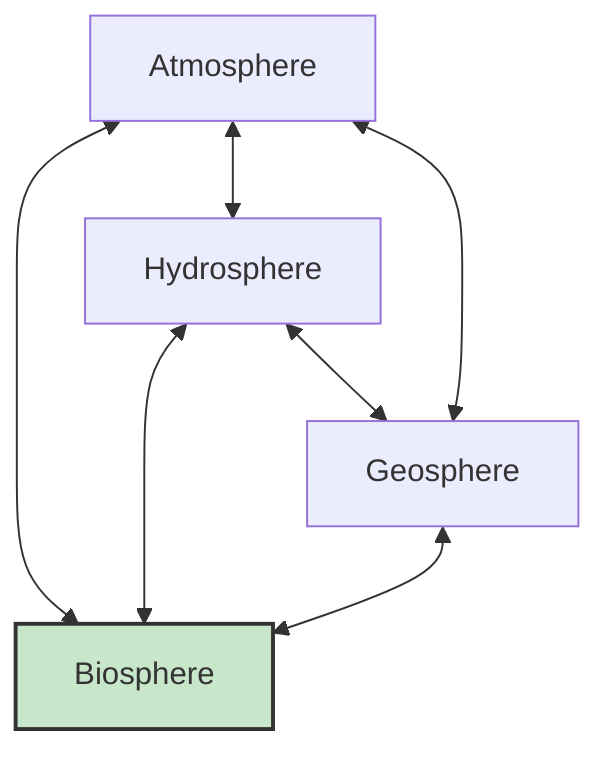

import Callout from '@/components/Callout.astro'

## The Four Spheres

Life on Earth is sustained by the interaction of four major systems:

1.  **Atmosphere (Air):**
    *   Contains Oxygen for respiration and Carbon Dioxide for photosynthesis.
    *   Regulates temperature via the Greenhouse Effect.
    *   Protects via the Ozone Layer.

2.  **Hydrosphere (Water):**
    *   Covers 70% of Earth.
    *   Essential for all cellular processes, digestion, and temperature regulation in organisms.
    *   Drives the water cycle (Rainfall).

3.  **Geosphere (Land/Soil):**
    *   Includes rocks, minerals, and soil.
    *   Soil provides nutrients (Nitrogen, Potassium) for plants.
    *   Geodiversity creates different habitats (mountains, valleys, plains).

4.  **Biosphere (Life):**
    *   The zone where the other three spheres interact to support life.
    *   Includes everything from bacteria to blue whales.

## The Importance of Balance

Earth functions like a giant team.
*   Plants (Biosphere) take $CO_2$ from the Atmosphere and water from the Hydrosphere/Geosphere to make food.
*   They release Oxygen back into the Atmosphere.
*   Decomposers return nutrients to the Geosphere.

Even a small disruption, like cutting down forests, affects rainfall (Hydrosphere), soil quality (Geosphere), and air quality (Atmosphere).