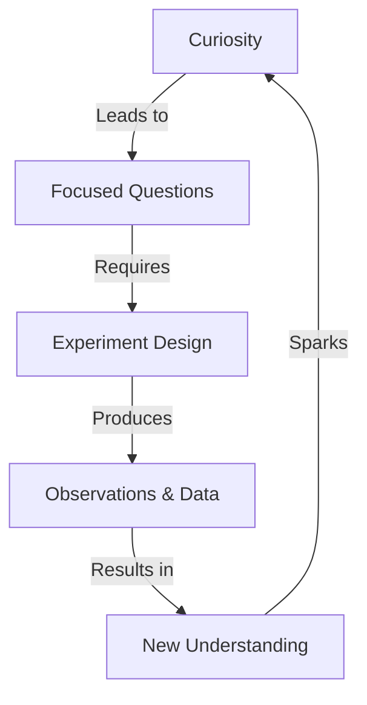
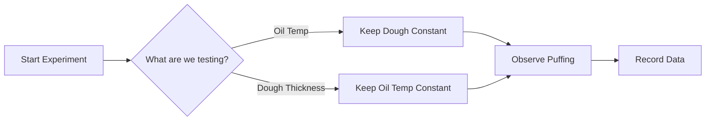
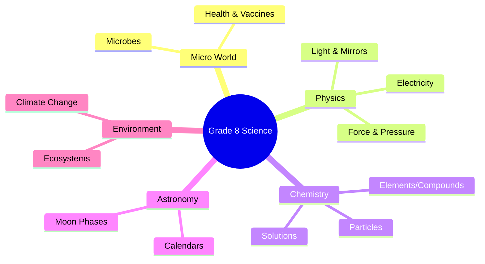
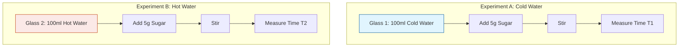

<<<FILE_START: index.mdx>>>
---
title: "Exploring the Investigative World of Science"
description: "Introduction to Grade 8 Science: transitioning from simple curiosity to systematic investigation."
date: 2025-01-15
tags: ["science", "introduction", "investigation", "grade-8"]
order: 1
draft: false
---

import Callout from '@/components/Callout.astro'

## Introduction

Welcome to Grade 8 Science! In previous years, we explored the world through wonder (Grade 6) and learned how scientific ideas evolve (Grade 7). This year, we step into the **Investigative World of Science**.

Science is not just about memorizing facts; it is about finding new facts through a systematic process. This chapter introduces the mindset of a scientist: observing carefully, asking focused questions, and designing experiments to find answers.

<Callout variant="tip">
**Core Theme:** Investigation in science balances the solid ground of **careful observation** (represented by roots) with the freedom of **creative thinking** (represented by a soaring kite).
</Callout>

### The Scientific Approach

To think like a scientist, we follow a path:
1.  **Ask focused questions** (e.g., "Why does dough rise?").
2.  **Design experiments** (Control what you change and what you keep the same).
3.  **Observe and Measure** (Collect data to improve understanding).

### Chapter Roadmap

The following topics will guide you through the philosophy of this textbook and the scientific method using a relatable example.

-   **Topic 1:** [The Spirit of Investigation](/topics/01-spirit-of-investigation)
-   **Topic 2:** [The Scientific Method: A Case Study](/topics/02-scientific-method)
-   **Topic 3:** [The Journey Ahead](/topics/03-journey-ahead)

### Formula Sheet: Key Definitions

| Term | Definition |
| :--- | :--- |
| **Investigation** | The process of using observation and experimentation to answer questions about the natural world. |
| **Variable** | Any factor that can change in an experiment (e.g., temperature, thickness). |
| **Observation** | gathering information using senses or instruments. |
| **Control** | Keeping conditions the same to ensure a fair test. |

<<<FILE_END>>>
<<<FILE_START: topics/01-spirit-of-investigation.mdx>>>
---
title: "The Spirit of Investigation"
description: "Understanding how science evolves from wonder to systematic inquiry."
date: 2025-01-15
tags: ["nature-of-science", "curiosity"]
order: 1
draft: false
---

import Callout from '@/components/Callout.astro'

## From Wonder to Investigation

Our journey in science has evolved over the years.
*   **Grade 6:** We started with simple **"Why?"** and **"How?"** questions, driven by wonder.
*   **Grade 7:** We learned that science is **evolving**; answers lead to new questions, and ideas change as we explore deeper.
*   **Grade 8:** We now enter the **Investigative** phase.

### What is Investigation?

Investigation means more than just looking at something. It involves active engagement with the world to solving puzzles.

<Callout variant="info">
**Definition:** Investigation is the process where we ask focused questions, design ways to answer them (experiments), and use observations to refine our understanding.
</Callout>

### The Roots and The Kite

The textbook uses two symbols to represent the scientific mindset:

1.  **The Root:** Represents a deep, solid foundation of knowledge, connecting us to our environment, traditions, and observations.
2.  **The Kite:** Represents curiosity taking flight, allowing ideas to soar toward new horizons.

**Key Takeaway:** Science works best when we balance **observation** (Roots) with **creative thinking** (Kite).

### Why do we Investigate?

We investigate to solve puzzles ranging from everyday life to the mysteries of the universe.
*   *Everyday:* Why does dough rise?
*   *Global:* Is the world getting warmer?
*   *Universal:* How do stars form?

By doing this, you become not just a learner, but a **Young Scientist**.
<<<FILE_END>>>
<<<FILE_START: topics/02-scientific-method.mdx>>>
---
title: "The Scientific Method: A Case Study"
description: "Learning the scientific method using the example of frying a puri."
date: 2025-01-15
tags: ["scientific-method", "experiment", "variables"]
order: 2
draft: false
---

import Callout from '@/components/Callout.astro'

## Thinking Like a Scientist

You don't need a fancy laboratory to do science. Your kitchen is a laboratory! Let's explore the scientific method using a simple question posed in the chapter:

> **"Why is one side of a puri thinner than the other?"**

To answer this, we cannot just guess. We must investigate systematically.

### Step 1: Ask a Scientific Question
Instead of a vague question, we ask specific ones:
*   What changes the way a *puri* puffs up?
*   Does the temperature of the oil matter?
*   Does the thickness of the dough matter?

### Step 2: Design the Experiment (Variables)

When designing an experiment, we identify two main types of things (variables):

1.  **Things we change (Independent Variables):**
    *   Thickness of rolled dough.
    *   Size of the dough circle.
    *   Type of flour (*atta* vs. *maida*).
    *   Temperature of the oil.
    *   Method of dropping the dough (vertical vs. sliding).

2.  **Things we observe (Dependent Variables):**
    *   Does it puff up? (Yes/No).
    *   Time taken to puff up (Seconds).
    *   Texture/Thickness after frying.

<Callout variant="warning">
**The Golden Rule of Fair Testing:** Change only **ONE** thing at a time while keeping everything else the same (Controls).
</Callout>

**Example of a Fair Test:**
If you want to test if **Oil Temperature** affects puffing:
*   **Change:** Oil temperature (Boiling hot vs. Warm).
*   **Keep Same:** Dough thickness, type of flour, size of puri.

### Step 3: Observation and Measurement

Observations can be qualitative (descriptive) or quantitative (measured).

*   **Qualitative:** "The oil splattered," "The puri turned brown," "It smelled burnt."
*   **Quantitative:** "The puri took 5 seconds to puff," "The oil temperature was $180^\circ C$."

### Step 4: Systematic Investigation

Even a simple phenomenon like a *puri* swelling involves complex physics (heat transfer, phase change of water to steam, pressure). Scientists call this systematic investigation.

*   **Notes:** Always keep notes of what you see, smell, and sense.
*   **Iterate:** After one round, you might ask new questions (e.g., "What if I prick a hole in it?").

### Why is one side thinner?
While the chapter encourages you to investigate, the scientific hint is that when the bottom layer of the puri hits the hot oil, it cooks and hardens slightly faster. The water inside turns to steam, pushing upwards, stretching the upper layer which is still soft. This makes the top layer thinner and more balloon-like before it is flipped.
<<<FILE_END>>>
<<<FILE_START: topics/03-journey-ahead.mdx>>>
---
title: "The Journey Ahead"
description: "A roadmap of the scientific topics covered in Grade 8."
date: 2025-01-15
tags: ["roadmap", "syllabus"]
order: 3
draft: false
---

import Callout from '@/components/Callout.astro'

## The Science Syllabus Roadmap

This year, our investigation will take us from the microscopic world to the vastness of space. Here is a preview of the interconnected topics we will cover.

### 1. The Microscopic World
We begin with a single drop of water to discover **Microbes**.
*   **Invisible Helpers:** Digestion, medicine production.
*   **Harmful Agents:** Infections.
*   **Health:** How vaccines, food, and exercise help us fight infections.

### 2. Physics: Energy and Forces
Technology improves our lives, often using electricity.
*   **Electricity:** Heating effects (heaters) and magnetic effects (motors).
*   **Force & Pressure:**
    *   Why objects speed up or slow down.
    *   Why a ball falls (Gravity).
    *   **Pressure:** How air pressure differences lead to winds and cyclones.

### 3. Matter
To understand pressure and heat, we zoom into **Particles**.
*   **Solids vs Gases:** How particles move.
*   **Classification:** Elements, Compounds, and Mixtures.
*   **Solutions:** How substances like sugar dissolve.

### 4. Light and Optics
We explore how we see the world.
*   **Reflection:** Mirrors (flat and curved).
*   **Refraction:** Bending of light through lenses (glasses).

### 5. Astronomy
Light connects us to the cosmos.
*   **The Moon:** Phases of the Moon (reflection of sunlight).
*   **Calendars:** How lunar cycles and sunrises helped humans create timekeeping systems.

### 6. Environment & Climate
Finally, we look at Earth as a whole.
*   **Ecosystems:** Relationships between living organisms (insects to whales) and the environment.
*   **Climate Change:** Earth is at the "perfect distance" from the Sun, but human activity is disrupting this balance. We will discuss the urgent challenges of global warming.

<<<FILE_END>>>
<<<FILE_START: solutions/probe-and-ponder.mdx>>>
---
title: "Probe and Ponder Solutions"
description: "Discussion and answers for the introductory questions on Page 1."
date: 2025-01-15
tags: ["solutions", "intro"]
order: 1
draft: false
---

import Callout from '@/components/Callout.astro'

## Page 1: Probe and Ponder

These questions are designed to spark curiosity. While they don't have single "exam-style" answers, here are the scientific explanations behind them.

### 1. Why is one side of a puri thinner than the other?

**Scientific Explanation:**
When a rolled dough disk is dropped into hot oil, it submerges. The bottom side contacts the hot oil first.
1.  **Heat Transfer:** The bottom layer gets cooked and stiffens almost immediately.
2.  **Steam Generation:** Water in the dough turns to steam.
3.  **Expansion:** The steam pushes upward. Since the bottom is already slightly stiff, the steam expands the *upper* layer, which is still soft and elastic.
4.  **Result:** The upper layer stretches significantly more than the bottom layer, becoming thinner as it expands like a balloon.

### 2. Are there more grains of sand on all the beaches and deserts of the world, or more stars in our galaxy?

**Scientific Estimate:**
This is a classic "Fermi Problem" (an estimation problem).
*   **Grains of Sand:** Scientists estimate there are roughly $7.5 \times 10^{18}$ (7.5 quintillion) grains of sand on Earth.
*   **Stars in the Universe:** There are approximately $10^{11}$ to $10^{12}$ stars in our galaxy (Milky Way), and there are roughly $2 \times 10^{12}$ galaxies in the observable universe. The total stars are estimated around $10^{22}$ to $10^{24}$.

**Answer:** There are far more stars in the Universe than grains of sand on Earth. However, if we restrict it just to *our galaxy* (The Milky Way), grains of sand might outnumber the stars.

### 3. Why has nature created such a vast variety of plants and animals?

**Scientific Concept:** **Evolution and Adaptation.**
Nature has a vast variety because environments vary (deserts, oceans, forests).
*   Living things possess variations (differences).
*   Those with traits best suited to their specific environment survive and reproduce.
*   Over millions of years, this leads to **Biodiversity**, ensuring life can survive in almost any condition on Earth.

<Callout variant="tip">
**Your Turn:** The book asks: *"Is there such a question that makes you curious about the world?"*
Try to formulate a question that starts with "Why" or "How" and think about how you could investigate it!
</Callout>
<<<FILE_END>>>
<<<FILE_START: practice/solved-examples.mdx>>>
---
title: "Practice: Designing an Investigation"
description: "Apply the scientific method to a new scenario."
date: 2025-01-15
tags: ["practice", "experiment-design"]
order: 1
draft: false
---

import Callout from '@/components/Callout.astro'

## Scenario: The Dissolving Sugar Mystery

To practice the skills learned in the "Puri" experiment, let's apply the scientific method to a common kitchen observation.

**Observation:** You notice that sugar seems to disappear faster in hot tea than in cold lemonade.

### Step 1: Formulate a Question
**Q:** Does the temperature of water affect how fast sugar dissolves?

### Step 2: Identify Variables

| Variable Type | What is it in this experiment? |
| :--- | :--- |
| **Independent Variable**  *(What we change)* | The temperature of the water (Hot vs. Cold). |
| **Dependent Variable**  *(What we measure)* | The time taken for the sugar to completely dissolve (in seconds). |
| **Control Variables**  *(What we keep same)* | 1. Amount of water (e.g., 100ml). 2. Amount of sugar (e.g., 1 teaspoon). 3. Type of sugar (Granulated). 4. Stirring speed (e.g., stir 5 times). |

### Step 3: Experimental Setup (Diagram)

### Step 4: Hypothesize
Based on the particle theory (which you will learn later in this book), we hypothesize that **higher temperature** makes particles move faster, so sugar should dissolve faster in hot water.

### Step 5: Data Table Template

Create a table like this in your notebook when you do the experiment:

| Trial | Temperature ($^\circ C$) | Time to Dissolve (seconds) | Observations |
| :--- | :--- | :--- | :--- |
| 1 | Cold ($10^\circ C$) | | Water stayed clear longer |
| 2 | Hot ($80^\circ C$) | | Sugar disappeared quickly |

<Callout variant="success">
**Conclusion:** If $T_{hot} < T_{cold}$, then our hypothesis is correct: Temperature increases the rate of dissolving.
</Callout>
<<<FILE_END>>>
