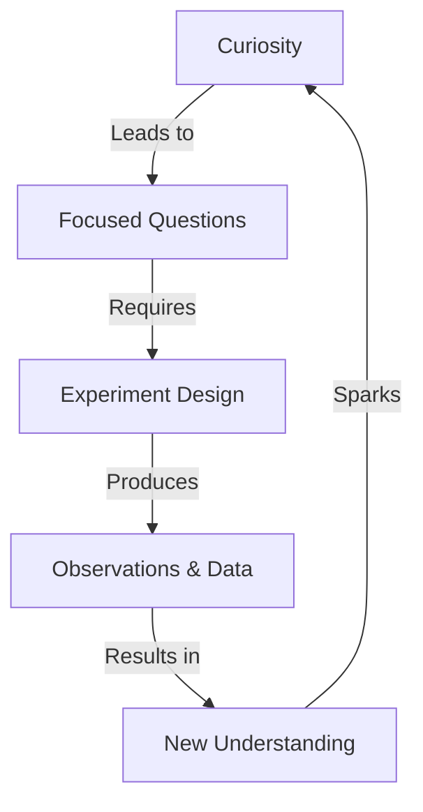

import Callout from '@/components/Callout.astro'

## Introduction

Welcome to Grade 8 Science! In previous years, we explored the world through wonder (Grade 6) and learned how scientific ideas evolve (Grade 7). This year, we step into the **Investigative World of Science**.

Science is not just about memorizing facts; it is about finding new facts through a systematic process. This chapter introduces the mindset of a scientist: observing carefully, asking focused questions, and designing experiments to find answers.

<Callout variant="tip">
**Core Theme:** Investigation in science balances the solid ground of **careful observation** (represented by roots) with the freedom of **creative thinking** (represented by a soaring kite).
</Callout>

### The Scientific Approach

To think like a scientist, we follow a path:
1.  **Ask focused questions** (e.g., "Why does dough rise?").
2.  **Design experiments** (Control what you change and what you keep the same).
3.  **Observe and Measure** (Collect data to improve understanding).

### Chapter Roadmap

The following topics will guide you through the philosophy of this textbook and the scientific method using a relatable example.

-   **Topic 1:** [The Spirit of Investigation](/topics/01-spirit-of-investigation)
-   **Topic 2:** [The Scientific Method: A Case Study](/topics/02-scientific-method)
-   **Topic 3:** [The Journey Ahead](/topics/03-journey-ahead)

### Formula Sheet: Key Definitions

| Term | Definition |
| :--- | :--- |
| **Investigation** | The process of using observation and experimentation to answer questions about the natural world. |
| **Variable** | Any factor that can change in an experiment (e.g., temperature, thickness). |
| **Observation** | gathering information using senses or instruments. |
| **Control** | Keeping conditions the same to ensure a fair test. |

