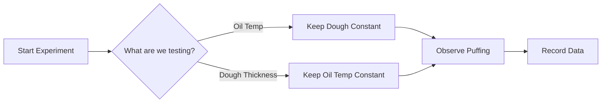

import Callout from '@/components/Callout.astro'

## Thinking Like a Scientist

You don't need a fancy laboratory to do science. Your kitchen is a laboratory! Let's explore the scientific method using a simple question posed in the chapter:

> **"Why is one side of a puri thinner than the other?"**

To answer this, we cannot just guess. We must investigate systematically.

### Step 1: Ask a Scientific Question
Instead of a vague question, we ask specific ones:
*   What changes the way a *puri* puffs up?
*   Does the temperature of the oil matter?
*   Does the thickness of the dough matter?

### Step 2: Design the Experiment (Variables)

When designing an experiment, we identify two main types of things (variables):

1.  **Things we change (Independent Variables):**
    *   Thickness of rolled dough.
    *   Size of the dough circle.
    *   Type of flour (*atta* vs. *maida*).
    *   Temperature of the oil.
    *   Method of dropping the dough (vertical vs. sliding).

2.  **Things we observe (Dependent Variables):**
    *   Does it puff up? (Yes/No).
    *   Time taken to puff up (Seconds).
    *   Texture/Thickness after frying.

<Callout variant="warning">
**The Golden Rule of Fair Testing:** Change only **ONE** thing at a time while keeping everything else the same (Controls).
</Callout>

**Example of a Fair Test:**
If you want to test if **Oil Temperature** affects puffing:
*   **Change:** Oil temperature (Boiling hot vs. Warm).
*   **Keep Same:** Dough thickness, type of flour, size of puri.

### Step 3: Observation and Measurement

Observations can be qualitative (descriptive) or quantitative (measured).

*   **Qualitative:** "The oil splattered," "The puri turned brown," "It smelled burnt."
*   **Quantitative:** "The puri took 5 seconds to puff," "The oil temperature was $180^\circ C$."

### Step 4: Systematic Investigation

Even a simple phenomenon like a *puri* swelling involves complex physics (heat transfer, phase change of water to steam, pressure). Scientists call this systematic investigation.

*   **Notes:** Always keep notes of what you see, smell, and sense.
*   **Iterate:** After one round, you might ask new questions (e.g., "What if I prick a hole in it?").

### Why is one side thinner?
While the chapter encourages you to investigate, the scientific hint is that when the bottom layer of the puri hits the hot oil, it cooks and hardens slightly faster. The water inside turns to steam, pushing upwards, stretching the upper layer which is still soft. This makes the top layer thinner and more balloon-like before it is flipped.