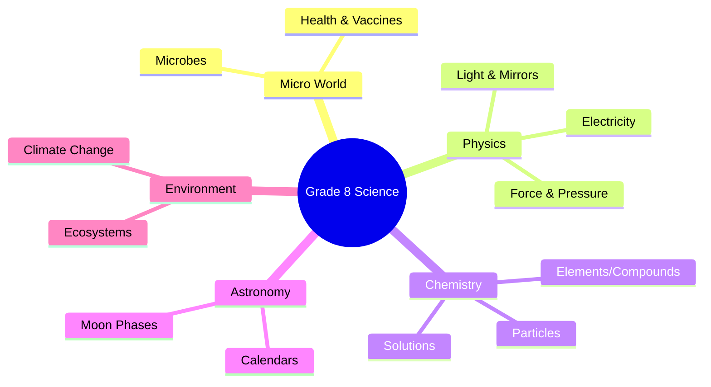

import Callout from '@/components/Callout.astro'

## The Science Syllabus Roadmap

This year, our investigation will take us from the microscopic world to the vastness of space. Here is a preview of the interconnected topics we will cover.

### 1. The Microscopic World
We begin with a single drop of water to discover **Microbes**.
*   **Invisible Helpers:** Digestion, medicine production.
*   **Harmful Agents:** Infections.
*   **Health:** How vaccines, food, and exercise help us fight infections.

### 2. Physics: Energy and Forces
Technology improves our lives, often using electricity.
*   **Electricity:** Heating effects (heaters) and magnetic effects (motors).
*   **Force & Pressure:**
    *   Why objects speed up or slow down.
    *   Why a ball falls (Gravity).
    *   **Pressure:** How air pressure differences lead to winds and cyclones.

### 3. Matter
To understand pressure and heat, we zoom into **Particles**.
*   **Solids vs Gases:** How particles move.
*   **Classification:** Elements, Compounds, and Mixtures.
*   **Solutions:** How substances like sugar dissolve.

### 4. Light and Optics
We explore how we see the world.
*   **Reflection:** Mirrors (flat and curved).
*   **Refraction:** Bending of light through lenses (glasses).

### 5. Astronomy
Light connects us to the cosmos.
*   **The Moon:** Phases of the Moon (reflection of sunlight).
*   **Calendars:** How lunar cycles and sunrises helped humans create timekeeping systems.

### 6. Environment & Climate
Finally, we look at Earth as a whole.
*   **Ecosystems:** Relationships between living organisms (insects to whales) and the environment.
*   **Climate Change:** Earth is at the "perfect distance" from the Sun, but human activity is disrupting this balance. We will discuss the urgent challenges of global warming.

