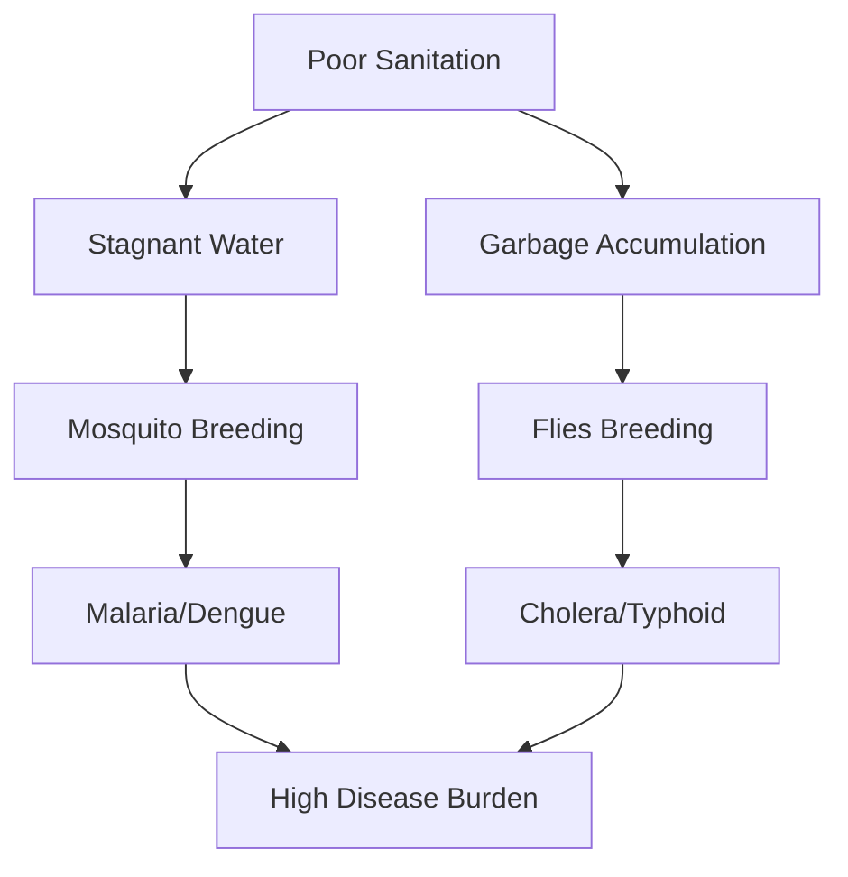

import Callout from '@/components/Callout.astro'

## Case Study 1: The "Superbug" Crisis

**Scenario:**
Ravi has a sore throat. He takes an antibiotic left over from his sister's previous illness without visiting a doctor. He feels better after 2 days and stops taking the medicine. Two weeks later, he gets sick again, but this time the medicine doesn't work.

**Analysis:**
1.  **Mistake 1 (Self-medication):** Sore throats are often viral. Taking antibiotics for a virus is useless.
2.  **Mistake 2 (Incomplete Course):** Even if it was bacterial, stopping early kills only the weak bacteria.
3.  **Result (Resistance):** The stronger bacteria survived, multiplied, and are now resistant to that antibiotic.

**Lesson:** Always consult a doctor and finish the full course of antibiotics.

## Case Study 2: The Clean Village

**Scenario:**
Village A has open drains and garbage piles. Village B has covered drains and regular garbage collection. During the monsoon, Village A sees a spike in Malaria and Diarrhea cases. Village B remains mostly healthy.

**Connection:**
*   **Malaria:** Stagnant water in open drains breeds mosquitoes (Vectors).
*   **Diarrhea:** Garbage and sewage contaminate water sources with pathogens.
*   **Conclusion:** Sanitation is a direct preventive measure for communicable diseases.

