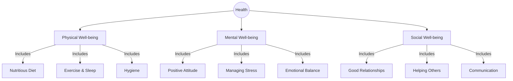

import Callout from '@/components/Callout.astro'

## Defining Health

Is a person healthy if they have no fever but are constantly stressed and lonely? According to modern science, the answer is **no**.

The **World Health Organization (WHO)** defines health as:
> "A state of complete physical, mental, and social well-being, and not merely the absence of disease."

### The Three Pillars of Health

### Case Study: The New Student
Consider the story of a Grade 8 student who moved to a new city. He felt lonely, spent excessive time on screens, stopped eating well, and developed headaches.
*   **Physical Symptoms:** Weight loss, sleeplessness, headaches.
*   **Root Cause:** Social isolation (loneliness) and Mental stress.
*   **Solution:** Reducing screen time and seeking social support (counsellor, making friends) improved his physical health.

This proves that **mind and body are connected**.

<Callout variant="info">
**Signs vs. Symptoms**
*   **Symptom:** What the patient *feels* (e.g., headache, pain, dizziness).
*   **Sign:** What can be *seen or measured* (e.g., fever of $102^\circ$F, rash, swelling).
</Callout>