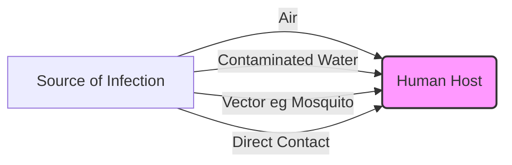

import Callout from '@/components/Callout.astro'

## Classification of Diseases

Diseases are broadly classified into two categories based on how they are caused and spread.

### 1. Non-Communicable Diseases (NCDs)
These diseases **do not spread** from person to person. They are caused by lifestyle, genetics, or environment.

*   **Causes:** Unhealthy diet, lack of exercise, pollution, hormonal imbalance.
*   **Examples:** Diabetes, Cancer, Heart Disease, Asthma, Obesity.
*   **Deficiency Diseases:** Scurvy (Vitamin C), Anaemia (Iron), Goitre (Iodine).

### 2. Communicable Diseases (Infectious)
These diseases **spread** from an infected person to a healthy person. They are caused by **Pathogens**.

*   **Pathogens:** Bacteria, Viruses, Fungi, Protozoa, Worms.
*   **Modes of Transmission:**
    *   **Air:** Coughing/Sneezing (Common Cold, TB).
    *   **Water/Food:** Contamination (Cholera, Typhoid, Hepatitis A).
    *   **Vectors (Insects):** Mosquitoes (Malaria, Dengue).
    *   **Direct Contact:** Skin-to-skin or sharing items (Chickenpox).

### Common Communicable Diseases Table

| Disease | Pathogen Type | Transmission | Preventive Measure |
| :--- | :--- | :--- | :--- |
| **Common Cold** | Virus | Air | Wash hands, mask up. |
| **Tuberculosis (TB)** | Bacteria | Air | Vaccination (BCG), isolation. |
| **Cholera** | Bacteria | Water/Food | Boil water, sanitary hygiene. |
| **Malaria** | Protozoa | Mosquito (Vector) | Mosquito nets, no stagnant water. |
| **Ringworm** | Fungi | Direct Contact | Personal hygiene, don't share towels. |

