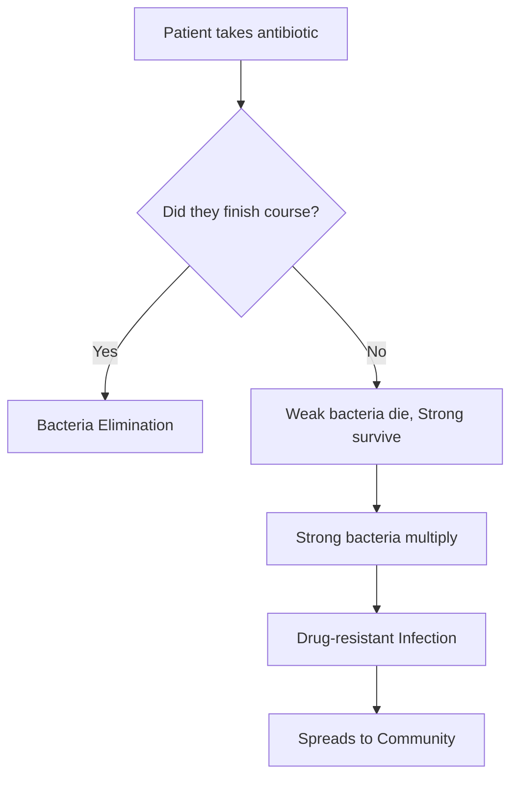

import Callout from '@/components/Callout.astro'

## Immunity: The Body's Defense

**Immunity** is the body's natural ability to fight diseases.
*   **Innate Immunity:** Protection we are born with.
*   **Acquired Immunity:** Protection developed after exposure to a disease or a vaccine.

## Vaccines: Prevention is Better than Cure

A **vaccine** trains the immune system to recognize a pathogen without causing the disease. It usually contains dead or weakened germs.

### The Story of Smallpox
*   **Observation:** Edward Jenner (1796) noticed milkmaids who got **Cowpox** (mild) never got **Smallpox** (deadly).
*   **Experiment:** He infected a boy with Cowpox, then exposed him to Smallpox. The boy survived.
*   **Result:** The first vaccine was created. Today, Smallpox is eradicated from the world.

## Antibiotics: Fighting Bacteria

**Antibiotics** are medicines that kill or stop the growth of bacteria.
*   **Discovery:** Alexander Fleming discovered **Penicillin** (the first antibiotic) from a mould in 1928.
*   **Limitation:** Antibiotics ONLY work against **Bacteria**. They do **NOT** cure viral infections like the Common Cold or Flu.

<Callout variant="error">
**Antibiotic Resistance:** If we overuse antibiotics or don't finish the prescribed course, bacteria can adapt and survive. These "superbugs" become very hard to kill.
**Rule:** Only take antibiotics prescribed by a doctor.
</Callout>

### Diagram: How Resistance Spreads

