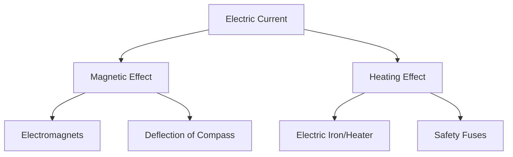

<<<FILE_START: index.mdx>>>
---
title: "Electricity: Magnetic and Heating Effects"
description: "Chapter 4 overview: Understanding how electric current creates magnetism and heat, and how batteries work."
date: 2025-01-15
tags: ["electricity", "magnetism", "heating-effect", "grade-8"]
order: 1
draft: false
---

import Callout from '@/components/Callout.astro'

## Introduction

We use electricity every day to light up our homes, but did you know electricity can also act like a magnet? Or that it is the secret behind how your iron box gets hot?

In this chapter, we explore two major effects of electric current:
1.  **Magnetic Effect:** How a wire carrying current behaves like a magnet.
2.  **Heating Effect:** Why wires get hot when current flows through them.

We will also look inside the batteries that power our portable devices to see how they generate electricity.

### Chapter Roadmap

*   **Topic 1:** [Magnetic Effect of Current](/topics/01-magnetic-effect) (Oersted's Discovery & Electromagnets)
*   **Topic 2:** [Heating Effect of Current](/topics/02-heating-effect) (Nichrome wire & Appliances)
*   **Topic 3:** [Electric Cells and Batteries](/topics/03-cells-and-batteries) (Voltaic, Dry, and Rechargeable cells)

### Key Definitions

| Term | Definition |
| :--- | :--- |
| **Magnetic Effect** | The phenomenon where a current-carrying wire produces a magnetic field around it. |
| **Electromagnet** | A coil of wire (usually around an iron core) that behaves like a magnet when electric current flows through it. |
| **Heating Effect** | The production of heat in a conductor due to the resistance it offers to the flow of electric current. |
| **Resistance** | The opposition to the flow of electric current offered by a material. |
| **Element** | A coil of wire (like Nichrome) used in heating appliances to generate heat. |
| **Electrolyte** | A liquid or paste that conducts electricity and helps generate current in a cell. |


<<<FILE_END>>>
<<<FILE_START: topics/01-magnetic-effect.mdx>>>
---
title: "Magnetic Effect of Electric Current"
description: "Discovering how electricity and magnetism are linked, and how electromagnets work."
date: 2025-01-15
tags: ["magnetism", "oersted", "electromagnet"]
order: 1
draft: false
---

import Callout from '@/components/Callout.astro'

## Oersted's Discovery

In 1820, a Danish scientist named **Hans Christian Oersted** noticed something strange. When he switched on an electric circuit, a compass needle lying nearby moved!

*   **Observation:** A compass needle deflects when placed near a current-carrying wire.
*   **Conclusion:** Electric current produces a **magnetic field** around it.

<div class="flex justify-center my-6">
  <svg width="400" height="200" viewBox="0 0 400 200" xmlns="http://www.w3.org/2000/svg">
    <!-- Wire -->
    <line x1="50" y1="100" x2="350" y2="100" stroke="currentColor" stroke-width="4" />
    <text x="200" y="80" fill="currentColor" text-anchor="middle">Current Carrying Wire</text>

    <!-- Compass -->
    <circle cx="200" cy="150" r="30" stroke="currentColor" stroke-width="2" fill="none" />
    <polygon points="200,130 190,160 210,160" fill="red" opacity="0.7" /> <!-- North pole -->
    <polygon points="200,170 190,160 210,160" fill="gray" opacity="0.5" /> <!-- South pole -->
    <text x="200" y="195" fill="currentColor" text-anchor="middle" font-size="12">Magnetic Compass</text>

    <!-- Field Lines Indication -->
    <path d="M 160 100 Q 160 130 200 130 Q 240 130 240 100" stroke="currentColor" stroke-width="1" stroke-dasharray="4" fill="none"/>
  </svg>
</div>

## Electromagnets

We can use this effect to create temporary magnets called **electromagnets**.

### How to make one?
1.  Take a magnetic material (like an iron nail).
2.  Wind an insulated copper wire tightly around it in a coil.
3.  Connect the wire ends to a battery.

When current flows, the nail behaves like a strong magnet and can attract paper clips. When the current stops, it loses its magnetism.

### Polarity of an Electromagnet
An electromagnet has a **North Pole** and a **South Pole**, just like a bar magnet.
*   If the compass North pole is attracted to End A, then End A is the **South Pole** (unlike poles attract).
*   If you reverse the direction of current (swap battery terminals), the poles of the electromagnet also reverse.

### Factors Affecting Strength
The strength of an electromagnet depends on:
1.  **Current Strength:** More cells (batteries) $\rightarrow$ Stronger magnet.
2.  **Number of Turns:** More turns in the coil $\rightarrow$ Stronger magnet.
3.  **Core Material:** Using soft iron as a core makes it much stronger than air or wood.

<Callout variant="tip">
**Real World Use:** Giant electromagnets attached to cranes are used in scrap yards to lift heavy iron loads and separate magnetic metals from waste.
</Callout>
<<<FILE_END>>>
<<<FILE_START: topics/02-heating-effect.mdx>>>
---
title: "Heating Effect of Electric Current"
description: "Why wires get hot and how we use this in everyday appliances."
date: 2025-01-15
tags: ["heating-effect", "resistance", "nichrome"]
order: 2
draft: false
---

import Callout from '@/components/Callout.astro'

## Why do wires get hot?

When electric current flows through a conductor, the material resists the flow of electrons. This opposition is called **Resistance**.
*   To overcome this resistance, the battery does work.
*   This work is converted into **Heat Energy**.

This is known as the **Heating Effect of Electric Current**.

### The Nichrome Wire Experiment
If you pass current through a **Nichrome** wire, it gets red hot very quickly. If you do the same with a Copper wire, it barely gets warm.
*   **Reason:** Nichrome has very high resistance compared to copper.
*   **Rule:** Higher Resistance = More Heat.

### Factors Affecting Heat Generation
The amount of heat produced depends on:
1.  **Material:** (Nichrome heats more than Copper).
2.  **Length:** Longer wires offer more resistance $\rightarrow$ More heat.
3.  **Thickness:** Thinner wires offer more resistance $\rightarrow$ More heat.
4.  **Current Magnitude:** More current $\rightarrow$ More heat.
5.  **Duration:** Longer time $\rightarrow$ More heat.

```mermaid
graph LR
    A[Electric Current] --> B{Resistance of Wire}
    B -->|High Resistance (e.g. Nichrome)| C[High Heat]
    B -->|Low Resistance (e.g. Copper)| D[Low Heat]
    C --> E[Used in Heaters/Irons]
    D --> F[Used in Connecting Wires]
```

## Applications

We use specific coils called **Heating Elements** in appliances.

| Appliance | Function | Component |
| :--- | :--- | :--- |
| **Electric Iron** | Pressing clothes | Nichrome element |
| **Room Heater** | Warming air | Nichrome element |
| **Light Bulb** | Producing light | Tungsten filament (heats till it glows) |
| **Electric Fuse** | Safety | Wire with low melting point (melts if current is too high) |

<Callout variant="warning">
**Safety First:** Never touch a heating element when it is switched on. It can cause severe burns.
</Callout>
<<<FILE_END>>>
<<<FILE_START: topics/03-cells-and-batteries.mdx>>>
---
title: "Electric Cells and Batteries"
description: "From Lemon batteries to Lithium-ion: How we generate portable electricity."
date: 2025-01-15
tags: ["batteries", "voltaic-cell", "dry-cell"]
order: 3
draft: false
---

import Callout from '@/components/Callout.astro'

## How Batteries Work

Batteries convert **Chemical Energy** into **Electrical Energy**.

### 1. The Voltaic Cell (The First Battery)
Invented by Alessandro Volta, inspired by Galvani's frog leg experiments.
*   **Components:**
    *   **Electrodes:** Two different metal plates (e.g., Copper and Zinc).
    *   **Electrolyte:** A liquid that conducts electricity (e.g., Salt solution or Lemon juice).
*   **Working:** A chemical reaction between the metals and the liquid pushes electrons from one plate to the other, creating current.

**DIY Lemon Battery:**
You can make a simple cell using a lemon, a copper strip, and an iron nail. The lemon juice acts as the electrolyte!

### 2. The Dry Cell (Common Battery)
The batteries we use in remotes and clocks are "Dry Cells".
*   **Why "Dry"?** The electrolyte is a moist paste (Ammonium chloride), not a liquid that can spill.
*   **Structure:**
    *   **Container:** Zinc (Negative Terminal).
    *   **Center Rod:** Carbon (Positive Terminal).
    *   **Electrolyte:** Paste surrounding the rod.

<div class="flex justify-center my-6">
  <svg width="200" height="300" viewBox="0 0 200 300" xmlns="http://www.w3.org/2000/svg">
    <!-- Outer Can -->
    <rect x="50" y="40" width="100" height="220" fill="#e0e0e0" stroke="currentColor" stroke-width="2" />
    <text x="20" y="150" fill="currentColor" font-size="12" transform="rotate(-90 20,150)">Zinc Can (-)</text>

    <!-- Carbon Rod -->
    <rect x="90" y="20" width="20" height="240" fill="#333" />

    <!-- Metal Cap -->
    <path d="M 90 20 L 110 20 L 110 30 L 90 30 Z" fill="#DAA520" />
    <text x="130" y="30" fill="currentColor" font-size="12">Metal Cap (+)</text>

    <!-- Paste -->
    <rect x="60" y="50" width="80" height="200" fill="url(#pastePattern)" opacity="0.3" />
    <text x="160" y="150" fill="currentColor" font-size="12">Electrolyte Paste</text>

    <defs>
      <pattern id="pastePattern" width="10" height="10" patternUnits="userSpaceOnUse">
        <circle cx="5" cy="5" r="1" fill="currentColor" />
      </pattern>
    </defs>
  </svg>
</div>

### 3. Rechargeable Batteries
Standard dry cells are single-use. Rechargeable batteries (like Lithium-ion in phones) can reverse the chemical reaction when plugged into power, allowing them to be reused hundreds of times.

<Callout variant="info">
**Future Tech:** Scientists are developing **Solid-state batteries** that are safer and last longer than current Lithium-ion batteries.
</Callout>
<<<FILE_END>>>
<<<FILE_START: solutions/intro-questions.mdx>>>
---
title: "Probe and Ponder Solutions"
description: "Answers to the introductory questions on Page 1."
date: 2025-01-15
tags: ["solutions", "intro"]
order: 1
draft: false
---

import Callout from '@/components/Callout.astro'

## Page 1: Probe and Ponder

**Q1: If we don’t have an electric lamp, how can we find out if current is flowing in a circuit?**
**Answer:** We can use the **Magnetic Effect**. Place a magnetic compass near the wire. If current is flowing, the needle will deflect. Alternatively, if the current is high enough, we could feel the wire getting warm (Heating Effect), though this is less sensitive than a compass.

**Q2: Is it possible to make temporary magnets? How?**
**Answer:** Yes. We can make temporary magnets called **Electromagnets**. This is done by winding an insulated wire around a magnetic material (like an iron nail) and passing electric current through it. It acts as a magnet only as long as the current flows.

**Q3: How is heat generated in various electrical appliances?**
**Answer:** Heat is generated due to the **resistance** of the heating element (usually made of Nichrome) inside the appliance. When electric current fights against this resistance, electrical energy is converted into heat energy.

**Q4: How do we know if a cell is dead? Can all cells be recharged?**
**Answer:**
*   A cell is "dead" when the chemicals inside are used up and it can no longer produce a potential difference to move electrons. We know this when the appliance stops working.
*   **No**, not all cells can be recharged. Standard dry cells (zinc-carbon or alkaline) are single-use. Only specific types, like Lithium-ion or Ni-MH batteries, are rechargeable.
<<<FILE_END>>>
<<<FILE_START: solutions/exercises.mdx>>>
---
title: "Chapter Exercises Solutions"
description: "Detailed solutions for the exercises on pages 13-16."
date: 2025-01-15
tags: ["solutions", "exercises", "grade-8"]
order: 2
draft: false
---

import Callout from '@/components/Callout.astro'

## Questions and Answers

### 1. Fill in the blanks
(i) The solution used in a Voltaic cell is called **electrolyte**.
(ii) A current carrying coil behaves like a **magnet (or electromagnet)**.

### 2. Choose the correct option
(i) Dry cells are less portable compared to Voltaic cells.
**Answer: False** (Dry cells are *more* portable because they use a paste, not liquid).

(ii) A coil becomes an electromagnet only when electric current flows through it.
**Answer: True**

(iii) An electromagnet, using a single cell, attracts more iron paper clips than the same electromagnet with a battery of 2 cells.
**Answer: False** (More cells = More current = Stronger magnet = More clips).

### 3. Multiple Choice Analysis
**Scenario:** Current flows through Nichrome wire.
*   (i) Wire becomes warm $\rightarrow$ **True** (Heating Effect).
*   (ii) Compass deflects $\rightarrow$ **True** (Magnetic Effect).
**Answer: (c) Both (i) and (ii) are correct.**

### 4. Match the columns

| Column A | Column B | Reasoning |
| :--- | :--- | :--- |
| (i) Voltaic cell | (d) Generates electricity by chemical reactions | Basic definition. |
| (ii) Electric iron | (c) Works on heating effect of electric current | Uses resistance to heat up. |
| (iii) Nichrome wire | (a) Best suited for electric heater | High resistance material. |
| (iv) Electromagnet | (b) Works on magnetic effect of electric current | Coil + Current = Magnet. |

### 5. Why is Nichrome used in heating devices?
**Answer:**
(i) It offers high resistance (generating more heat).
(ii) It does not melt easily at high temperatures (high melting point).
(iii) It does not oxidize (burn) easily when red hot.
*From the options provided in the book, the best fit is related to its ability to generate heat due to resistance.*

### 6. Convenience of Electric Heating vs Firewood
**Answer:**
Electric heating is more convenient because:
1.  **Pollution:** It does not produce smoke or harmful gases (indoor air quality).
2.  **Control:** Temperature can be easily regulated (switching on/off instantly).
3.  **Efficiency:** Less energy wastage compared to open fires.
4.  **Societal Impact:** Reduces deforestation and respiratory diseases caused by smoke inhalation.

### 7. Compass Deflection Analysis
**(i) Direction of Current:** Current flows from Positive (+) to Negative (-). In diagram 4.4a, trace the wire from the cell's positive terminal.
**(ii) Why it moves:** The current-carrying wire creates a magnetic field that interacts with the magnetic field of the compass needle, causing a force that deflects it.
**(iii) Reversing Terminals:** The direction of the magnetic field will reverse, so the compass needle will deflect in the **opposite direction**.

### 8. Sumana's Electromagnet Problem
**Scenario:** Switch is OFF, clips fall, but wire is still warm.
*Wait, the question says she FORGETS to move switch to OFF.*
**Correct Reading:** "Sumana forgets to move the switch... to OFF position... After some time, the iron nail no longer picks up clips, but wire is warm."
**Answer:**
1.  **Why it stopped lifting:** The battery has likely drained out (died) because it was left ON for too long. The current dropped so low that the magnetic field became too weak to hold the clips.
2.  **Why still warm:** Even a weak residual current can generate some heat, or the heat generated earlier has not yet dissipated completely.

### 9. Lemon Battery Circuit (Fig 4.11)
**Answer:** Circuit **(b)** will glow.
*   **Reason:** For a battery to work, you need two **different** metals as electrodes.
    *   (a) uses Iron nail and Iron nail. No potential difference.
    *   (b) uses Iron nail and Copper strip. This creates a potential difference.

### 10. Neha's Coil (Removing the Nail)
**Answer:**
*   **Will it deflect?** Yes. A current-carrying coil (solenoid) produces a magnetic field even without a core.
*   **More or Less?** The deflection will be **less**. The iron nail (ferromagnetic core) significantly strengthens the magnetic field. Removing it weakens the magnet.

### 11. Coils of different metals (Iron, Copper, Aluminium, Nichrome)
**Question:** Which circuits cause compass deflection?
**Answer: (iv) In all four circuits.**
*   **Reason:** Oersted's discovery applies to **any** conductor carrying current. As long as current flows through Iron, Copper, Aluminium, or Nichrome, a magnetic field is generated around the wire.

<Callout variant="tip">
**Note:** While Iron is magnetic, the *wire itself* generating the field doesn't need to be magnetic material. It just needs to conduct electricity. However, the *strength* might vary slightly due to current differences (since resistance varies), but all will deflect the compass.
</Callout>
<<<FILE_END>>>
<<<FILE_START: practice/think-like-a-scientist.mdx>>>
---
title: "Think Like a Scientist"
description: "Advanced scenarios to test your understanding of electricity."
date: 2025-01-15
tags: ["practice", "critical-thinking"]
order: 1
draft: false
---

import Callout from '@/components/Callout.astro'

## Scenario 1: The Weak Electromagnet

**Problem:** You built an electromagnet using a single cell and 20 turns of wire, but it can barely pick up one paper clip. How can you make it stronger *without* changing the battery?

**Solution:**
You can increase the magnetic strength by:
1.  **Increasing the number of turns:** Wrap more wire around the nail (e.g., 50 or 100 turns).
2.  **Changing the Core:** Ensure you are using a soft iron nail (steel retains magnetism but isn't as strong instantly).
3.  **Tighter Windings:** Ensure the coils are packed closely together.

## Scenario 2: The Hot Wire Mystery

**Problem:** You have two Nichrome wires of the same length. Wire A is thin, and Wire B is thick. You connect them to the same battery one by one. Which one will generate more heat?

**Analysis:**
1.  **Resistance:** Thinner wire (A) has *higher* resistance than thicker wire (B).
2.  **Heat:** generally, higher resistance generates more heat *potential*, but high resistance also reduces current flow.
    *   *Actually, this is complex!* Heat $= I^2Rt$.
    *   If connected to the same voltage (battery): $Heat = V^2/R$.
    *   Since Resistance is in the denominator, a **Lower Resistance** (Thick wire) draws much more current.
    *   **Result:** The **Thick Wire (B)** might actually get hotter or glow brighter because it draws significantly more power ($P=VI$) from the battery, assuming the battery can supply it!
    *   *Textbook Context:* Usually, textbooks emphasize "High Resistance = Heat". If the current was kept *constant* (series circuit), the Thin wire would heat more. But with a fixed Voltage source (parallel/single), the Thick wire draws more power.

<Callout variant="info">
**Simplified Grade 8 View:** In your activities, you learned Nichrome (High R) heats up while Copper (Low R) doesn't. This suggests high resistance leads to visible heating. So, typically, you would expect the **Thin Wire** to glow red hot more easily because the heat is concentrated in a smaller mass, even if total power is lower.
</Callout>

## Scenario 3: Lemon Battery Challenge

**Problem:** You made a lemon battery but the LED isn't glowing. List three possible reasons.

**Troubleshooting:**
1.  **Same Metals:** Did you use two copper strips? You need Copper (+) and Zinc/Iron (-).
2.  **Dry Lemon:** The lemon might not be juicy enough (poor electrolyte). Roll it to break internal sacs.
3.  **LED Polarity:** LED only works one way. Try flipping the legs (Long leg to Copper).
4.  **Voltage too low:** One lemon provides ~0.9V. An LED needs ~2-3V. You might need 3-4 lemons in series.
<<<FILE_END>>>
