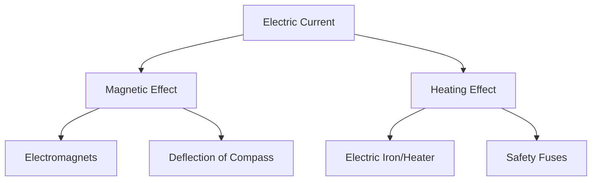

import Callout from '@/components/Callout.astro'

## Introduction

We use electricity every day to light up our homes, but did you know electricity can also act like a magnet? Or that it is the secret behind how your iron box gets hot?

In this chapter, we explore two major effects of electric current:
1.  **Magnetic Effect:** How a wire carrying current behaves like a magnet.
2.  **Heating Effect:** Why wires get hot when current flows through them.

We will also look inside the batteries that power our portable devices to see how they generate electricity.

### Chapter Roadmap

*   **Topic 1:** [Magnetic Effect of Current](/topics/01-magnetic-effect) (Oersted's Discovery & Electromagnets)
*   **Topic 2:** [Heating Effect of Current](/topics/02-heating-effect) (Nichrome wire & Appliances)
*   **Topic 3:** [Electric Cells and Batteries](/topics/03-cells-and-batteries) (Voltaic, Dry, and Rechargeable cells)

### Key Definitions

| Term | Definition |
| :--- | :--- |
| **Magnetic Effect** | The phenomenon where a current-carrying wire produces a magnetic field around it. |
| **Electromagnet** | A coil of wire (usually around an iron core) that behaves like a magnet when electric current flows through it. |
| **Heating Effect** | The production of heat in a conductor due to the resistance it offers to the flow of electric current. |
| **Resistance** | The opposition to the flow of electric current offered by a material. |
| **Element** | A coil of wire (like Nichrome) used in heating appliances to generate heat. |
| **Electrolyte** | A liquid or paste that conducts electricity and helps generate current in a cell. |

