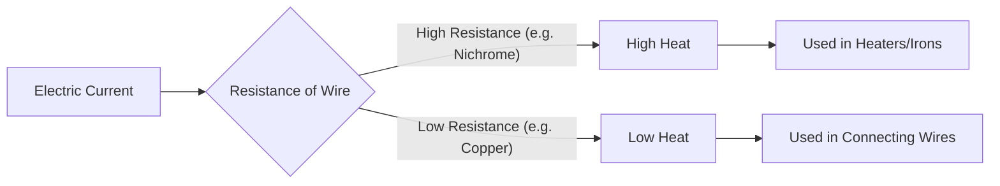

import Callout from '@/components/Callout.astro'

## Why do wires get hot?

When electric current flows through a conductor, the material resists the flow of electrons. This opposition is called **Resistance**.
*   To overcome this resistance, the battery does work.
*   This work is converted into **Heat Energy**.

This is known as the **Heating Effect of Electric Current**.

### The Nichrome Wire Experiment
If you pass current through a **Nichrome** wire, it gets red hot very quickly. If you do the same with a Copper wire, it barely gets warm.
*   **Reason:** Nichrome has very high resistance compared to copper.
*   **Rule:** Higher Resistance = More Heat.

### Factors Affecting Heat Generation
The amount of heat produced depends on:
1.  **Material:** (Nichrome heats more than Copper).
2.  **Length:** Longer wires offer more resistance $\rightarrow$ More heat.
3.  **Thickness:** Thinner wires offer more resistance $\rightarrow$ More heat.
4.  **Current Magnitude:** More current $\rightarrow$ More heat.
5.  **Duration:** Longer time $\rightarrow$ More heat.

## Applications

We use specific coils called **Heating Elements** in appliances.

| Appliance | Function | Component |
| :--- | :--- | :--- |
| **Electric Iron** | Pressing clothes | Nichrome element |
| **Room Heater** | Warming air | Nichrome element |
| **Light Bulb** | Producing light | Tungsten filament (heats till it glows) |
| **Electric Fuse** | Safety | Wire with low melting point (melts if current is too high) |

<Callout variant="warning">
**Safety First:** Never touch a heating element when it is switched on. It can cause severe burns.
</Callout>