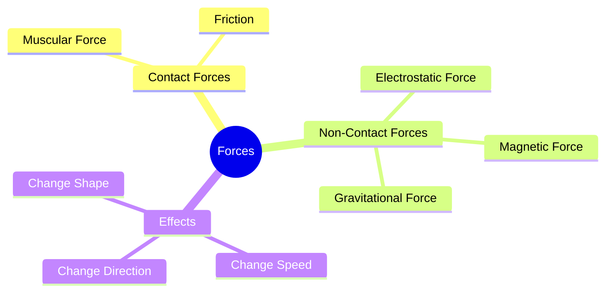

import Callout from '@/components/Callout.astro'

## Introduction

Why do we have to pedal harder to go uphill? Why does a ball rolling on the ground eventually stop? The answer lies in the concept of **Force**.

In this chapter, we explore how forces—pushes and pulls—govern the motion of everything around us. From the muscles we use to lift a bag to the invisible gravity keeping us on Earth, forces are everywhere.

### Chapter Roadmap

*   **Topic 1:** [What is a Force?](/topics/01-what-is-force) (Definition and Effects)
*   **Topic 2:** [Contact Forces](/topics/02-contact-forces) (Muscular Force and Friction)
*   **Topic 3:** [Non-Contact Forces](/topics/03-non-contact-forces) (Magnetism, Electrostatics, Gravity)
*   **Topic 4:** [Weight and Mass](/topics/04-weight-and-mass) (Using a Spring Balance)
*   **Topic 5:** [Floating and Sinking](/topics/05-floating-and-sinking) (Buoyancy)

### Key Definitions

| Term | Definition | Unit |
| :--- | :--- | :--- |
| **Force** | A push or a pull resulting from the interaction between two objects. | Newton (N) |
| **Friction** | A force that opposes the motion of an object moving over a surface. | Newton (N) |
| **Gravity** | The force with which the Earth (or any massive body) attracts objects towards itself. | Newton (N) |
| **Weight** | The measure of the force of gravity acting on an object. | Newton (N) |
| **Mass** | The amount of matter contained in an object. | Kilogram (kg) |

