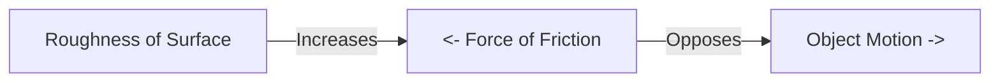

import Callout from '@/components/Callout.astro'

## What are Contact Forces?

Contact forces are forces that can be applied only when the interacting objects are in **physical contact** with each other.

### 1. Muscular Force
This force results from the action of muscles.
*   **Example:** Lifting a bucket, kicking a ball, or a bullock pulling a cart.
*   **Mechanism:** Muscles contract and relax to exert force on bones or objects. It is essential for all our physical activities and body functions (like digestion and blood circulation).

### 2. Friction
Have you noticed that a ball rolling on the ground eventually stops? This is due to **Friction**.

*   **Definition:** The force that acts between two surfaces in contact and opposes the motion of one surface over the other.
*   **Direction:** Friction always acts in the **opposite direction** to the motion.
*   **Cause:** It arises due to **irregularities** (roughness) on the two surfaces locking into each other. Even smooth-looking surfaces have microscopic irregularities.

<Callout variant="warning">
**Rough vs. Smooth:** Friction is greater on rough surfaces (like sand or carpet) and lesser on smooth surfaces (like ice or glass). This is why we slip on wet floors—water reduces friction!
</Callout>